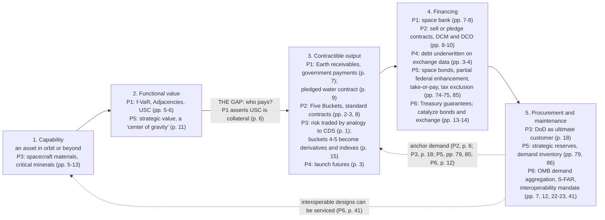

# Cahan's space-finance program: a study guide to six papers

Prepared for Ian Helfrich on 2 October 2026, from the six documents Bruce Cahan sent after the 1 October meeting (P1–P6).

**Conventions**
- **Citations.** (P2, p. 9) means PDF page 9. In all six files the printed page number equals the PDF page number; for P4 these are the browser print's "1 of 4" numbers. Endnotes and footnotes are cited by the page they are printed on, e.g. (P1, p. 15, n. 37) or (P5, p. 80, n. 155).
- **The copies.**
  - **P5** is a public copy, because the upload of Bruce's file failed: https://www.newspacenexus.org/wp-content/uploads/2022/09/US-Space-Policies-for-the-New-Space-Age-Competing-on-the-Final-Economic-Frontier-010621-final.pdf. It is dated 6 January 2021, "(supersedes prior versions)" (P5, p. 2). P6 cites the same file name at an earlier newspacenm.org address (P6, p. 44, ref. 4). Check with Bruce that his copy is the same edition.
  - **P4** is a four-page browser print of the Quartz page, footed "9/28/20, 1:49 PM" (P4, pp. 1–4). The print lost its hyperlinks, so the "(pdf)" link to Butow's report (p. 2) is gone.
  - **P3** is undated. It bears "© 2017-8" (P3, p. 1), its latest access date is 31 July 2018 (ref. 117, p. 25), and P6 gives the venue as the 2018 AIAA Space and Astronautics Forum, September 2018 (P6, p. 44, ref. 3).
- **Strength tags.** **strong** = primary-sourced description. **moderate** = sourced but stretched. **weak** = rests on anecdote or analogy. **asserted** = no support offered.
- **Outside the texts** marks background knowledge that is not in the papers. Every "In econ terms" block and all of §5 are outside the texts: they are my framing. Of the economists and analysts named there, only these are cited in the papers: Carlton (P2, ref. 66 on p. 13), Landry (P2, ref. 81 on p. 13), Carril & Duggan (P6, ref. 105 on p. 52), Arrow & Debreu (P1, p. 14, n. 25), Gulley, Nassar & Xun (P3, p. 10; ref. 93 on p. 24) and Nassar et al. 2020 (P5, p. 80, n. 150). P5 also cites Weinzierl (P5, p. 49; p. 50, n. 88) and Chang (p. 68; p. 70, n. 129).
- **Post-publication items** are outside the texts. They are collected in §6 and reused in §§1, 3–5 and 8–10. Each keeps the confirmed, reported or unconfirmed label its source gives, as of 2 October 2026.
- **My reading** marks the guide's own interpretation.
- **Quotes** are verbatim. Only line-break hyphenation has been repaired.

**Contents**
1. [Start here](#1-start-here): the papers at a glance, how they relate, the study plan and reading route
2. [The program in one picture](#2-the-program-in-one-picture): the financing chain and the timeline
3. [Paper by paper](#3-paper-by-paper): [3.1 P1, the bank](#31-p1-the-bank-2016) · [3.2 P2, the market](#32-p2-the-market-2018) · [3.3 P3, the quartermaster](#33-p3-the-quartermaster-2018) · [3.4 P4, the pitch](#34-p4-the-pitch-2020) · [3.5 P5, the strategy](#35-p5-the-strategy-2021) · [3.6 P6, the buyer](#36-p6-the-buyer-2021)
4. [Cross-paper threads and shifts in vocabulary](#4-cross-paper-threads-and-shifts-in-vocabulary), with tensions to raise
5. [Finance and economics crosswalk](#5-finance-and-economics-crosswalk), with full references
6. [What has happened since](#6-what-has-happened-since), with a scorecard for P5 and dates to watch
7. [Corrections to the earlier reading packet](#7-corrections-to-the-earlier-reading-packet) (reference appendix)
8. [Questions worth asking Bruce](#8-questions-worth-asking-bruce)
9. [Connections to your work](#9-connections-to-your-work): teaching exercises, supply chains, geospatial, research questions
10. [Interleaved self-test (30 questions)](#10-interleaved-self-test-30-questions)

---

## 1. Start here

**At a glance**

| Paper | Claim | Mechanism | What is evidenced | One-line critique (my reading) |
|---|---|---|---|---|
| P1, the bank | Space assets can be financed by lending against their functional value (pp. 5–6) | A space bank that underwrites f-VaR reduction, with the USC as collateral (pp. 6–8) | Funding totals, satellite deal structure, the treaties and Cape Town's status (pp. 2, 6–7, 10–12) | Avoided cost is not pledgeable income; only Example 3's offtake converts it (pp. 6, 9) |
| P2, the market | Standard space commodities traded on an exchange would reveal demand and guide investment (p. 1) | Five Buckets, standard contracts, DCM listing and DCO clearing (pp. 2–3, 9–10) | Exchange and grading history; the U.S. legal route (pp. 4–5, 9–10, 15–16) | Futures follow deep cash markets, but P2 lists first (pp. 4–5, 10) |
| P3, the quartermaster | A U.S.-organized space commodities exchange would strengthen national security by assuring the supply chains behind space capabilities (pp. 1, 20) | P2's exchange, assumed to exist (p. 1): standards and price information (pp. 16–17), rulebook sanctions even against sovereigns (pp. 17–18), smoother DoD demand (p. 18), U.S. hosting (pp. 19–20) | Import reliance and Chinese production shares in critical minerals; helium, lithium and niobium concentration; Chinese exchanges' 70.58% of metals-futures volume (pp. 9–15) | The data diagnose supply risk; nothing shows an exchange beats stockpiles, offtake contracts or purchase commitments (pp. 3, 13, 18) |
| P4, the pitch | Fernholz: "Government contracts and venture funding" cannot support "stable and sustainable economic development"; the fix is "financial engineering" (p. 1) | Cahan: hedge on an exchange the risks a firm "doesn't control", keep equity for technology risk (p. 3); exchange data would support "more reliable underwriting" of debt (pp. 3–4) | Names, roles and dates, and the report that the ideas reached Butow's 2020 report (pp. 1–2) | Two interviewees, no data, no dissent. Launch futures are called "cheaper insurance" (p. 3), but P2 has futures hedge price and leaves yield risk to insurance (P2, p. 4) |
| P5, the strategy | Space is "a center of gravity for the world's two competing economic systems", so U.S. space policy needs an economic and financial program (pp. 11, 20–21) | Critical-infrastructure designation (p. 84); a 2060 North-Star vision run by a Task Force that becomes a Center (pp. 82–84); credit-enhanced space bonds (pp. 74–75, 85); a CFTC-regulated exchange primed by strategic reserves (p. 79); a federal demand inventory (p. 86) | Institutional facts such as PPD-21's omission of space and the EXIM lapse; VC, fiscal and energy-incentive data (pp. 33, 50–51, 63, 68, 98–99) | Guarantees and take-or-pay leases are unpriced contingent liabilities, and "there are no built models" (pp. 85–86) |
| P6, the buyer | Government should budget for and buy space as shared, interoperable infrastructure (pp. 6–8) | OMB demand aggregation and an interoperability mandate; S-FAR; Treasury as investor (pp. 7, 12–15, 22–23) | Accounting regimes, rule page counts, Treasury's stated goals, spending and contractor charts (pp. 13–15, 18, 20, 28–34) | The decisive quantities are unmeasured, as P6 concedes (pp. 21, 24, 26, 28) |

| Paper | Shorthand | Title | Authors | Venue and form | Proposed institution |
|---|---|---|---|---|---|
| P1 (2016) | **The bank** | *Outer Frontiers of Banking: Financing Space Explorers and Safeguarding Terrestrial Finance* | Cahan; Marboe (Univ. of Vienna); Roedel (P1, p. 1) | *New Space*, pre-issue copy, DOI 10.1089/space.2016.0010; an earlier version was presented at IAC 2015 (P1, p. 1) | An experimental space bank, "not yet in operation" (P1, pp. 7–8; p. 15, n. 37) |
| P2 (2018) | **The market** | *Space Commodities Futures Trading Exchange: Adapting Terrestrial Market Mechanisms to Grow a Sustainable Space Economy* | Cahan; Pittman (NASA); Cooper (AWS); Cumbers (SynBioBeta) (P2, p. 1) | *New Space*, pre-issue copy, DOI 10.1089/space.2017.0047 (P2, p. 1) | A futures exchange to be registered with the CFTC as a DCM, with DCO clearing (P2, pp. 9–10) |
| P3 (2018) | **The quartermaster** | *Space Commodities in Service of National Security* | Cahan (Stanford MS&E; Urban Logic); Maj. Timothy Locke (U.S. Air Force Space Command, Space and Missile Systems Center) (P3, p. 1) | AIAA-format paper, 27 pp.: text on pp. 1–20, 154 references on pp. 20–27; undated (see Conventions) | P2's exchange, organized under U.S. law as "a strategic peacekeeping asset" (P3, pp. 15, 19–20) |
| P4 (2020) | **The pitch** | "How the space economy can catch up with hog bellies and soy beans" | Fernholz, Quartz senior reporter, quoting Gen. Butow of the Defense Innovation Unit and Cahan (P4, pp. 1–2) | *Quartz* feature, 24 Sept 2020; a version first ran in its Space Business newsletter (P4, pp. 1, 4) | A Space Commodities Exchange formed by a Board of Trade; "space bonds" named but not defined (P4, pp. 2, 4) |
| P5 (Jan 2021) | **The strategy** | *US Space Policies for the New Space Age: Competing on the Final Economic Frontier* | Cahan (Stanford MS&E; Urban Logic); Sadat (recently Policy Director at the National Security Council; career DoD official) (P5, p. 6) | NewSpace New Mexico white paper, 112 pp., with a foreword by the head of Commerce's Office of Space Commerce; a supplement to the *State of the Space Industrial Base 2020* report (SSIB 2020) (P5, pp. 1–4, 16) | A National Space Enterprise Task Force that becomes a permanent Center; space bonds; a CFTC-regulated exchange (P5, pp. 79, 83–85) |
| P6 (Sept 2021) | **The buyer** | *Space Budgeting for Modern Times: Industrial Space Capabilities with less waste, delay, and obsolescence* | Cahan (Urban Logic); Vaughn (GXO, Inc.); Sadat (*Space Force Journal*); DeRaad and Maethner (NewSpace New Mexico) (P6, p. 4) | White paper, 24 Sept 2021, published by NewSpace New Mexico, whose CEO and strategy lead are co-authors (P6, pp. 2, 4); 54 pp.; the report does not mention peer review | OMB as the aggregate buyer and Treasury as patient investor (P6, pp. 8, 12–15) |

**Why these shorthands.** P3 is **the quartermaster**: it treats space commodities as military supply, resting on "assured logistical arrangements that are robustly available" (P3, p. 1), with DoD as the "ultimate customer" (p. 18). P4 is **the pitch**: a journalist's summary of the proposal for business readers (P4, pp. 1–4). P5 is **the strategy**: it packages the earlier tools into a national program and assigns each recommendation to named offices (P5, pp. 82–94).

**How the papers relate.** Five of the six come from one principal author, Cahan, writing from Urban Logic with a different set of co-authors each time. P4 is a Quartz feature by Tim Fernholz in which Cahan is the main voice (P4, pp. 2–4). The texts link to one another:
- P2 reuses P1's functional definition of the "space economy" (P1, p. 14, n. 1; P2, p. 1), and repeats P1's line that lunar launch investment should be "proportional to the lunar development activities" (P1, p. 2; P2, p. 2).
- P3 takes its exchange, Five Buckets and board of trade from P2, cited as ref. 123 (P3, pp. 15–16). Without comment, it relabels buckets 4–5 as "Financial Derivatives" and "Financial Indexes" (P3, p. 15).
- P4 says Cahan's exchange and space-bond ideas "would eventually find their way into Butow's 2020 report on the space industrial base" (P4, p. 2). P5 presents itself as a supplement to the *State of the Space Industrial Base 2020* report (P5, p. 16).
- P5 says its exchange design "reflects research and proposals presented in" P1, P2 and P3 (P5, p. 80, n. 155). It takes P3's five categories (P3, p. 15; P5, p. 78), and it is the first to specify the space bonds that P4 only names (P4, p. 2; P5, pp. 74–75, 85).
- P6 lists P1, P2, P3 and P5 as its references 1–4 (P6, p. 44). It cites P5 for NorthStar and space bonds without restating either (P6, pp. 11, 14, 41). Its pin cite "(4 p. 82)" (P6, p. 41) lands on P5's "North-Star" vision recommendation (P5, p. 82).
- The people overlap. Sadat co-authors P5 and P6 (P5, p. 6; P6, p. 4). The 32 registrants of the 2020 working group behind P5 include Cahan, Butow, Timothy Locke (P3's co-author), and Casey DeRaad and Scott Maethner (P6's co-authors) (P5, pp. 5, 107). P6's authors "met through the annual State of the Industrial Base Workshop in May 2020" (P6, p. 4, n. 1).

**None of the six tests its proposal.** P1 defers the USC algorithm (P1, p. 6). P3 opens "Assuming that a formalized space commodities exchange exists" (P3, p. 1). P4 has no data and hedges "If it can do that" (P4, p. 3). P5 concedes "there are no built models" of the budget effects (P5, p. 86). P6 concedes that its decisive quantities are unmeasured (P6, pp. 21, 24, 26, 28). P3's data, from USGS, Gulley et al. and FIA, document the problem, not the effect of the remedy (P3, pp. 9–15).

**Disclosure of Cahan's stake tightens over time:**
- P1 says "No competing financial interests exist" (P1, p. 13). GoodBank™ is "a common law trademark of Urban Logic, Inc., a 501c3 nonprofit" (p. 15, n. 37), and Urban Logic is one of Cahan's listed affiliations (p. 1).
- P2 says "Bruce Cahan is organizing the Space Commodities Exchange" (P2, p. 11). Its copyright is held by Cahan, Urban Logic and the co-authors (P2, p. 1).
- P3 says the research was "supported by Urban Logic, Inc., a New York 501c3 nonprofit", which "is in the process of creating a Space Commodities Exchange" (P3, p. 20). Its copyright is held by Cahan, Urban Logic and the co-author (p. 1).
- P4 is journalism and has no conflict statement. It reports that Cahan developed the exchange and bond ideas and "has been briefing executives, military officials, and industry consultants" (P4, pp. 2, 4).
- P5 introduces the formula: Cahan "is the designer and principal organizer of the Space Commodities Exchange described in Section 10" (P5, p. 6).
- P6 repeats it for the Exchange "referenced herein" (P6, p. 3). Its copyright is held by Cahan and Sadat (P6, p. 2).

**My reading.** From P2 on, each disclosure concerns the exchange alone. That matters most in P5 and P6, which ask government to support it: P5 would tie strategic reserves to it (P5, p. 79), and P6 would have Treasury help catalyze it (P6, p. 14).

**What reading all six together shows**
- **The turn to government can be traced paper by paper.** The last column of the §2 timeline shows it, from P1's unreliable funder to P5's "credit enhancer" (P5, p. 68) and P6's anchor customer (P6, pp. 8, 12–15).
- **NorthStar and space bonds, which P6 cites without defining, are defined in P5.** NorthStar is a 2060 National Space Vision drafted by a presidentially appointed Task Force that would evolve into a permanent Center (P5, pp. 82–84). Space bonds carry federal credit enhancement on "A portion of the bonds", with interest deferred in the early years, "(e.g., Years 1 – 3)" (P5, pp. 74–75, 85). §3.5 has the full design.
- **Critical infrastructure.** P5 asks government to treat space "as a separate critical infrastructure domain" (P5, p. 84). Like P6 (P6, p. 14), it never says what designation would trigger.
- **The space bank disappears after P1.** Its only later mention is the Commerce foreword to P5, which lists it among ideas that "merit careful consideration" (P5, p. 3).
- **P3 holds the program's only substantial data**, on critical minerals (P3, pp. 9–13). P6 never mentions critical minerals.

**Outside the texts (status as of 2 October 2026; sources and labels in §6).** The post-publication searches found none of the proposed institutions in operation. SSIB 2025 (April 2026) marks the 2020 and 2021 exchange recommendations "Not Begun" and moves the exchange beyond five years (confirmed). NSM-22 (April 2024) kept 16 critical-infrastructure sectors, with no space sector (confirmed). The only enacted "space bonds" are tax-exempt spaceport bonds (P.L. 119-21 §70309, July 2025; confirmed).

**How to use this guide.** For each paper, read the one-paragraph argument in §3, then the PDF pages below, then the argument map. Cover the right-hand columns of the concepts table and define each term. Write an answer to each recall question before opening it. Open sessions 2–6 with five minutes of retrieval: answer the previous session's recall questions cold. The program takes about eight hours: six sessions and a spaced self-test.
- **Session 1 (85 min):** §§1–2, the P1 route, §3.1, the P1 questions.
- **Session 2 (75 min):** the P2 route, §3.2, the P2 questions.
- **Session 3 (75 min):** the P3 route, §3.3, the P3 questions.
- **Session 4 (60 min):** the P4 route, §3.4, the P4 questions; then part A of the P5 route.
- **Session 5 (65 min):** part B of the P5 route, §3.5, the P5 questions.
- **Session 6 (90 min):** the P6 route, §3.6, the P6 questions, §4.
- **Self-test (50 min, 2–3 days after session 6):** §10 cold, then §8. The day before you next talk to Bruce, redo the §10 questions you missed.
- **Later:** §§5, 6 and 9. §7 is a reference appendix (corrections to the 1 October packet).

**Reading route (PDF pages only).** The route is about 42,500 words, roughly four hours at 180 words a minute; the minutes below use that pace.

| Session | Paper | Pages | Min | Goal |
|---|---|---|---|---|
| 1 | Guide | §2 | 5 | The chain and the timeline |
| 1 | P1 | 1; 2; 3 (lower left and top right); 5–6; 7; 8; 9; 12; 13; 15 (n. 37) | 40 | What satellite lenders rely on (p. 7) and what P1 offers instead for Space-Bound Assets (my inference: P1 never says they are unbankable); the leap "USC becomes the collateral"; the four examples |
| 2 | P2 | 1; 2–3 (Table 1); 4 (bottom of left column and right column); 6; 7; 8; 9–10; top of 11; 15–16 (ASTM appendix) | 45 | The taxonomy, the regulatory route, the road map and what it leaves out, and how buyer-led standards began |
| 3 | P3 | 1–2; 8–20 (read the tables and figures on pp. 9–16 in the PDF, because extraction scrambles Table 3) | 45 | The "Assuming" premise and the CDS analogy; the minerals evidence, the paper's only data; exchanges as "toll booths"; what the exchange is said to do for DoD; the disclosure (p. 20) |
| 4 | P4 | 1–4 | 5 | Time-matching, the first mention of space bonds, the risk split, the Board of Trade |
| 4 | P5, part A | 3 (foreword); 6 (authors and conflict statement); 11–12; 19–21; 61–64; 68–70 | 30 | The "center of gravity" frame; the four Missing Policy Elements; the VC-horizon argument; government as validating customer, long-term investor and credit enhancer |
| 5 | P5, part B | 73–75; 77–80; 82–86 | 30 | The Golden Gate precedent and the space-bond design; the exchange design (categories, Board of Trade, CFTC DCM, strategic reserves, n. 155); the recommendations, from the North-Star vision to the demand inventory and the "no built models" concession |
| 6 | P6 | 6–8; 12–15 (read the table on pp. 13–15 in the PDF, because extraction scrambles it); 18; 21–25; 28; 30; 34–35; 38–40; 41 | 40 | The diagnosis, the OMB/Treasury program, and the evidence gap the authors admit |
| Optional | — | P1 pp. 4, 10–11; P3 pp. 2–7 (history, procurement, spacecraft materials); P5 pp. 16–17 (the link to SSIB 2020), 32–33 (China), 45–46 (open, closed and hybrid economies), 49–50 (Weinzierl, the energy precedent, PPD-21), 88–90 (supply-chain transparency and CFIUS), 93 (the OMB Circular A-16 model), 107 (working-group registrants); P6 pp. 10–11 (geospatial precedent), 20 (the buying agencies) | — | Background. P3 pp. 9–13, P5 pp. 88–90 and 93, and P6 pp. 10–11 bear on your supply-chain and geospatial work |

P5's core is 26 of its 112 pages. The rest restates or illustrates it; skip it on a first pass.

**If you have only 75 minutes:** P1 pp. 6–7, 9; P2 pp. 2–3, 9–10; P3 pp. 1, 15, 18; P4 pp. 2–3; P5 pp. 74–75, 79, 84–86; P6 pp. 6–8, 12–14 (about 12,900 words, a brisk read).

---

## 2. The program in one picture

**What each paper covers on the chain**
- **P1** builds links 1–2, then jumps to link 4. For Space-Bound Assets its only link 3 is Example 3's pledged water contract (P1, p. 9). For satellites it names Earth receivables and government payments (p. 7).
- **P2** builds link 3 and the market half of link 4.
- **P3** works at both ends. At link 1 it documents the inputs, spacecraft materials and critical minerals (P3, pp. 5–13). At link 5 it names DoD as the buyer whose lumpy demand an exchange would smooth (p. 18). In between it borrows P2's exchange (p. 15) and adds technology and operational risk as a tradeable commodity (p. 1).
- **P4** restates links 3–4 for business readers: launch futures as a hedge, and debt underwritten on exchange data (P4, pp. 3–4).
- **P5** gives link 2 a strategic meaning (P5, p. 11) and builds the state half of link 4, space bonds with federal credit enhancement (pp. 74–75, 85). It starts on link 5 with strategic reserves and a demand inventory (pp. 79, 86).
- **P6** builds link 5 and Treasury's part of link 4 (P6, pp. 7, 12–14, 22–23, 41).
- **The dotted edges close the loop.** Government demand is what makes outputs contractible, and interoperable procurement keeps capabilities serviceable.

**Timeline: 2016 → 2018 → 2020 → 2021**

| Date | Paper | Stage | Unit of analysis | Basis of value | Government is… |
|---|---|---|---|---|---|
| 2015–16 | P1 | Bank | The asset | Functional value, USC (P1, pp. 5–6) | An unreliable funder (P1, pp. 2–3, 11), though a contractor can pledge its government payments (p. 7) |
| May 2018 (online, per P6, p. 44) | P2 | Market | The standard contract | Prices from trading (P2, pp. 1, 4, 8) | A buyer that "one could imagine" seeding markets, and the regulator (P2, pp. 6, 9–10) |
| 2018 (undated; Sept 2018 per P6, p. 44) | P3 | Quartermaster | The supply chain, with the exchange as national infrastructure | Assured access (P3, pp. 1–2); futures that tell producers what to supply (p. 17) | The "ultimate customer", whose lumpy buying an exchange would smooth (P3, p. 18) |
| 24 Sept 2020 | P4 | Pitch | The firm's capital structure | Underwriting from exchange supply-and-demand data (P4, pp. 3–4) | One of two inadequate funding pillars; officials want private investment to "take a larger role" (P4, pp. 1–2) |
| 6 Jan 2021 | P5 | Strategy | The national program | Strategic value, "a center of gravity" (P5, p. 11); maturity matching (p. 74) | "initial validating customer" (p. 62), "primary driver and long-term horizon investor" (p. 64) and "credit enhancer" (P5, p. 68) |
| 24 Sept 2021 | P6 | Buyer | The government purchase | Lifecycle present value, "true cost" (P6, pp. 18, 22) | Anchor customer and patient investor (P6, pp. 8, 12–15) |

Two events the papers mention connect P4, P5 and P6. One is the May 2020 *State of the Space Industrial Base* workshops: P5 draws on their finance working group, and P6's authors met there (P5, pp. 5, 17; P6, p. 4, n. 1). The other is Butow's 2020 report, which P4 says took up Cahan's ideas and which P5 supplements (P4, p. 2; P5, p. 16).

**My interpretation (no paper says this).** Each stage takes up a constraint the previous one left open. P1's USC has no payer and no price, so P2 tries to create prices. P2's exchange has no deep cash market, and its only named demand-side mechanism is federal procurement (P2, p. 6). P3 names DoD as the customer whose lumpy demand an exchange would smooth (P3, p. 18), and P5 makes government the anchor and financier (P5, pp. 62, 64, 79, 85). P5 already lists OMB among the offices for its demand inventory (p. 86) and Treasury first for its bonds (p. 85), and it uses the OMB Circular A-16 analogy (p. 93) that P6 develops (P6, pp. 10–11). So P6 is the budgeting half of P5's package, not a turn away from the exchange. What changes most across the six is who carries the risk: a lender relying on functional value (P1), market counterparties (P2–P4), and finally the federal balance sheet (P5–P6).

---

## 3. Paper by paper

### 3.1 P1: The bank (2016)

**Citation and genre.** Cahan, Marboe & Roedel, *New Space* (2016), DOI 10.1089/space.2016.0010 (P1, p. 1). This is a conceptual advocacy article with no data, no model and no test. It has five parts:
- a finance primer (pp. 3–4);
- a valuation framework supported mainly by Cahan's own papers (p. 5; p. 14, nn. 17, 19–22);
- an account of how satellite deals are financed (pp. 6–7);
- a space-bank proposal with four examples (pp. 7–10);
- a legal review (pp. 10–12). This is the best-sourced section.

**The argument in one paragraph.** The authors argue that no current source of money can build a space economy. Government budgets are set each year by congressional politics (P1, pp. 2–3), and with budgets shrinking, "new and innovative space projects will fail due to the inconsistency of financial support" (p. 11). Private money depends on a few founders (p. 2). Project finance "lacks the purpose or panorama view" of an interdependent portfolio (p. 2). Only satellites are financed routinely, because "The cash flows of current satellites come from and stay on Earth" (p. 7): lenders take subscriber revenues or, from a government contractor, "its government payments" (p. 7). For long-term investment in any asset, and specifically for Space Assets (Earth-bound and Space-Bound), the authors propose "functional value", the services an asset provides to the real economy (pp. 5–6; p. 14, n. 16). They make this concrete as a Unit of Space Convenience (USC): the change in the marginal cost of meeting needs with the asset versus without it, with the algorithm deferred (p. 6). The paper then asserts: "In effect, USC becomes the collateral for banking on Space Assets" (p. 6). An experimental space bank would lend against that value and build an underwriting model (pp. 7–8). The obstacle is law. *Lex rei sitae*, the rule that the law of the place where an asset sits governs it, has no location to apply in orbit, which no state can appropriate. Article VIII of the Outer Space Treaty points to the state of registry, but "this might not be the state in which the borrower or the lender reside" (p. 10). Lending therefore "depends largely on the creditworthiness of the borrower" (p. 11). The 2012 Space Assets Protocol has four signatures and no ratifications (p. 11).

**Argument map**

| # | Step | Pages | Strength |
|---|---|---|---|
| 1 | Government outspends private money: NASA spent $17B (2013) against $13B of private investment and debt (2000–2015). This compares a one-year flow with a 15-year cumulative total. | 2 | moderate |
| 2 | Appropriations "overshoot, undershoot, or ignore elements of a space economy". VC money and demand guarantees create a "short-term artificial supply of capital"; the support is three SpaceNews items on fixed-satellite overcapacity and Intelsat's Caa1 rating (n. 2). | 2–3; 14 (n. 2) | weak |
| 3 | All space investment is one interdependent portfolio, so a public clearinghouse should rank projects. | 2–3 | asserted |
| 4 | There are three asset classes, each defined by its Revenues and a bundle of Rights. | 3 | moderate |
| 5 | Value assets by function, not spot price (3L-Map, f-VaR). Adjacencies "have value and produce Revenues". | 4–5 | asserted |
| 6 | Defines the USC, illustrates it with a wrench and a weather satellite, and defers the algorithm. | 6 | weak |
| 7 | **"USC becomes the collateral for banking on Space Assets."** | 6 | **asserted (the central leap)** |
| 8 | Satellite finance is mature: equity plus receivables debt, including a contractor's government payments; a 15-year design life against roughly 10 years of commercial life; risk from export-credit agencies (ECAs). In space, interrupted finance has no substitute, so funding needs redundancy. | 6–7 | moderate / weak |
| 9 | "As has been shown", a space bank (GoodBank™, "not yet in operation") should lend; four hypothetical examples follow (below). | 7–10; 15 | asserted |
| 10 | Creation, perfection and enforcement of security interests differ by country. *Lex rei sitae* has no location to apply in orbit, and Article VIII points to a state of registry that may not be the parties' own (p. 10). Lending is bespoke and credit-based. | 10–11 | moderate |
| 11 | Cape Town's tools: international interests, a registry, remedies. The Aircraft Protocol works. The Space Protocol lost support over licensing, public-service continuity, and operators' view that lenders undervalued security in space assets. | 11–12; 16 (nn. 72, 86) | **strong** |
| 12 | Use-based rights help financing; a "prudent space banker" lends to assets that cut others' costs; space convenience is "an objective benefits stream". | 12–13 | asserted |

**The four examples (P1, pp. 8–10)**
- **Ex. 1, Earth-Bound resiliency.** Accounts are "safeguarded outside of the fragile, disaster, or conflict zone". Forty percent of humankind (2 billion people) lacks a basic bank account. Aid is tracked with "digital QoL f-VaR tags". The bank serves as backup, "a layer of protection beyond offsite" (p. 8).
- **Ex. 2, repair, salvage and reuse.** End-of-life destruction "seems an uneconomic policy". Repaired assets are reused by entrepreneurs in developing economies ("downcycling") (pp. 8–9).
- **Ex. 3, three rovers** linked and financed by a pledged water contract (p. 9).
- **Ex. 4, opening and democratizing finance** for all scientific and humanitarian missions (pp. 9–10).

**Key concepts**

| Term | Definition | Page | Why it matters |
|---|---|---|---|
| Earth-bound vs Space-Bound Assets | Earth-bound assets are in orbit but earn mainly on Earth; Space-Bound assets earn "primarily beyond Earth's orbit". Each is defined by Revenues and a bundle of Rights (use, assign revenues, transfer, exclude). | 3 | The labels are counterintuitive. P1 shows that satellites' repayment rests on Earth payers (p. 7). The Rights bundle is what the USC lacks. |
| QoL; Periodic Table of QoL Elements | QoL = quality of life (p. 1, keywords). The Periodic Table covers "the adequacy and equity of" economic, educational, environmental, health, housing, telecommunications, transportation and other conditions. | 1; 5 | The list of needs against which f-VaR is measured. |
| Functional value | "the services provided to the real economy through using the asset" | 5; 14 (n. 16) | P1 applies it to any Asset a long-term investor values (p. 5), then to Space Assets (pp. 5–6). This is where social value and pledgeable income get conflated. |
| f-VaR; 3L-Map; Adjacencies | f-VaR is the functional value at risk of a need; it is not a loss quantile. The 3L-Map lays Needs, Capacities and Money over a geographic area. Adjacencies are needs that one investment reduces together. | 5–6; 14 (nn. 17, 18) | f-VaR is what the bank would underwrite, but its units shift: dollars in the wrench example, physical quantities in the variable list (p. 6). Adjacencies are economies of scope. P1 n. 18 misdescribes standard VaR: "VaR optimizes choosing the blend of investments … that maximize portfolio safety and yield" (p. 14, n. 18). Outside the texts: VaR is a loss quantile and optimizes nothing. |
| USC | The cumulative change in the marginal cost of meeting needs, with the asset versus without it. It depends on at least Asset, QoL, f-VaR, MC-E and MC-S. MC-E / MC-S = the marginal cost on Earth / in space "of reducing a unit of f-VaR to level A (acceptable f-VaR)". | 6 | The signature idea: an avoided-cost measure. |
| Space bank / GoodBank™ | An experimental "teaching hospital bank", not yet operating. Also a CubeSat "bank in a box". | 4; 7–8; 15 | The term blurs three things: a bank in orbit, a lender to space assets, and a training bank. |
| Water-supply contract | A contract linking three rovers, pledged to finance them. | 9 | P1's only conversion of a Space-Bound Asset's value into pledgeable cash flow. It is an offtake. |
| Cape Town / Space Assets Protocol | The Convention (2001) provides international interests, a registry and remedies. The Protocol (2012) modifies the remedies; it has 4 signatures and 0 ratifications (p. 11). Benchmark: the Aircraft Protocol entered into force with the Convention in 2006; "As of September 2015, the Cape Town Convention has 69 and the Aircraft Protocol 60 ratifications" (p. 16, n. 72), and its registry "is successfully operating" (p. 12). The Rail Protocol is not in force because its registry "has not become operational" (p. 11). Where the Space registry would sit, at the UN or the ITU, was still undecided (p. 12). | 11–12; 16 (n. 72) | The existing attempt to make space assets bankable, and P1's own benchmark. |
| Functional (use-based) property rights | Without the Protocol, rights "may be seen as purely functional, lasting as long and accruing to the extent used" (p. 12), like easements the holder "can lose through abandonment, nonuse, or misuse" (p. 13). | 12–13 | P1 says this "is not a barrier to financing" (p. 13). A lender would ask what it holds after default, when use often stops. Later, P3 substitutes exchange rulebook sanctions (P3, pp. 17–18) and P5 asks for the legal means to "hypothecate" space assets (P5, p. 87); neither says what a lender holds in the asset after default. |
| Space Finance Principles | A proposed compact of "comprehensive, modern finance principles for Space Assets", with the Law of the Sea as precedent (p. 12), to be piloted by space banks as open standards (p. 13). | 12–13 | P1's institutional end state. |

**Proposed vs evidenced.** The paper's *evidence* is descriptive and sourced:
- the funding totals (p. 2);
- how satellite deals are structured (pp. 6–7);
- the treaties, Cape Town, and the Protocol's status and loss of support (pp. 10–12).

The following are *asserted* without support:
- that capital is misallocated (pp. 2–3);
- that f-VaR can be measured and "produce[s] Revenues" (p. 5);
- the USC itself, which is never computed (p. 6);
- that the USC can serve as collateral (pp. 6, 13);
- that the bank would deliver its benefits (pp. 7–10).

*Conceded unknown:* "Further research would create a definitive algorithm" for the USC (p. 6).

The paper also *overclaims*. The abstract's headline sentence reads: "A space bank is described to prove that banking in space is viable and improves on terrestrial money flows for fragile regions affected by war, corruption, disaster, or breakdown of basic human rights" (p. 1). The bank section opens "As has been shown" (p. 7). Yet GoodBank™ "is not yet in operation" (p. 15, n. 37).

**Strongest point.** P1 rightly frames space infrastructure as a problem of complementary investment: assets are valuable because later missions use them (pp. 2, 5–7, 13). Its benchmark is also right. Satellites are bankable because a terrestrial payer can be held to its obligations (p. 7), and Example 3's pledged offtake is the right instrument (p. 9).

**Weaknesses and assumptions**
- **Social value is not pledgeable income.** The USC counts costs that other missions avoid. "USC becomes the collateral" (p. 6) holds only if the owner captures those savings, through prices, offtake contracts or public payment.
- **The USC is not operational.** "Cumulative change in marginal cost" mixes marginal and total quantities. The variable list is "at least" (p. 6), and "general equilibrium" (p. 6; p. 14, n. 25) is used loosely.
- **The wrench example, read charitably (my reconstruction).** By P1's definition, the USC is the change in marginal cost with vs without the asset (p. 6). Without the printer, meeting the need costs MC-E = $5M; with it, MC-S = $2.5M, an implied saving of $2.5M. For the wrench alone neither option is worth it, since the f-VaR is $1M. The printer pays only if it also serves others among the "twenty-five Periodic Table QoL elements" (p. 6). That is P1's Adjacency logic (p. 5). The open question is who pays for those other uses. P1 computes no USC and never explains the twenty-five elements (p. 6).
- **Banking economics are missing.** The paper proposes deposit funding (p. 13) of long-lived, illiquid, correlated assets. It mentions "regulatory capital" only in a compliance list (p. 8). It never analyzes maturity mismatch, concentration or capital adequacy, and never compares the bank with ECAs or capital markets.
- **Example 1 pulls two ways.** Users could "transact without fear of government surveillance", yet the bank stays "compliant with anti-money laundering, know your customer, regulatory capital" rules (p. 8). The paper does not say how both can hold.
- **The operators' stated reason cuts against P1.** Major satellite companies opposed the Protocol because "banks and special investors did not value security interest in space assets adequately and concluded that the capital markets presented a better source of financing" (p. 12). That is low collateral value, not bad law. My reading: this supports a liquidation-value critique and undercuts P1's view that collateral law is the binding constraint. The authors call the loss of support "a surprise" (p. 12). They later call the Protocol a "failure" (p. 13); p. 11 had described it as lacking "broad acceptance" and not yet in force. The industry had reversed itself: the Protocol was "originally sponsored and prepared by a space industry working group" (p. 16, n. 86).

**In econ terms** (outside the texts: my framing). The USC is a partial-equilibrium avoided-cost measure. Option 3 on p. 6 is option value: capacity kept available for future users. P1 treats total value as if it were pledgeable income; in Holmström–Tirole terms, externalities that accrue to other missions cannot be pledged. P1's two working cases, Earth-side receivables and government payments (p. 7) and an offtake contract (p. 9), are exactly where pledgeable income exists. The bank is a delegated monitor whose mandate (growing the space economy, p. 8) concentrates its exposures, despite P1's nod to a multipurpose bank (p. 8) and a network of banks (p. 15, n. 37). It would lend against assets with low liquidation value (Shleifer–Vishny).

**Recall questions**

1. What makes satellites bankable, and what does that imply for Space-Bound Assets?

Satellite debt is repaid from Earth receivables: "The cash flows of current satellites come from and stay on Earth" (P1, p. 7). A government contractor "would pledge its government payments" (p. 7). Space-Bound Assets generate revenues "enjoyed primarily beyond Earth's orbit" (p. 3), so P1 turns to the USC (pp. 5–6). My inference: P1 shows that satellites' repayment rests on Earth payers (p. 7). It does not say Space-Bound Assets are unbankable. It says lending on any space-asset collateral is bespoke and relies on the borrower's credit (p. 11).

2. Define the USC. What does each move between the weather-satellite options measure?

The cumulative change in the marginal cost of meeting needs, with vs without the asset (P1, p. 6). Option 1 (build and launch) → Option 2 (buy launch) is the saving from a third-party launch service; Option 2 → Option 3 (use an existing service) adds more "units of space convenience" (p. 6).

3. What is P1's central leap, and where does it come closest to bridging it?

From avoided cost to collateral: "USC becomes the collateral" (P1, p. 6); "an objective benefits stream" (p. 13). Closest bridge: Example 3, where "in effect a water supply contract" is pledged to finance the rovers (p. 9), i.e. an offtake.

4. Apply it. A lunar water-plant operator asks a space bank for a 10-year loan. Using only P1, what could the bank take as security, which law governs it, and what does the bank hold if the plant stops operating? Write your prediction first.

A pledged supply contract, as in Example 3 (P1, p. 9). For the governing law, P1's discussion (written for satellites) points to the law of the state of registry under Outer Space Treaty Article VIII, since the Space Protocol is not in force (pp. 10–11). If the plant stops, possibly nothing: use-based rights last "to the extent used" (p. 12), and P1 likens them to easements that can be lost through "nonuse" (p. 13).

5. Why did the Space Assets Protocol lose support, and which reason undercuts the authors?

States feared conflict with their treaty licensing authority, and worried about public-service continuity on default (P1, p. 12). Major satellite companies issued a joint letter because "banks and special investors did not value security interest in space assets adequately and concluded that the capital markets presented a better source of financing" (p. 12). The Protocol was "originally sponsored and prepared by a space industry working group" (p. 16, n. 86), so the industry reversed itself. My reading: the operators' reason, low collateral value, undercuts the view that law is the binding constraint.

---

### 3.2 P2: The market (2018)

**Citation and genre.** Cahan, Pittman, Cooper & Cumbers, *New Space* (2018), DOI 10.1089/space.2017.0047, labeled "ORIGINAL ARTICLE" (P2, p. 1). In substance it is a market-design concept note and a plan for a venture.
- About half is a primer on trading, exchange history, contract types and the CFTC (pp. 3–10).
- Its 131 references mix statutes and CFTC releases with Wikipedia and trade press (pp. 11–15).
- Disclosure: "as a result of researching this article, Bruce Cahan is organizing the Space Commodities Exchange" (p. 11).

**The argument in one paragraph.** The authors argue that no shared economic road map exists for space (P2, p. 1). Firms "initially resist" coordinating interoperability, and their customers pay for it (p. 2). Space goods can be commodified the way computing was. Candidates include bandwidth, remote-sensing processing, low-Earth-orbit launch, graded water, rare earths and platinum-group metals (p. 2). The authors sort them into "Five Buckets": raw materials, processed goods, services, contractual rights and financial rights. Each commodity is defined by its origin or function, "rather than on specifying a specific technology standard" (pp. 2–3). The title's "Sustainable" means a closed-loop, circular economy: "Commodities created for this circular and sustainable economy will be much more valuable than commodities produced for single use or single missions" (p. 3). Precedents in grain, diamonds, railroad steel and ASTM, and chemicals show that space trading "can follow the precedent" (pp. 3–5, 15–16). Exchanges supply liquidity and risk transfer, and novation to the exchange replaces bilateral counterparty risk (p. 7). The U.S. route is to register as a designated contract market (DCM) and clear through a derivatives clearing organization (DCO) (pp. 9–10). A nine-step road map that starts in LEO "might readily proceed" (p. 10), and the exchange "anticipates and enables" the industry's road map (p. 11).

**Argument map**

| # | Step | Pages | Strength |
|---|---|---|---|
| 1 | No economic road map exists (p. 1). Firms resist interoperability, and customers pay for it (p. 2). | 1–2 | moderate / weak |
| 2 | Launch, imagery and identity services are "already moving toward commodity definition". | 2 | weak |
| 3 | The Five Buckets classify commodities by origin or function (Table 1). | 2–3 | asserted (a taxonomy) |
| 4 | A standard contract becomes a "virtual commodity"; an index of contracts is also a commodity. | 3 | moderate |
| 5 | Historical precedents show space "can follow the precedent". | 3–5; 15–16 | weak (only successes are selected) |
| 6 | Commodities markets "thrive on risk", and rigid price controls stunt them. | 5 | moderate |
| 7 | Procurement drove standards. FSSI savings "vary markedly", but "one could imagine" seeding a market through procurement. | 6 | weak |
| 8 | Proprietary interfaces cost lives, scale and insurance. | 6 | moderate (supports standards, not trading) |
| 9 | Exchanges pursue seven goals, provide liquidity and risk transfer, and novate trades with collateral. | 7 | moderate |
| 10 | A 2017 contract for a 2025 lunar launch "resembles a financial option". Contracts can be sold and pledged. | 8 | weak |
| 11 | The legal route: the Commodity Exchange Act (CEA) definition of "commodity", a DCM (Part 38), a DCO (Part 39). The CFTC adapted to crypto. | 9–10 | moderate |
| 12 | A nine-step road map (below); the exchange serves the 2004 Vision for Space Exploration. | 10–11 | asserted |

**The nine steps (P2, p. 10)**
1. Form a Board of Trade of suppliers, customers, investors and other stakeholders.
2. "Focus on the space economy as it exists today in LEO".
3. Size the capital needed for the first 2 years.
4. Recruit experienced management.
5. "Raise sufficient capital from the Board of Trade and the public markets".
6. Apply to the CFTC for DCM recognition.
7. Build a five-year "order book" and start "filling the Five Buckets".
8. Build a data-analytics platform.
9. "consider if an existing commodity or financial exchange might partner with the Board of Trade".

The authors add: "Certainly, this road map would change" (p. 10).

**Key concepts**

| Term | Definition | Page | Why it matters |
|---|---|---|---|
| Five Buckets | (1) raw materials, (2) processed goods, (3) services, (4) contractual rights, (5) financial rights | 2–3 | The core taxonomy. Road-map step 1 defines the buckets' contents, step 7 starts "filling the Five Buckets", and step 9 adds them to a partner exchange (p. 10). P3 and P5 replace buckets 4–5 with "Financial Derivatives" and "Financial Indexes", dropping the rights buckets (P3, p. 15; P5, p. 78). |
| Origin or function | Traded definitions are kept separate from the technology used to produce the good | 3 | Answers the worry that standards freeze innovation. Strained for launch, whose specification is technical (p. 8). |
| Virtual commodity; index | A resalable standard contract; a bundle of contracts treated as a commodity | 3 | P2 already counts derivatives as commodities. |
| Benchmark grade and spread | Futures trade one grade; other grades are quoted at a spread to it | 4 | The fix for P2's several grades of water (p. 2). |
| FSSI | Federal Strategic Sourcing Initiatives: bulk buying since 2005 under OMB, OFPP, GSA and Treasury | 6 | P2's only demand-side mechanism. |
| Interoperability costs | Proprietary interfaces: a mission with extension cords "only for its national wall socket", plus fittings and formularies | 6 | P2's strongest argument, and its link to P6. |
| B2B platform precedent | "The Exostar cloud-based online market for managing the aeronautics industry's supply chain" | 7 (ref. 86 on p. 14) | A procurement platform, not a futures exchange. It is a cheaper first step. |
| Seven goals; novation | The goals run from reducing price volatility to reducing counterparty risk. Under novation the exchange faces both sides and takes collateral. | 7 | What an exchange is for. |
| Forwards outside the CFTC | "CFTC does not regulate forward contracts" | 9 | The first space contracts are likely to be forwards. |
| CFTC vs SEC | "a commodity futures contract and a financial index thereof can span the jurisdiction of the CFTC and the Securities and Exchange Commission (SEC)" | 9 | Bucket 5, "Financial Rights, held as investor, lender, or other virtual rights holder" (p. 3), may fall under the SEC, not the CFTC. P6 names both agencies (P6, p. 15). Outside the texts: whether a claim is a security turns on the Howey test. |
| DCM / DCO | A DCM is a board of trade that lists contracts (Part 38). A DCO is a clearer that mutualizes credit risk and is stress tested (Part 39). | 9–10 | The road map omits the DCO. |
| "Order book" | A five-year pipeline of commodities to put under contract, not resting bids and offers | 10 | The real test of feasibility. |

**Proposed vs evidenced.** *Evidenced:*
- agency road maps (p. 1);
- exchange and grading history, largely from institutional histories (pp. 4–5, 15–16);
- the U.S. regulatory route, from primary sources (pp. 9–10);
- that FSSI savings "vary markedly" (p. 6).

*Asserted:*
- that commodity definition is "already moving" (p. 2);
- that the exchange would reveal demand and justify investment (p. 1);
- that without it, growth "could be slowed or investments misallocated" (p. 1). The only support is the p. 6 thought experiment;
- that the lunar contract has a market value (p. 8);
- that the exchange "might readily proceed" (p. 10).

*Conceded unknown:* the economics are "worthy of textbook treatment and testing" (p. 6); "Certainly, this road map would change" (p. 10).

The account of novation rests on an anonymous personal communication (p. 7).

**Strongest point.** The Five Buckets cleanly separate goods, services, contractual rights and financial claims, and defining them by function answers the lock-in worry (pp. 2–3). P2 also names a real U.S. legal route. It is candid that forwards fall outside the CFTC's reach, that jurisdiction can overlap with the SEC's, and that only "a fraction" of registered DCMs still operate (p. 9).

**Weaknesses and assumptions**
- **The sequence is reversed.** P2's p. 5 section on success and failure cites Till (2014, ref. 63) and Carlton (1984, ref. 66) but never applies their conditions (outside the texts: a deep cash market, a gradable underlying, and hedgers on both sides). Every precedent it gives formalized an existing market. P2's own timeline agrees. The Chicago Board of Trade was "organized" in 1848, and only in 1864 did it list "the first standardized 'exchange traded' forward contracts called futures contracts" (p. 4). Among P2's sources on why contracts fail is a Bloomberg piece titled "Traders Asked for This Futures Contract, But They Aren't Using It" (p. 5; ref. 64 on p. 13). P2 assumes that listing a contract creates the cash market.
- **The market is thin, and P2 names no private buyer.** There are few suppliers (pp. 2, 11). P2's only demand-side mechanism is federal procurement, through which "one could imagine" seeding a market (p. 6); it names no specific private buyer (pp. 6, 11). Outside P2, government is the dominant buyer (cf. P6, pp. 8, 12). Those conditions point to procurement contracts and forwards, not exchange-traded futures. Later papers make government the demand: P3 names DoD the "ultimate customer" (P3, p. 18), and P5 would "prime the pump" with stated U.S. demand for strategic reserves (P5, p. 79).
- **The road map starts where the examples are not.** Step 2 starts in LEO (p. 10), but the worked examples are a lunar launch (p. 8) and off-Earth water (p. 2).
- **The commodities are not fungible.** Water is "for use in a specific orbit or off-Earth destination, for a defined period of time" (p. 2), so each orbit and window is a separate thin market. P2 never applies its own benchmark-plus-spread fix (p. 4). Outside the texts: services cannot be stored, so no cost-of-carry links spot and futures prices.
- **Instruments are mislabeled.** A fixed-price contract with one firm is a forward. P2 calls it option-like and then a "commodity future" (p. 8), although the CFTC does not regulate forwards (p. 9).
- **There are slips and contradictions.**
  - Farmers hedge "by buying futures contracts" (p. 4). Outside the texts: a producer protecting a harvest sells futures.
  - ASTM is expanded as "American Standards Testing Materials" (p. 5).
  - DCMs are said to manage "clearance" (p. 9), but clearing is the DCO's job (p. 10).
  - Table 2 is titled "Types of Futures Contracts" but lists forwards, swaps and options alongside futures (p. 9).
  - Swaps are described as setting "a fixed exchange rate between two currencies" to be settled "at a fixed time in the future" (p. 8). Outside the texts: that describes a currency forward; a swap exchanges streams of payments.
  - Volatility will "grow and feed healthy futures markets" (p. 5), yet goal (1) is to "Reduce the volatility of prices" (p. 7), and P2 lists HM Treasury's warning that "Volatility of commodity prices causes widespread social, economic, political, and environmental impacts" (p. 7).
  - The road map has no clearing or delivery-verification step (p. 10), although P2 says specifications "will need to be verifiable, and disputes mediated" (p. 2), and goal 6 is to "Mediate and reduce disputes" (p. 7).

**In econ terms** (outside the texts: my framing). P2 tries to create a futures market by listing it first. The success literature (Working; Telser & Higinbotham; Silber; Carlton; Brorsen & Fofana) predicts that futures follow deep cash markets that have a homogeneous underlying, volatility and two-sided hedging demand. What an exchange actually adds is standardization plus central-counterparty clearing. The pledgeability claim is a collateral channel, and Rampini–Viswanathan predict that the most financially constrained firms hedge least.

**Recall questions**

1. How does P2 define the space economy, and why does that matter?

It is the economy that "builds, operates, exchanges, and finances" assets using the functional value of space activity (P2, p. 1). Because exchange and finance sit inside the definition, a market institution counts as infrastructure. The definition comes from P1 (P1, p. 14, n. 1).

2. Place a 2017 contract for a 2025 lunar cargo launch in the Five Buckets. Where does a contract on its value go?

The launch itself is a service (bucket 3). The right to take delivery is a contractual right (bucket 4). A contract paying on changes in its value is a financial right (bucket 5). See P2, pp. 2–3, 8 and Table 1 on p. 3.

3. Why define commodities by origin or function, and where does that break?

It lets technologies compete while the traded definitions stay stable (P2, p. 3). It strains for services whose specification is itself technical, such as payload in kg, container size in m³, and route (p. 8).

4. What is wrong with the farmer-hedging example?

P2 says the farmers hedge "by buying futures contracts" (P2, p. 4). Outside the texts, a producer protecting a harvest price goes short. Also, P2's own quotation of the CEA lists "frozen concentrated orange juice" (p. 9), which suggests the listed orange contract is FCOJ.

5. Apply it. Suppose the first listing were LEO bandwidth, a candidate on p. 2, in line with road-map step 2 (p. 10). Is it a forward or a future? Who regulates it, and which clearing step is missing? Write your prediction first.

A bilateral fixed-price contract for delivery is a forward, outside the CFTC (P2, pp. 8–9). A future needs a DCM, which lists contracts and enforces their terms (p. 9), and a DCO, which clears them and mutualizes credit risk (p. 10). The road map has a DCM step (step 6) but no DCO step (p. 10).

---

### 3.3 P3: The quartermaster (2018)

**Citation and genre.** Cahan & Locke, "Space Commodities in Service of National Security", an AIAA-format paper: text on pp. 1–20, 154 references on pp. 20–27 (P3, pp. 1, 20–27).
- **Authors (p. 1):** Cahan (Stanford MS&E; Urban Logic) and Major Timothy Locke (U.S. Air Force Space Command, Space and Missile Systems Center).
- **Date and venue:** The PDF names neither. It carries "© 2017-8 Bruce Cahan, Urban Logic, Inc. and the co-author hereof" (p. 1); Conventions gives the rest of the dating evidence, including P6's venue (P6, p. 44, ref. 3).
- **Form:** A position paper with no model and no original data; it reproduces published data (pp. 9–15). References are web sources, including Wikipedia (ref. 35, p. 22) and a blog (ref. 147, p. 27).
- **Disclosure:** The views are not endorsed by the U.S. Air Force. Urban Logic funded the research and "is in the process of creating a Space Commodities Exchange" (p. 20).

**The argument in one paragraph.** The authors argue that U.S. space power, like military power before it, depends on "assured logistical arrangements that are robustly available" (P3, p. 1). Because commodities include financial risks, space firms' technology and operational risks "could be turned into a space commodity" on the model of credit default swaps (p. 1). The data show U.S. import dependence, Chinese dominance in several critical minerals, and concentrated helium, lithium and niobium supply (pp. 9–13). Stockpiles are not enough: "Alternative market strategies terrestrially and in space are required" (p. 13). Chinese exchanges hold 70.58% of first-half 2018 volume in the 40 most-traded metals contracts (p. 15). "Assuming that a formalized space commodities exchange exists" (p. 1), P2's exchange would set standards and cut insurance costs (p. 16), sanction defaulters, even sovereigns (pp. 17–18), smooth DoD's lumpy demand (p. 18), curb cartels and serve as "a strategic peacekeeping asset" (p. 20). It should therefore be organized in the U.S. (pp. 19–20).

**Argument map**

| # | Step | Pages | Strength |
|---|---|---|---|
| 1 | Security "hinges, in part, on the procurement of commodities". | 1; 4 | moderate (framing) |
| 2 | Risk can be commodified "By analogy to credit default swaps". Launch firms "must buy commodities futures contracts or enter into similar arrangement". | 1–2 | asserted |
| 3 | Space is "congested, contested and competitive". Logistics decided wars from 1775 to 2006, though no vignette involves an exchange. | 2–3 | strong (doctrine) / moderate (history) |
| 4 | Procurement is slow, bespoke and split by service. | 4–5; 8 | moderate |
| 5 | NASA has tested 11,684 materials; Table 1 lists 21 classes and 396 alloys and variants (my sum). | 5–7 | strong (and it cuts against easy grading) |
| 6 | Debris removal can become a tradeable commodity; debris is a "tragedy of the commons". | 5; 8 | weak (no payer) |
| 7 | Space is "a high-demand use, low-density paradigm", so DoD needs dual-purpose supply chains. Space Act Agreements shift risk to providers, who will want to hedge. | 8–9 | moderate |
| 8 | Critical minerals: USGS list, Chinese production shares, import reliance, HHI. | 9–11 | strong data / weak construction |
| 9 | Helium, lithium and niobium are concentrated; helium pricing "will need to be hedged". | 11–13 | weak |
| 10 | Five "Mining the Sky" scenarios; "all five scenarios are unfolding". | 13–14 | asserted |
| 11 | Exchanges are "toll booths"; Chinese exchanges dominate metals-futures volume. | 14–15 | moderate (real data, overread) |
| 12 | **P2's exchange would bring standards, cheaper insurance, rulebook sanctions, steady demand, fewer cartels and peace.** | 15–20 | **asserted (the central leap)** |

**The evidence: critical minerals and metals futures (pp. 9–15).** These pages hold the paper's only data. The text extraction scrambles Table 3, so read it in the PDF. Counts are mine, from the page images.

| Exhibit | What it shows | What to check (my reading unless cited) |
|---|---|---|
| Table 2 and China's shares (pp. 9–10; Coulomb et al., ref. 94 on p. 24) | USGS's 35 critical minerals; "China produces more than 90% of rare earth elements (REE), and more than 80% of Antimony, Germanium, Magnesium and Natural Graphite" | The list is economy-wide: only beryllium's use mentions aerospace (p. 9). |
| Table 3: net import reliance (NIR), 2014 (p. 10; Gulley et al., ref. 93 on p. 24) | The U.S. is fully import-reliant (1.00) on 9 of 42 commodities, including niobium and tantalum | China's NIR is higher on 17 of 42, e.g. lithium (0.83 vs 0.50), so the table shows two importers competing for third-country supply as much as Chinese control. "Total NIR" adds the two ratios (niobium 2.00), which means nothing, and the header says "metric tons" for ratios. |
| Fig. 2: HHI, 752 (sulfur) to 8,432 (beryllium) (p. 11) | Captioned "China's Relative Competitive Advantage over U.S. in Obtaining Strategic Minerals (HHI score)" | Outside the texts: an HHI sums squared market shares, so it measures concentration. Beryllium ranks first, yet Table 3 has the U.S. nearly self-sufficient (0.01) and China import-reliant (0.69) (p. 10). Squaring Fig. 8's niobium production shares (89%, 10%, 1%) gives about 8,000, near niobium's 8,256 (p. 13). The figure tracks supply concentration, not China versus the U.S. |
| Helium, lithium, niobium (pp. 11–13; Figs. 3–8) | Government is helium "buyer, seller, investor and market regulator" (p. 11). CBMM produces "80% of global supply" of niobium (p. 13). | The U.S. slices of Fig. 4 total 58% of helium production (p. 12). Lithium production is Australian and Chilean; China has 7% (p. 12). None of the three cases shows Chinese production dominance; niobium's risk is one Brazilian producer (p. 13). |
| Fig. 9: FIA, Jan–June 2018, "40 most traded metals" (pp. 14–15; ref. 117 on p. 25) | Chinese exchanges 70.58% (Shanghai 51.4%, Dalian 16.8%, Zhengzhou 2.4%); U.S. 11.53%; LME 9.87% | FIA "inventories the volume of commodities futures contracts traded" (p. 14): shares of contracts, not tonnage, value or open interest. The contracts are unnamed, so none is shown to be a Table 2 mineral, and SHFE "ultimately controlling" metals for "space rocketry" (p. 15) does not follow. |

**Key concepts**

| Term | Definition | Page | Why it matters |
|---|---|---|---|
| Space commodity | Goods, services, and "financial and virtual commodities" such as political risks and credit defaults (p. 1); possibly "chemically identical" to terrestrial goods but riskier (pp. 18–19) | 1; 18–19 | With no formal definition, minerals, services and risks share one argument without contract specifications. |
| Five Buckets (P3 version) | Raw Materials, Processed Goods, Services in Space, Financial Derivatives, Financial Indexes, set by a Board of Trade that includes "regulators and government agencies" (p. 16) | 15–16 | P2's rights buckets disappear (below). |
| High-demand use, low-density | Few pre-positioned assets face sudden demand, so DoD needs "dual-purpose (military-commercial) components whose supply chains are persistent and accessible" | 8 | The best bridge from doctrine to market thickness. |
| Space activities as a service (SaaS) | Space Act Agreements: private investment plus milestone payments, delivering at the bid price, so providers "have increased economic incentive to hedge" | 8–9 | P3's micro source of hedging demand. Not software. |
| Rulebook enforcement | Defaulters are suspended until they cure (p. 17). A sovereign interfering with others' space objects could have its "futures contracts ... stayed, terminated or held as collateral" (p. 18). | 17–18 | The most original idea: private ordering in place of treaty enforcement. |
| CDS analogy | Technology and operational risk as a tradable claim (p. 1); a derivative "akin to a credit default swap (CDS)" covering failed legal claims (p. 18) | 1; 18 | The main financial innovation claimed, and the one P4 revises. |

**Proposed vs evidenced.** *Evidenced*, from cited sources: doctrine (p. 2); DoD procurement and logistics scale (pp. 3–4); spacecraft materials (pp. 5–7); the mineral and futures data, with the problems above (pp. 9–15); treaty ratification and exchange default rules (p. 17).

*Asserted:* that risk commodification would lower government cost (p. 1); that the exchange would "likely reduce insurance costs and enhance creditworthiness" (p. 16), "alleviate shortages" (p. 18), deter rogue sovereigns (p. 18), "grow the space economy faster" than existing exchanges (p. 18), and "limit the justification for, and capacity of, cartels" (p. 20).

*Hedged:* "Assuming" (p. 1), "might" (pp. 1, 18, 20), "Hypothetically" (p. 18); terrestrial exchanges already list some space commodities "(and today, in part, do)" (p. 19). The conclusion drops the hedges: the exchange "also would enhance and become an asset for national security" (p. 20).

**Strongest point.** P3 names a real industrial-base problem. DoD is the "ultimate customer" for goods made from rare commodities; if its buying "spikes demand for a rare commodity in one year, and removes that demand the next year", prices jump without securing future supply (p. 18). The helium case, with government on "multiple sides" of one market (p. 11), and the concentration data (pp. 9–13) bear directly on critical-mineral supply-chain work.

**Weaknesses and assumptions**
- **No counterfactual.** The paper never compares an exchange with stockpiles, offtake contracts or purchase commitments, so its data diagnose without prescribing; read as printed, Table 3 and Figs. 2 and 9 also overstate China's position (above). Its stockpile stance shifts: the 1938 Navy stockpile is overdue foresight (p. 3), stockpiling alters "the free market supply and demand" (p. 13), yet Table 4 marks stockpiles in three of five scenarios (p. 14).
- **The CDS analogy fits poorly** (pp. 1, 18). Outside the texts: a CDS pays on a named entity's credit event. Launch failures and voided claims are correlated, insurance-type risks with moral hazard, and P3 names no protection seller. Nor is any space firm shown hedging on an exchange (pp. 1–2, 9).
- **Sanctions assume no outside option.** Staying a nation's futures (p. 18) binds only a state that trades there; Fig. 9 shows the alternative venue (p. 15).
- **Table 4 contradicts the text.** The text calls Scenarios 2, 4 and 5 "warfighting and preparing for warfighting"; Table 4 marks warfighting only for 2 and 5 (p. 14).
- **Cartels.** No mechanism is given; the OPEC claim cites a blog, a Heritage commentary and congressional testimony, with no figures (p. 20; refs 147–149 on p. 27). Outside the texts: OPEC has coexisted with liquid crude futures for decades.
- **A slip, and interest.** 7.6 km/s is about 17,000 mph, not "15,000" (p. 8). Urban Logic funds and builds the exchange (p. 20), and the mechanism rests on self-citations, P2 and a 2017 Cahan video (refs 123–124, p. 26).

**In econ terms** (outside the texts: my framing; none of the economists named here is cited in P3). P3's subject is security of supply for a large public buyer, an insurance problem with four standard tools: stockpiles, take-or-pay contracts (Masten & Crocker; Joskow), advance purchase commitments (Kremer, Levin & Snyder), and futures. A futures hedge pays when prices spike but cannot guarantee delivery when supply is cut off; in the warfare scenarios (p. 14), only physical storage does. DoD's lumpy demand (p. 18) is a hold-up problem: suppliers will not sink specific investment for a buyer who may vanish (Klein, Crawford & Alchian), and the textbook fix is a multi-year commitment. Hedging adds value when external finance is costly (Froot, Scharfstein & Stein), but constrained firms hedge least (Rampini & Viswanathan), and new futures contracts usually fail without a deep cash market (Working; Carlton).

**How P3 relates to the other papers**
- **P2.** P3 cites P2 (ref. 123, p. 26) for the exchange, buckets and Board of Trade (P3, pp. 15–16; P2, pp. 2–3, 10). Buckets 4–5 change from "Contractual or Legally Enforceable Rights" and "Financial Rights" (P2, p. 3) to "Financial Derivatives" and "Financial Indexes" (P3, p. 15) without comment, so delivery rights vanish. P2 allows partnering with an existing exchange (P2, p. 10, step 9); P3 says a dedicated one "will grow the space economy faster" (P3, p. 18). P3's text never mentions the CFTC, a DCM or a DCO (cf. P2, pp. 9–10). P2 raises national security only as other nations' strategy (P2, p. 11); P3 makes DoD the customer.
- **P1.** Both cite the Law of the Sea (P1, p. 12; P3, p. 17). Where P1 wanted Space Finance Principles (P1, pp. 12–13), P3 offers exchange rulebooks (P3, pp. 17–18). P1 found end-of-life destruction "an uneconomic policy" (P1, p. 8); P3 makes refueling legacy satellites a commodity opportunity (P3, p. 8).
- **P4.** P4 reverses P3's risk split: it commodifies only "the risks the space entrepreneur doesn't control" and keeps technology risk with equity (P4, p. 3; P3, p. 1). §3.4 has the detail.
- **P5.** P5 adopts P3's five categories (P3, p. 15; P5, p. 78) and turns Fig. 9 into "Seventy percent of the major metals used in consumer and industrial electronics are traded on Chinese commodities exchanges", unsourced (P5, p. 77). It would tie strategic reserves to the exchange to "prime the pump" (P5, p. 79), although P3 says stockpiling alters market supply and demand (P3, p. 13).
- **P6.** P6 cites P3 as ref. 3 (P6, p. 44). It expands P3's FAR/DFAR point (P3, p. 8) into a full critique (P6, pp. 20–27), and its "Interoperability in space is existential" passage (P6, p. 41) develops P3's standards and refueling points (P3, pp. 7–8). The CDS becomes a distress signal for primes (P6, p. 39). In 2021 the exchange is still "proposed" (P6, p. 14). P6 never mentions critical minerals, rare earths or helium.

**Recall questions**

1. What is P3's central analytic assumption, and what does it imply for its claimed benefits?

"Assuming that a formalized space commodities exchange exists" (P3, p. 1). The exchange was only "proposed" (p. 15), and Urban Logic was still creating it (p. 20). Every benefit is hypothesized, not observed.

2. Apply it. Using only Table 3 (P3, p. 10), which country is more import-reliant on lithium, and on niobium? What does niobium's "Total NIR" of 2.00 mean? Write your prediction first.

Lithium: China (0.83 vs 0.50). Niobium: a tie at 1.00; the supplier is Brazil's CBMM (p. 13). "Total NIR" sums two countries' ratios, so 2.00 means nothing, and "metric tons" is the wrong unit (p. 10).

3. What does Fig. 9 measure, and what can it not show?

Shares of futures contracts traded in the 40 most-traded metals, January–June 2018: Chinese exchanges 70.58%, U.S. 11.53% (P3, pp. 14–15). Counts are not tonnage or value, and the contracts are unnamed, so the figure cannot show SHFE "ultimately controlling" rocket metals (p. 15).

4. How would the exchange discipline a sovereign, and what in P3's own data weakens the idea?

Its futures "might be stayed, terminated or held as collateral" until damages are settled (P3, p. 18). But a state can trade elsewhere, and Fig. 9 shows the dominant metals venue is Chinese (p. 15).

5. Predict. DoD buys a rare commodity heavily one year and not the next. What does P3 predict and propose, and what would an economist propose? Write your prediction first.

Prices "rise quickly", and neither DoD nor commercial needs are "predictably and economically served"; the exchange "can assure a continuity of commercial space and non-space demand" (P3, p. 18). My reading: an exchange reveals demand but does not create it. The standard fix for hold-up is a multi-year purchase or take-or-pay commitment.

---

### 3.4 P4: The pitch (2020)

**Citation and genre.** Fernholz, "How the space economy can catch up with hog bellies and soy beans", *Quartz*, 24 Sept 2020 (P4, p. 1). This is a four-page business feature and the only item in the set not written by Cahan (byline, p. 1). Fernholz narrates and quotes Gen. Steven "Bucky" Butow of the Defense Innovation Unit (pp. 1–2) and Cahan (pp. 2–4). It offers no data and no independent or dissenting source.

**The argument in one paragraph.** Fernholz says "Government contracts and venture funding" cannot support "stable and sustainable economic development" (P4, p. 1). Butow calls the non-telecom sector "kind of a false economy" (p. 1). Cahan calls space "a classic finance time-matching challenge". In Fernholz's words, most VC funds have "a three to five-year time horizon", and large government contracts have so far masked the gap (p. 2). The remedy, which Fernholz says reached Butow's 2020 report (p. 2), is an exchange for launches, fuel, debris removal, data connections and more (p. 3). Launch futures would be "cheaper insurance against launch failures and delays", and Cahan says shedding uncontrollable risks saves equity for technology risk (p. 3). If contracts can be standardized, exchange data would support "more reliable underwriting" and debt (pp. 3–4), organized through a Board of Trade (p. 4).

**Argument map**

| # | Step | Pages | Strength |
|---|---|---|---|
| 1 | Fernholz: contracts and VC are inadequate. Butow: outside telecom, a "false economy" (never defined). | 1–2 | asserted / weak |
| 2 | Fernholz: VC horizons are 3–5 years (unsourced). Cahan: infrastructure pays back over "many decades". | 2 | moderate |
| 3 | Fernholz: officials favor private money "in part because of a belief" that it is more efficient. | 2 | weak (labeled a belief) |
| 4 | Fernholz: launch futures are "cheaper insurance", like corn futures for farmers. | 3 | weak (analogy) |
| 5 | Cahan: commodify the risks the firm cannot control; keep equity for development risk. | 3 | moderate |
| 6 | Fernholz: "The key is standardizing the definitions"; then exchange data support underwriting and cheaper debt. | 3–4 | weak (conditional) |
| 7 | Fernholz: "The trick" is a Board of Trade. Cahan: "greater certainty in 2030 or 2040". | 4 | asserted |

**Key concepts**

| Term | Definition | Page | Why it matters |
|---|---|---|---|
| Financial engineering | Cahan's term to "nudge engineers" toward money "other than the government" | 2 | Echoes P1, where financial engineers transform "duration or maturity until repayment" (P1, p. 3). |
| False economy | Butow's undefined label for the non-telecom sector | 1 | Is finance missing, or paying demand? My reading: an exchange creates no buyers. |
| Time-matching challenge | Short-horizon capital against assets that pay back over decades | 2 | The core diagnosis, and the case for space bonds, which P5 develops (P5, pp. 74–75). |
| Equity conservation | Make a financial commodity of "the risks the space entrepreneur doesn't control"; equity covers the rest | 3 | The most coherent mechanism. It reverses P3 (below). |

**Proposed vs evidenced.** *Evidenced* inside P4: only names, roles and dates (pp. 1–2), and that the ideas reached a 2020 Butow report (p. 2), which P5 cites (P5, p. 17, n. 18). Outside the texts (confirmed): that report recommends space bonds and a Space Commodities Exchange, and lists Cahan as a participant without citing him for them (SSIB 2020, PDF pp. 9, 61; §6.1). *Asserted:* everything else (pp. 1–4). *Hedged:* "In one hypothetical" and "If it can do that" (p. 3); private efficiency is "a belief" (p. 2).

**Strongest point.** Cahan states the maturity mismatch crisply, and Fernholz names what has masked it: long-term government contracts (p. 2). Cahan's risk split is sound: shed what the firm cannot control and keep what it can (p. 3).

**Weaknesses and assumptions**
- **One-sided sourcing.** The only voices are the proposal's originator (pp. 2, 4) and the official whose report took it up (p. 2).
- **Futures are not insurance** (p. 3). P2 says futures protect "against price, availability, and currency risks" and leaves crop yields to insurance (P2, p. 4).
- **A rival explanation is missing.** The only reason Fernholz gives for incumbents staying out is contract language (p. 3). My reading: too few hedgers is likelier.
- **Finance shortcuts.** Outside the texts: debt is "cheaper" (p. 3) only with frictions (Modigliani–Miller), and VC funds last about 10 years, with 3–5-year investment periods (cf. p. 2). No CFTC, clearing or margin appears (pp. 1–4; contrast P2, pp. 9–10).

**In econ terms** (outside the texts: my framing; P4 cites no economists). Hedging exogenous risk adds value when external finance is costly (Froot, Scharfstein & Stein) and can raise debt capacity (Smith & Stulz; Leland). But constrained firms hedge least (Rampini & Viswanathan), and new futures contracts usually fail without a deep cash market (Working; Carlton).

**How P4 relates to the other papers**
- **P1.** P1's "short-term artificial supply of capital" (P1, p. 2) anticipates the two-pillar critique (P4, p. 1). But P1 cites "the satellite industry today" as oversupplied (P1, p. 2), while Butow exempts telecom (P4, p. 1).
- **P2.** The Board of Trade is P2's road-map step 1 (P2, p. 10; P4, p. 4). P2's launch contract "resembles a financial option" (P2, p. 8); P4 calls launch futures insurance (P4, p. 3).
- **P3.** P3 commodifies "the technology and operational risks of space business models" (P3, p. 1); P4 keeps those with equity (P4, p. 3).
- **P5.** P5 restates the VC horizon and the risk split (P5, pp. 62, 78) and is the first to specify the bonds P4 names (§3.5).
- **P6.** P6 backs "the proposed Space Commodities Exchange and 'space bonds'" (P6, p. 14; P4, p. 2). But where P4 credits long-term contracts with masking the mismatch (P4, p. 2), P6 treats contractors' reliance on "contract extensions, loans, mergers and bailouts" as the problem (P6, p. 6).

**Recall questions**

1. What is the "time-matching challenge", and what has kept it from biting?

Fernholz says most VC funds have "a three to five-year time horizon"; Cahan says infrastructure must pay for itself "over lifecycles of many decades" (P4, p. 2). Large, long-term government contracts are why the problem "has been avoided so far" (p. 2).

2. Which risks does Cahan want commodified, and how does that differ from P3?

Cahan: "the risks the space entrepreneur doesn't control", so that equity covers "the development and other risks that their technology can control" (P4, p. 3). P3 commodified "the technology and operational risks of space business models" (P3, p. 1), the very risks P4 keeps in the firm.

3. Apply it. A satellite maker holds a launch future, and its own launch fails. What does P4 promise, and what pays? Write your prediction first.

Fernholz promises "cheaper insurance against launch failures and delays" (P4, p. 3). Outside the texts: a long future pays only if launch prices rise, which one firm's failure rarely causes. P2 separates futures, which protect "against price, availability, and currency risks", from yield insurance (P2, p. 4).

---

### 3.5 P5: The strategy (2021)

**Citation and genre.** Cahan & Sadat, *US Space Policies for the New Space Age: Competing on the Final Economic Frontier*, NewSpace New Mexico, 6 January 2021 (P5, pp. 1–2). This is the public copy described under Conventions.
- **Authors (p. 6):** Cahan (Stanford MS&E; CEO, Urban Logic) and Sadat ("recently Policy Director" at the National Security Council; a career DoD official).
- **Basis:** P5 is a supplement to the USSF/DIU/AFRL *State of the Space Industrial Base 2020* report (p. 16; p. 17, n. 18). It draws on the May 2020 workshops, which had over 120 participants, and especially on the Space Policy and Finance Tools Working Group led by Sadat, Singh and Koleski (p. 5). Its 32 registrants include P3's and P6's co-authors (p. 107; see §1).
- **Form:** A 112-page policy white paper with no model and no original data. Each recommendation names "offices of primary responsibility (OPRs)" (pp. 82–94).
- **Foreword:** O'Connell of Commerce's Office of Space Commerce says a space bank, tax credits, space bonds and an exchange "merit careful consideration" (p. 3). The body never develops the bank or the tax credits.
- **Disclosure:** Cahan "is the designer and principal organizer of the Space Commodities Exchange described in Section 10" (p. 6).

**The argument in one paragraph.** The authors argue that space has become "a center of gravity for the world's two competing economic systems" (P5, p. 11), and that China pursues it through state-financed plans such as Belt and Road and a "30-year cislunar economic and industrial plan" (pp. 11, 32). U.S. policy, they say, lacks economic policy, interagency coordination, a critical-infrastructure designation with financing, and urgency about procurement that is "complex, siloed, and opaque" (pp. 20–21). The financial core is a horizon mismatch. VC suits "short-term (2 - 5 years)" horizons (p. 62), while space infrastructure "requires larger amounts of capital committed for decades" (p. 74). Government must therefore "reassert itself as primary driver and long-term horizon investor" (p. 64). Federal "credit enhancer" programs built other industries (pp. 68–70), so "The United States can direct federal financial engineering to commercial space industries" (p. 70) once space is declared critical infrastructure (p. 84). The tools are space bonds (pp. 74–75, 85), a CFTC-regulated exchange primed by strategic reserves (p. 79), a federal demand inventory (p. 86), and a 2060 National Space Vision drafted by a Task Force that becomes a permanent Center (pp. 83–84). The authors concede that "there are no built models" of the budget effects (p. 86).

**Argument map**

| # | Step | Pages | Strength |
|---|---|---|---|
| 1 | Space is the economic "center of gravity" between market and state-controlled systems; n. 4 concedes most economies are "hybrids". | 11; 13 | asserted |
| 2 | China "has cornered and dominated the global market". Its milestones are sourced; the market claim has no share data. | 20; 32–33 | weak |
| 3 | U.S. policy lacks an economic strategy, a standing all-space body and a DoD chief economist. | 20–21; 83 | moderate |
| 4 | VC is short-horizon, cyclical and "may be myopic"; distressed firms risk foreign purchase "at liquidation sale prices". | 61–64 | moderate |
| 5 | Government is the "initial validating customer", but its annually appropriated demand is unpredictable. | 21; 62; 86 | moderate |
| 6 | Federal credit enhancement built other industries; the capital it drew in "leverage and dwarf the net out-of-pocket costs". | 49–50; 68–70 | weak (no counterfactual) |
| 7 | Declare space critical infrastructure so the toolkit applies. | 20–21; 50; 84 | weak (mechanism unstated) |
| 8 | Long-lived assets need long-dated bonds, as with the Golden Gate Bridge. | 73–75; 85 | weak (analogy) |
| 9 | An exchange would reveal demand and hedge non-technology risks; strategic reserves would "prime the pump". | 77–80; 84–85 | weak |
| 10 | Build a 2060 Vision, a permanent Center and a federal demand inventory modeled on OMB Circular A-16. | 82–86; 93 | moderate |
| 11 | Add property and hypothecation rights, export-control reform, supply-chain certificates, a CFIUS review and STEM programs. | 87–92 | weak |
| 12 | Government should share "an appropriate proportion" of entrepreneurs' risks. | 96–97 | asserted |

**The space-bond design (pp. 73–75, 85).** This is P5's main new instrument. The rationale: no one funds bridges with "illiquid short-term venture capital", so space needs instruments that "match capital to the lifecycle maturity of the assets and revenues serving as their collateral for repayment" (p. 74).

| Feature | What P5 says | Page |
|---|---|---|
| Issuer | "space companies directly or through state or local economic development authorities"; later "Federal, State, and Municipal Bond Markets", with no federal issuer named | 74; 85 |
| Maturity | Illustrative: repayment runs to "e.g., Years 4 – 25", about 25 years (the Golden Gate bonds ran 40) | 74–75 |
| Interest deferral | Interest "could be deferred on the bonds for the early years after issuance (e.g., Years 1 – 3), and then be rolled up into principal" | 75 |
| Guarantee | "A portion of the bonds would carry federal credit enhancement" to reach investment grade; whether this means some bonds or part of each is unclear. Levers: "federal partial guarantees of debt service payments", federal "take or pay" leasing, and eligibility "toward specific regulatory reserve ratios" | 74–75; 85 |
| Tax treatment | "federal income tax exclusion or deductibility for interest received on the space bonds"; also "and / or tax exempt treatment" | 75; 85 |
| Repayment source | Revenues of "revenue-generating space infrastructure assets", which are also the collateral; in substance, take-or-pay payments too | 74–75; 85 |
| Holders | Banks, insurance companies and pension funds | 75 |
| Owners and payoff | OPRs: Treasury, DoC, DFC, SBA. Banks "propose and justify stable structures" that "prudently leverage – but do not abuse" federal support, which "may prove to be both a bargain while diversifying the financial risk" | 75; 85 |

*The Golden Gate precedent.* In P5's account, San Francisco and five counties, "spurned by the mainstream bankers", formed a district in 1930 to issue $35 million of 40-year bonds "secured solely by the tolls". Bank of America underwrote the first tranche at 5% (pp. 73–74). Outside the texts: the District history page that n. 147 cites (checked 2 Oct 2026) says voters pledged their homes, farms and businesses as collateral, with tolls repaying the bonds. It also places the vote during the Depression, not as banks were "climbing out of the Great Depression" (p. 73). My reading: this was a taxpayer-backed bond on a toll monopoly, so it resembles the federal backing P5 wants but never prices.

*What P5 leaves unspecified*
- program size, which projects qualify, and who selects them;
- the guaranteed share, full-faith-and-credit status, fee, coupon and amortization after Year 3;
- what happens if revenue has not started by Year 4;
- budget scoring, and whether take-or-pay needs multi-year appropriations;
- enforcement against assets in orbit. P5 still asks for the right to "hypothecate" space assets (p. 87), so its named collateral may not yet be pledgeable;
- how 25-year debt fits satellites that "may become obsolete after 10 years of useful life" (P1, p. 7);
- what "deductibility for interest received" means. My reading: deductibility applies to interest paid.

*Worked example (illustrative numbers, mine).* Take a $100M bond at the Golden Gate's 5% (P5, p. 74) on P5's schedule (p. 75). Deferral raises the debt to $115.8M by the end of Year 3. Level payments over Years 4–25 (P5 gives no schedule) cost $8.79M a year, against $7.10M on a plain 25-year bond. At the end of Year 10, $91.3M is still owed (plain bond: $73.6M). Financing a satellite with about 10 commercial years (P1, p. 7), almost all the principal outlives the revenue. §9, Exercise A adds duration and the guarantee.

*Outside the texts (§6.2).* The one enacted "space bond" is narrower: P.L. 119-21 §70309 lets spaceports use tax-exempt exempt-facility bonds, with none of P5's guarantees or take-or-pay (confirmed). Space Florida authorized up to $235M for a first deal; issuance is unconfirmed (reported).

**Key concepts**

| Term | Definition | Page | Why it matters |
|---|---|---|---|
| Center of gravity | Clausewitz's term applied to economics: space as the decisive U.S.–China arena | 11; 16 | Recasts industrial finance as security, which justifies state support throughout. |
| Open / Closed / Hybrid | Open: transparent rules (stock market). Closed: government directs investment (USDA). Hybrid: a market front "downplaying the government's role as the prime customer, guarantor, investor, and insurer" (DoD) | 45–46 | All three examples are American. P5's program expands the hybrid role, which strains "the United States cannot become China" (p. 32). |
| Initial validating customer | Government as first buyer and "national steward" of startups between VC rounds | 62 | P5 also says this model "fails" once seed grants and prototyping contracts expire (p. 86). |
| VC horizon; patient capital | VC fits "short-term (2 - 5 years)" horizons; patient capital means "five years or more" | 62; 64 | The premise of the bonds. P4 says "three to five-year" (P4, p. 2). |
| Credit enhancer | Government, directly or via GSEs, giving "financial guarantees of payment or performance" across ten sectors | 68–70 | The precedents for space bonds; their contingent-liability cost is never discussed. |
| Space Commodities Exchange | A CFTC-regulated DCM run by a Board of Trade, trading "raw materials, processed goods, services, financial derivatives, and financial indexes" | 78–79 | Cahan's signature proposal (p. 6). The categories follow P3, not P2. |
| Prime the pump | Stated U.S. demand for reserves of water, propellants, metals and minerals in cislunar space by set dates, as "a transparent floor for potential market demand" | 79 | The exchange then rests on public demand. |
| Federal demand inventory | A published survey and inventory of current and future federal space demand, with centralized buying, modeled on OMB Circular A-16 | 86; 93 (nn. 166–167) | Cheap and measurable; it parallels federal geospatial-data coordination. |
| Task Force / Center | An all-space body, "horizontally wide and vertically flat", that drafts the 2060 Vision and becomes a permanent Center | 83–84 | P6 moves permanence to OMB and Treasury. |
| Certificate of inquiry | A "digitally-authenticated time-stamped certificate of inquiry" from a database of suspect foreign owners, as safe-harbor evidence of due diligence | 88–89 | Treats due diligence as a public good. My reading: it shows someone asked, not what they found. |

**Proposed vs evidenced.** *Evidenced*, from cited sources: institutional facts such as PPD-21's omission of space and the EXIM lapse (pp. 50–51, 68); China's space milestones (p. 33); $135.2B of space VC since 2004 (p. 33); fiscal data (p. 63); energy-incentive tallies (pp. 50, 98–99); and one peer-reviewed supply-risk study, Nassar et al. 2020 (p. 80, n. 150).

*Asserted:* China's dominance (p. 20); that energy "would not exist today without federal financial incentives" (p. 50); the bargain (p. 75); every benefit of the exchange and the Task Force (pp. 78–79, 83–84); and the unsourced "Seventy percent of the major metals" (p. 77), whose note concerns something else (p. 80, n. 151).

*Conceded:* "there are no built models" (p. 86); investment "weathered the COVID-19 recession" (p. 63); exchange demand must be "soundly established" (p. 79); participants "may hold different views" (p. 5).

**Strongest point.** P5 pairs the maturity problem with demand risk. VC's horizon does not fit assets needing "capital committed for decades" (pp. 62, 74), and fragmented, annual buying keeps government from sending "a clear and predictable demand signal" (p. 21). Its fix, a demand inventory on the OMB Circular A-16 model (pp. 86, 93), is cheap and measurable. Its typology candidly admits the U.S. already runs closed and hybrid sectors (pp. 45–46).

**Weaknesses and assumptions**
- **Guarantees are unpriced contingent liabilities.** The bonds rest on guarantees, take-or-pay and tax relief (p. 85), and the conclusion asks government to share "an appropriate proportion of the scientific, financial and other risks" (p. 97). There is no loss, fee or scoring analysis; the words *bailout* and *moral hazard* never appear. The only safeguard is "prudently leverage – but do not abuse" (p. 75). P6 later concedes Treasury "unexpected outlays" (P6, p. 13).
- **Demand risk is relabeled as financing risk.** P5 cites "a lack of growing demand" (p. 63). Longer maturities change timing, not revenue. What makes the bonds investment grade is take-or-pay (p. 85); what makes the exchange viable is the reserve floor (p. 79).
- **Designation has no mechanism.** P5 never names what designation would trigger (pp. 20, 50, 84). It counts "18 Critical Infrastructure Sectors" (p. 50); outside the texts, PPD-21, which P5 cites (p. 93, n. 165), designates 16.
- **The China evidence is thin.** The U.S. and China together hold 74% of space VC since 2004 (p. 33). China's $10 trillion is labeled "in Chinese Yuan", then called "Ten trillion dollars" (p. 32). The "Seventy percent" turns P3's share of metals futures contracts (P3, p. 15) into a share of metals (P5, p. 77).
- **Numbers do not add up.** $22.8T of debt over $21T of GDP is given as 79% (p. 63); it is about 109%. 2019 VC of $385B (p. 61) conflicts with Appendix E's $257.3B (p. 106).
- **Capture is diagnosed, not applied.** P5 blames "Entrenched procurement policies, practices, and beneficiaries" (p. 21) but sets no eligibility rule for enhanced bonds (p. 85), and its lead author organizes the recommended exchange (p. 6).
- **The exchange lacks clearing**, which P2 assigned to a DCO (P2, p. 10).

**In econ terms** (outside the texts: my framing; P5 cites Weinzierl, p. 50, n. 88, and Chang, p. 70, n. 129, but none of the economists named here). Matching maturity to asset life limits rollover risk (Diamond) but creates no revenue; revenue bonds work when cash flows are contracted and ring-fenced (Esty). The Golden Gate had a toll monopoly and taxpayer backing instead; early space assets have neither. A partial guarantee is a put written by taxpayers (Merton). Its value rises with volatility and leverage, and capitalized interest adds leverage just before revenue is due. Budget scoring at Treasury rates understates its cost (Lucas), and Arrow–Lind supports public risk-bearing only for risks uncorrelated with the economy. Take-or-pay and the reserve floor are advance market commitments (Kremer, Levin & Snyder): the credit comes from a purchase commitment, so the space bond is procurement financed off-budget. Weinzierl's complementarities (p. 49) argue more for coordinating demand than for subsidizing debt. And tax exemption is worth nothing to pension funds, which pay no income tax, though P5 names them as holders (p. 75).

**How P5 relates to the other papers**
- **P1.** P5 restates P1's "transform risk, return, financial asset type, and duration or maturity until repayment" (P1, p. 3) as its "four functions" (P5, p. 74). P1 warned that when "governments guarantee demand" they create a "short-term artificial supply of capital" (P1, p. 2); P5 makes government "primary driver and long-term horizon investor" (P5, p. 64). P1's space bank (P1, pp. 7–8) survives only in the foreword (P5, p. 3).
- **P2.** P5 keeps the Board of Trade and CFTC DCM (P2, pp. 9–10; P5, p. 79) and turns P2's OMB/GSA strategic sourcing (P2, p. 6) into a demand inventory (P5, p. 86). It drops DCO clearing (P2, p. 10) and the rights buckets, "Contractual or Legally Enforceable Rights" and "Financial Rights" (P2, p. 3; P5, p. 78).
- **P3.** P5 takes P3's five categories and, unsourced, its 70.58% metals-futures figure, and ties reserves to the exchange despite P3's warning about stockpiling (P3, pp. 13, 15; P5, pp. 77–79; details in §3.3). P3's board included "regulators and government agencies" (P3, p. 16); P5's does not (P5, p. 79).
- **P4.** The "three to five-year time horizon" (P4, p. 2) becomes "2 - 5 years" (P5, p. 62). Cahan's risk split (P4, p. 3) returns, with payment, collision, currency and political risks "sold off and hedged via the Exchange" (P5, p. 78). P4 says the bond idea reached Butow's 2020 report (P4, p. 2); P5, that report's supplement (P5, p. 16), is the first to specify the bonds (pp. 74–75, 85).
- **P6.** P6 cites P5 (ref. 4) for a "whole-of-government" NorthStar approach (P6, p. 11) and for "new market investment vehicles such as the proposed Space Commodities Exchange" and space bonds (P6, p. 14). It moves permanence from P5's Task Force and Center (P5, pp. 83–84) to OMB and Treasury, "two permanent institutional actors" (P6, p. 8), though P5 had already given Treasury the bonds and OMB the inventory (P5, pp. 85–86).

**Recall questions**

1. What does P5 say causes the financing gap, and which of its own pages points elsewhere?

A horizon mismatch: VC suits "short-term (2 - 5 years)" horizons (P5, p. 62), while infrastructure needs "capital committed for decades" (p. 74). But P5 also cites "a lack of growing demand" (p. 63). My reading: take-or-pay demand (p. 85), not maturity, would make the bonds creditworthy.

2. Give the space-bond term sheet.

Issuers: space companies or state and local development authorities (P5, p. 74). Credit: partial federal enhancement to investment grade (pp. 74–75) via debt-service guarantees, take-or-pay, tax exclusion and reserve-ratio eligibility (p. 85). Schedule: interest deferred in, e.g., Years 1–3, then repaid through, e.g., Years 4–25 (p. 75). Holders: banks, insurers, pension funds (p. 75). Repayment: asset revenues (pp. 74–75). OPRs: Treasury, DoC, DFC, SBA (p. 85).

3. Apply it. A $100M bond at 5% on P5's schedule finances a satellite with about 10 commercial years (P1, p. 7). What is owed after Year 3 and after Year 10? Write your prediction first.

About $115.8M after Year 3 (P5, p. 75). With level payments over Years 4–25 (my assumption), about $91.3M after Year 10, when the satellite's commercial life may end (P1, p. 7).

4. What is wrong with P5's Golden Gate account?

P5 says the 1930 bonds were "secured solely by the tolls" as banks were "climbing out of the Great Depression" (P5, pp. 73–74). Outside the texts: the District page P5 cites (n. 147) says voters pledged their property as collateral during the Depression. The precedent is taxpayer-backed.

5. What would "prime the pump" do, and which earlier warning does it run into?

Stated U.S. demand for cislunar reserves would set "a transparent floor for potential market demand" (P5, p. 79). Outside the texts: an advance market commitment (Kremer, Levin & Snyder). P3 warned that stockpiling means "the free market supply and demand for the commodity is altered" (P3, p. 13).

---

### 3.6 P6: The buyer (2021)

**Citation and genre.** Cahan, Vaughn, Sadat, DeRaad & Maethner, published by NewSpace New Mexico on 24 Sept 2021 (P6, pp. 1–2).
- **Authors (p. 4):** Cahan (Founder/CEO, Urban Logic); Vaughn (Founder/CEO, GXO, Inc.); Sadat (founder and first editor-in-chief, *Space Force Journal*); DeRaad (CEO) and Maethner (strategy and integration lead) of NewSpace New Mexico, the publisher. They met through the May 2020 State of the Industrial Base Workshop (p. 4, n. 1). Copyright is held by Cahan and Sadat (p. 2).
- **Form:** 54 PDF pages. The text is pp. 6–43, and 127 references are on pp. 44–54. This is a policy white paper; the report does not mention peer review.
- **Stance:** The authors concede some readers "may find" the approach "represents a specific point of view, rather than being an agnostic technical or scientific exploration" (p. 8). The report offers "clusters of questions" (p. 43) and addresses OMB, OFPP, Treasury, agency CFOs, Congress and CRS (p. 43).
- **Disclosure:** the conflict-of-interest statement is on p. 3.

**The argument in one paragraph.** The authors take as given that the U.S. government will be a major customer, investor, regulator and ally of space through 2060 (P6, p. 8). If agencies "buy and budget for its space functions as à la carte, bespoke systems that cannot support or interoperate with other systems", P6 warns, budgets will be "weighed down by a cascade of legacy systems" (p. 6). Concentration "perpetuates legacy technologies and sidelines innovation", though it "may not increase how much the government pays" (pp. 6, 38). The FAR and DFAR (the federal and defense procurement rulebooks) assume mature terrestrial markets (p. 21). The remedy runs through two "permanent institutional actors" (p. 8):
- **OMB** would aggregate demand, buying "in bulk if necessary" (p. 12). It would require "a public-private, industry-driven consensus of interoperability for modularity of system components and functionalities" (p. 7).
- **Treasury** "holds the role of long-term investor in the industrial space sector" (p. 13). It would back guaranteed loans and help catalyze the Exchange and "space bonds" (pp. 13–14). P6 cites P5 (ref. 4) for both and mentions the bonds only there (p. 14); P5 sketches them: issuers, partial federal credit enhancement, and illustrative interest deferral in Years 1–3 with repayment through Year 25 (P5, pp. 74–75, 85; §3.5).

Procurement principles would become "S-FAR" (pp. 22–23). Budgets would count "true cost (current costs minus the present value of savings on future costs)" (p. 18). Because the decisive quantities are unmeasured (pp. 21, 24, 26, 28), the authors propose a review of compliance costs, an AI study of contracts, and a 20-year research panel (pp. 25–27, 38–40).

**Argument map**

| # | Step | Pages | Strength |
|---|---|---|---|
| 1 | Government is a major space customer through 2060, and space is a critical dependency. | 8; 16–17 | asserted ("takes as a given") |
| 2 | Federal buying creates markets, and early architecture locks in: computing; aviation ("During commercial aviation's first 80 years (1918 – 1998), the federal government spent at least $155 billion to help grow and sustain that industry", p. 12); 28 years from A-16 to the Geospatial Data Act. | 10–12 | moderate |
| 3 | Bespoke, fragmented buying (see "Fragmented buyers" below) leads to legacy systems and "renewed versions of obsolescence". The claim that programs keep "momentum" cites only two references on one program, Wideband Global SATCOM (WGS) (p. 16; refs 42–43 on p. 47). | 6–7; 16; 20; 41 | weak (a mechanism, no program data) |
| 4 | Concentration slows innovation; it "may not increase how much the government pays". | 6; 30–34; 38 | weak |
| 5 | Short political horizons, lobbying, and few default terminations of large primes. | 6; 16; 34–35 | asserted |
| 6 | For space, FAR/DFAR costs exceed their value, and the rules "protect oligopoly". Prediction: incumbents who "used the FAR/DFAR as a moat" may struggle as government's share of revenue shrinks (p. 21, n. 5). | 20–27 | weak (unmeasured, as the authors concede) |
| 7 | IRAD (contractors' Independent Research and Development) is "free money" for primes. Accelerators such as SBIR, DIU and SpaceWERX provide seed funding "too minor and too unsustained to level the playing field" (p. 36). | 36–37 | weak |
| 8 | Accounting cannot trace investment, and "no OMB government-wide process exists" for capital plans. | 18 | moderate |
| 9 | OMB and Treasury have the standing to lead. | 8; 12–15 | moderate |
| 10 | Remedies: an OMB interoperability mandate, S-FAR, blended acquisition; Treasury guarantees, a critical-infrastructure designation, the Exchange, space bonds. | 7; 13–14; 22–23; 41 | asserted |
| 11 | Measure the gaps: a compliance review, an AI study, six hypotheses, a 20-fiscal-year panel. | 25–27; 34–35; 38–40 | moderate (the most defensible step) |
| 12 | Stakes: China, follower status, "subservience to authoritarian-led economic systems". | 6; 41–42 | asserted |

**Key concepts**

| Term | Definition | Page | Why it matters |
|---|---|---|---|
| Industrial space | P6's label for the phase after "new space" and "commercial space" (p. 6, n. 2), though p. 41 treats the terms as synonyms: firms "also called 'new space companies' and 'commercial space companies'". These firms sell reliable multi-purpose assets to government and private buyers (p. 41). | 6; 41 | Suppliers become permanent infrastructure providers. |
| À la carte, bespoke systems | Agency-specific purchases that cannot interoperate | 6 | The root cause in P6's diagnosis. |
| Fragmented buyers | Six civilian agencies and about eleven DoD and intelligence buying offices, including Space Force RCO, SSC, SDA, NRO, NGA and DARPA | 20 | P6's best descriptive basis for "à la carte" buying. |
| Interoperability for modularity | An OMB-required consensus standard for interfaces | 7; 41 | The headline remedy: "Interoperability in space is existential" (p. 41). |
| Vantage points; "feast or famine" | Long Horizon, Shared Domain, Critical Dependencies, Complexity; government purchases arriving at unpredictable times | 16–17; 12 | Why annual budgeting fits space poorly. |
| Interperiod equity / true cost | Current cost minus the present value of future savings | 18 | The capital-budgeting core. P6 cites FASAB's Handbook (ref. 46, p. 31) for the term (p. 18), then redefines it in n. 4. Outside the texts: GASB uses "interperiod equity" for whether current-year revenues cover current-year services, so future taxpayers do not pay for today's (§5). |
| CFIUS; Circulars A-16 and A-130 | CFIUS = Committee on Foreign Investment in the United States (p. 13). OMB Circular A-16 (1990) covers geospatial data; A-130 covers federal information systems (p. 11). | 11; 13 | Precedents P6 cites for OMB and Treasury roles. |
| 48 CFR 1.102(d) | Permits a strategy that is in the Government's best interest, not addressed in the FAR, and not prohibited by law, EO or regulation | 22–23 | Some reform needs only existing discretion. P6 reads it as "may and even must". |
| S-FAR | Judges value over the lifecycle and by market structure; allows contracts beyond cost-plus. "Promoting competition" would mean "making sure that the U.S. industrial base exists to meet national security needs in space", plus sales to "non-adversary nations". New firms founded by "minorities, women, disabled, veterans" should not be forced to subcontract. | 22–23 | The most concrete procurement proposal, and an industrial-policy redefinition of competition. |
| Research variables | Prime = more than 1% of space spending; patents per $1M; new facility clearances (p. 38); campaign contributions as a share of contracts (p. 39); firms under 5 years old; ratings; cost of capital; CDS distress; FOCI (foreign ownership, control or influence); and a breakdown of resistance to innovators into FAR rules, cautious contracting officers, missing readiness criteria, and capital concerns (p. 40) | 38–40 | A ready-made panel design. |

**Proposed vs evidenced.** *Evidenced*, from government sources:
- three GAAP regimes and DoD's failed audits (p. 18);
- the FAR at 1,992 pages and the DFAR at 1,334 (p. 20);
- 48 CFR 1.102 (pp. 21–22);
- the goals and commitments in the Treasury Strategic Plan FY2018–22 (left two columns of the table, pp. 13–15). The right-hand column, "Space Intersection with Goal", is the authors' proposal, not Treasury's (pp. 13–15);
- GAO on IRAD (p. 36);
- charts of civilian space spending, Air Force and Space Force space procurement, and DoD obligations to the Top 100 (pp. 28–34).

*Asserted:*
- the innovation harm (pp. 6, 38);
- that the rules "protect oligopoly" and "add little value" (p. 23);
- that compliance makes government pay more "than would be commercially payable" (p. 25);
- political capture (p. 16);
- incumbent protection (p. 34);
- that Treasury's existing goals already imply a role in space, e.g. "Unless and until Treasury seeks data on government-wide spending, investment, and business function reliance directly or derivatively on space-based assets and services, such decisions will remain unaligned" (p. 14);
- that a critical-infrastructure designation makes finance "cheaper and more dependable" (p. 14);
- OMB's "authority and mandate" (p. 12).

The FAR critique leans on Philip K. Howard's popular books (p. 21; refs 72–73 on p. 49).

*Conceded unknown:*
- "There is uncertainty as to whether the full burden of FAR/DFAR compliance will grow and expand U.S. industrial space sector" (p. 21);
- "There is no publicly available OMB, Office of Federal Procurement Policy (OFPP) or other review" (p. 24);
- no cost-benefit analysis exists (p. 26);
- space-dependent budgets are "unknown today" (p. 28).

**Strongest point.** P6 recasts acquisition as a problem of budgeting and finance and centers OMB and Treasury (pp. 8, 12–15). It gives a concrete mechanism: bespoke satellites "cannot readily be refueled, repaired, upgraded, cyber-hardened or protected from space debris" by commercial operators (p. 41). It also turns its own claims into measurable variables (pp. 38–40).

**Weaknesses and assumptions**
- **The evidence does not match the claim.** The section is titled "Dominance in Space Contracts", but the chart covers DoD-wide (not space-specific) FY2020 obligations to the Top 100, and the Top 100 includes Humana and Moderna (pp. 31–32). The 81% figure is the Top 25's share of the Top-100 total ($235.08B of about $291.5B), not a share of any space market (p. 30). The space-specific figures P6 does give are two orders of magnitude smaller. Air Force plus Space Force space procurement was $2.72B (FY2019 actual), $2.04B (FY2020 est.) and $0.66B + $1.58B = $2.24B (FY2021 est.) (p. 28). That line is lower in the FY2020 and FY2021 estimates than in FY2019, in a section headed "growing reliance and spending" (p. 28). P6 also says DoD and intelligence totals "are not available from unclassified sources" (p. 28). Civilian space (budget function 252) rises to about $24B in the 2021–25 estimates (p. 28). The innovation harm rests on Kodak, POGO and PwC surveys (p. 38).
- **An unknown is treated as known.** The authors admit uncertainty and that no review exists (pp. 21, 24, 26), then assert "protect oligopoly" (p. 23). The termination claim is a self-described "cursory analysis" with no rates (p. 34); P6 lists performance, embeddedness and political protection as untested alternatives (pp. 34–35).
- **OMB is treated as a benevolent planner.** P6 cites the Evidence Act of 2018 (p. 12) and OMB's assessments of ICT supply-chain risk (p. 13). These cover evaluation and risk review, not authority to buy for DoD and the intelligence community, and the report gives no statutory analysis of that authority. Its precedent is Circular A-126 on agencies' use of aircraft (p. 12; ref. 23, p. 45). Buying "in bulk" (p. 12) raises the scale needed to bid, which works against new entrants. P6 itself warns against "low-ball priced, tightly conditioned bids that require profiting from add-on or extras" and says "Companies should standardize the designs, interoperability, and specifications" (p. 12), which sits uneasily with an OMB mandate. The risks of mandated standards (lock-in, common cyber exposure) go unaddressed.
- **Treasury guarantees are uncosted, and the case for Treasury's exposure is thin.** Guarantees sit awkwardly with the report's critique of "loans, mergers and bailouts" as business models (pp. 6, 13). The evidence for Treasury's exposure consists of a Macroaxis page titled "Northrop Probability of Bankruptcy Analysis - Current Probability 50%" (ref. 30), Intelsat's 2021 reorganization (ref. 31), and three documents on the 1971 Lockheed loan guarantee (refs 32–34) (p. 13; refs on p. 46). No federal bailout after 1971 is cited. Interleaving link: P1 used Intelsat's Caa1 rating as an example of oversupply (P1, p. 14, n. 2); P6 uses Intelsat as an example of bankruptcy.
- **Slips.** The report says House and one-third of Senate elections come "every four years" (p. 8), but p. 16 cites the "two-year Congressional election cycle". It uses "interperiod equity" in its own sense: it cites FASAB's Handbook (ref. 46, p. 31) and then redefines the term in n. 4 (p. 18). Citation numbers in footnotes 3, 6 and 7 are misaligned with the bibliography (pp. 16, 23, 36).
- **Disclosed interest.** Cahan's role as "designer and principal organizer" of the Exchange is disclosed on p. 3; the Exchange is recommended on p. 14.

**Worked example: P6's "true cost" (illustrative numbers, mine).** Bespoke: $100M now plus $10M a year of upkeep for 10 years. Interoperable: $120M now plus $4M a year. P6 defines true cost as "current costs minus the present value of savings on future costs" (p. 18, n. 4). The interoperable option saves $6M a year, so its true cost is $120M − PV($6M a year for 10 years). At 3% that is $120M − $51.2M = $68.8M; at 10% it is $120M − $36.9M = $83.1M (annuity factors 8.530 and 6.145). Annual budgeting sees only $120M vs $100M. Here the discount rate changes the size of the advantage, not its sign.

**In econ terms** (outside the texts: my framing). P6 combines the industrial organization of procurement with public finance. On the procurement side:
- **Hold-up and switching costs.** Specific, non-interoperable assets lock the buyer in (Farrell–Klemperer).
- **Dynamic harm from concentration.** The harm is to innovation rather than price, which is consistent with Carril–Duggan's finding of no price effect.
- **Compliance as a fixed entry cost.** It weighs most on firms with a high cost of capital.

On the finance side, P6 proposes what amounts to a Musgrave-style capital budget (one that separates investment from current spending) plus federal credit support, whose cost at market prices exceeds its budget scoring (Lucas). The main counterargument is Bajari–Tadelis: cost-plus contracting is efficient for complex systems that change often, and much of national-security space fits that description.

**Recall questions**

1. Predict. If OMB bought LEO imagery "in bulk" (P6, p. 12) under one interface standard (p. 7), name one effect P6 expects and one it underplays. Write your prediction first.

Expected: systems that can be serviced, instead of "renewed versions of obsolescence" (P6, p. 41). Underplayed (my reading): bigger lots raise the scale needed to bid. P6 wants "enough companies to offer healthy competition" but warns only about "low-ball priced" bids (p. 12). P6's reason for choosing OMB and Treasury is that they are "two permanent institutional actors" (p. 8).

2. Trace the chain from à la carte buying to "renewed versions of obsolescence".

Agencies buy bespoke systems that cannot interoperate, and each one's contractor maintains it separately (P6, p. 6). Commercial operators cannot service these systems (p. 41). Until OMB mandates a consensus standard, the government keeps paying "to maintain and cobble together, renewed versions of obsolescence" (pp. 7, 41).

3. Does P6 claim that concentration raises the prices government pays?

No. P6 says concentration "may not increase how much the government pays" (P6, pp. 6, 38), citing Carril & Duggan (p. 38). The harm it claims is to innovation.

4. What does the Top-100 chart show, and what can it not show?

It shows $292B of FY2020 DoD obligations to the Top 100 contractors, with the Top 25 receiving $235.08B, or 81% (P6, p. 30). The data cover all of DoD, not space, and the share is of the Top-100 total. The chart therefore says nothing about concentration in space markets. P6's only space-specific procurement figures are far smaller: Air Force plus Space Force space procurement of $2.72B (FY2019), $2.04B (FY2020 est.) and $2.24B (FY2021 est.) (p. 28), roughly 1/130 of the DoD-wide total.

5. What quantitative evidence shows that FAR/DFAR costs exceed their benefits?

Essentially none. The report offers page counts (P6, pp. 20, 38) and a hypothetical: a new cubesat design every 2 years against a 4-year procurement cycle (p. 27). It concedes the effect is uncertain (p. 21) and that no review (p. 24) or cost-benefit analysis (p. 26) exists. It asks OFPP to measure costs, compliance staff, payment delays and the cost of financing those delays (p. 25).

---

## 4. Cross-paper threads and shifts in vocabulary

§2 gives the stages. This section follows single threads through all six documents. In the thread table, page numbers refer to the paper in that column, and "—" means the paper does not take the thread up. P4 is journalism, so its cells say whether Fernholz or Cahan is speaking.

**Threads**

| Thread | P1 (2016) | P2 (2018) | P3 (2018) | P4 (2020) | P5 (Jan 2021) | P6 (Sept 2021) | Shift |
|---|---|---|---|---|---|---|---|
| "Space commodity" | Not defined. The USC would "commoditize the functional value of Space Assets" (p. 6); missions have "commodity needs" (p. 9) | The central term: Five Buckets, including contractual and financial rights, each defined by "origin or function" (pp. 2–3) | The widest: technology and operational risks "could be turned into a space commodity" (p. 1). Buckets 4–5 become Financial Derivatives and Financial Indexes (p. 15) | Fernholz's list, in scare quotes: launches, payload delivery, fuel, debris removal, data, moon rocks (p. 3) | P3's list, as "Five categories of Space Commodities" (p. 78), with one example per bucket (p. 80, n. 154) | A loose label (pp. 11, 23), defined by citing refs 1–4 (p. 23) | P2 is the precise version. Delivery rights leave the taxonomy after P2, so P6's references point to two taxonomies. Treat the term as a different variable in each paper |
| Basis of value | Functional value: "Spot prices and historical price correlations can be misleading" (p. 5); "USC becomes the collateral" (p. 6) | Prices revealed by trading (pp. 1, 4, 8) | Assured access. Futures "inform" farmers and miners what to supply (p. 17). No valuation method | Fernholz: exchange data on supply and demand allow "more reliable underwriting" (pp. 3–4) | Strategic: space is "a center of gravity" (p. 11). "there are no built models" (p. 86) | Lifecycle "true cost" (p. 18, n. 4), not "the spot market" (p. 22) | P1's with-vs-without logic returns only in P6. My reading: P3 and P5 put strategic necessity in place of valuation, so they never have to show that benefits exceed costs |
| Government | An unreliable funder: guarantees create "a short-term artificial supply of capital" (p. 2). Yet a contractor "would pledge its government payments" (p. 7) | A buyer that "one could imagine" seeding markets (p. 6); the CFTC regulates (pp. 9–10) | DoD is the "ultimate customer", whose lumpy buying an exchange would smooth (p. 18) | Fernholz: one of two inadequate pillars (p. 1); officials want private investment to take "a larger role" (p. 2) | "initial validating customer" (p. 62), "long-term horizon investor" (p. 64), "credit enhancer" (p. 68); take-or-pay and guarantees (p. 85) | "the epitome of a long-term customer" (p. 12); OMB and Treasury are the "permanent institutional actors" (p. 8) | Route around it (P1), let it seed markets (P2), serve DoD (P3), have it step back (P4), make it anchor and guarantor (P5), reform its budgeting (P6). P4 alone leans toward private finance; P5, four months later, goes furthest the other way |
| Vehicle | A space bank, "not yet in operation" (pp. 7–8; p. 15, n. 37) | Board of Trade, then DCM listing and DCO clearing (pp. 9–10) | The exchange, assumed to exist (p. 1), hosted under U.S. law (pp. 19–20). The CFTC is never mentioned | The exchange plus "space bonds" (p. 2). No regulator named | Space bonds (pp. 74–75, 85); the exchange as a CFTC DCM (p. 79); a Task Force that becomes a Center (pp. 83–84). The bank appears only in the Commerce foreword (p. 3) | Treasury-backed loans (p. 13); the Exchange and "space bonds" (p. 14); OMB as aggregate buyer (p. 12) | Bank, then exchange, then state credit. No Cahan text explains why the bank was dropped. The regulator is in P2, absent from P3 and P4, and back in P5 |
| Standards | Lending is "bespoke tailoring" (p. 10); banks would pilot Space Finance Principles (pp. 12–13) | Firms "initially resist" interoperability (p. 2). ASTM: a dominant buyer starts, committees finish (pp. 15–16) | A board that includes "regulators and government agencies" sets grades (p. 16). The Model T and KML built markets (p. 19) | Fernholz: "The key is standardizing the definitions". Cahan: the "space community" should define them (p. 3) | Board of Trade committees (p. 79); interoperability is a "must have" (p. 80, n. 153) | An OMB-mandated "interoperability for modularity" (p. 7); "Interoperability in space is existential" (p. 41) | The standard-setter moves from banks, to committees, to a buyer mandate. The wording escalates from "resist" to "must have" to "existential" |
| Time horizons | Appropriations are a "tug-of-war" (p. 2). A 15-year design life against about 10 commercial years (p. 7) | Largely absent: an "order book" for the first 5 years (p. 10) | One-year DoD demand spikes (p. 18); policy should not shift every "election cycle" (p. 5) | Fernholz: VC's "three to five-year time horizon". Cahan: payback over "many decades" (p. 2) | VC suits "short-term (2 - 5 years)" horizons (p. 62); patient capital is "five years or more" (p. 64); bonds to Year 25 (p. 75); a 2060 Vision (p. 83) | "two/four-year horizon games" (p. 6); a Long Horizon vantage point (pp. 16–17) | Two problems: political horizons (P1, P3, P5, P6) and financial ones (P4, P5). Only P5 offers a matching instrument, yet it calls five years "patient" |
| Law and enforcement | *Lex rei sitae*, the Outer Space Treaty, Cape Town, the Space Protocol (pp. 10–12) | CEA, DCM, DCO (pp. 8–10); the UN treaties do not provide for an exchange (p. 6) | The treaties are ambiguous and no international space authority exists (p. 17). A nation's futures "might be stayed, terminated or held as collateral" (p. 18) | — | Rights to "create, transfer, license, and hypothecate" space assets (p. 87); export controls and CFIUS (pp. 87–90) | FAR/DFAR, FASAB, CFIUS and FOCI (pp. 13, 18–27, 39–40) | Cape Town is not mentioned after P1. P3's rulebooks and P5's hypothecation rights are substitutes, but neither says how a lender enforces a security interest in an orbiting asset |
| What the lender relies on | Earth receivables and government payments (p. 7); the USC (p. 6); a pledged water contract (p. 9) | Holders can "readily sell and pledge the contract" (p. 8) | Graded derivatives "would likely reduce insurance costs and enhance creditworthiness" (p. 16) | Fernholz: exchange data for underwriting; "Borrowing can generate cheaper capital for companies than selling equity" (p. 3) | Asset revenues plus partial federal enhancement (pp. 74–75); take-or-pay leases (p. 85) | Payment delays bridged with loans or equity (p. 25); Treasury bears "unexpected outlays" (p. 13) | From the asset (P1), to the contract (P2), to market information (P3, P4), to a federal guarantee or offtake (P5, P6). Only P6 says the guarantor carries the downside |
| Risk transfer | Space needs "its bankers and insurers" (p. 2) | Futures protect against "price, availability, and currency risks"; crop yields are insured separately (p. 4) | Trade "the technology and operational risks", by analogy to CDS (p. 1) | Cahan: commodify "the risks the space entrepreneur doesn't control" (p. 3) | Firms keep design and operating risk; payment, collision, currency and political risks "are sold off and hedged via the Exchange" (p. 78) | CDS pricing only as a sign of contractor distress (p. 39) | P3 sells the risk the firm controls; P4 and P5 sell only what it does not, without noting the reversal. By P6 the CDS is a symptom to watch, not an instrument to build |
| Complementarity | "panorama view" (p. 2); Adjacencies (p. 5); demand grows with the number of users (p. 13) | "economically interdependent supply chain" (p. 2) | A build hierarchy from materials to services (p. 7); dual-purpose supply chains (p. 8) | — | Weinzierl's epigraph: "the whole may be much greater than the sum of the parts" (p. 49) | Whole-of-government; space as a "shared service" (pp. 6, 29) | The same intuition throughout. Who internalizes the spillover moves from a banker (P1), to a market (P2, P3), to the state (P5, P6) |
| Servicing and obsolescence | 15-year design life against about 10 commercial years (p. 7); salvage and reuse (pp. 8–9) | Circular goods are "much more valuable than commodities produced for single use" (p. 3) | Refueling legacy satellites and removing debris as commodity opportunities (p. 8) | Fuel and debris removal on Fernholz's list of tradables (p. 3) | Interoperability to "reduce obsolescence" (p. 80, n. 153) | Bespoke satellites cannot be "refueled, repaired, upgraded" (p. 41) | From a lending case (P1), to traded services (P3, P4), to a procurement rule (P5, P6) |
| National frame and inclusion | Finance for developing countries; colonial export is "a certainty" if finance stays with "few wealthy nations or individuals" (p. 9) | UN Treaty goals; an open-data analogy (pp. 6, 11) | China's shares of mineral output and metals-futures volume (pp. 10, 15); the exchange as a "strategic peacekeeping asset" (p. 20) | Cahan, as reported: an exchange would give "vibrant financing for a US space industry" (p. 4) | Space is "a center of gravity" (p. 11); the U.S. "cannot become China" (p. 32); alternatives to Belt and Road for allies (p. 87) | Sales to "non-adversary nations" (p. 23); CFIUS and FOCI (pp. 13, 39–40) | From universal (P1, P2) to national-strategic (P3–P6), peaking in P5 |
| Critical minerals | Mining as one use of an asset (p. 3) | Rare earths and platinum-group metals as candidates (p. 2) | The evidential core: China produces "more than 90%" of rare earths (p. 10); import reliance, HHI, helium, lithium, niobium (pp. 10–13) | — | An unsourced "Seventy percent" (p. 77); Nassar et al. on supply risk (p. 77; p. 80, n. 150); certificates of inquiry, CFIUS (pp. 88–90) | — (CFIUS and FOCI only) | Minerals rise in P3, become supply-chain governance in P5 and vanish in P6, though P6 cites P3 and P5 for global competition (P6, p. 38) |
| Geospatial precedent | The 3L-Map is drawn for "each geographic area of concern" (p. 5) | Are space commodities utility goods, or "like open data"? (p. 6) | Google Earth's KML as a standard that built a market (p. 19) | — | OMB Circular A-16 as the model for a demand inventory: no need for each agency "to map California from scratch" (p. 93, nn. 166–167) | 28 years from A-16 to the Geospatial Data Act (pp. 10–11) | From origin story (P1, P2), to design template (P5), to a warning about delay (P6) |
| Evidence for the remedy | The USC algorithm is deferred (p. 6) | The economics are "worthy of textbook treatment and testing" (p. 6) | "Assuming that a formalized space commodities exchange exists" (p. 1) | "In one hypothetical"; "If it can do that" (p. 3) | "there are no built models" (p. 86) | "clusters of questions" (p. 43); no review exists (p. 24) | All six defer the decisive number. P3 alone has external data, and they describe the problem, not the remedy. P1, P2 and P6 offer technology as the later fix (P1, pp. 4, 8–9, 13; P2, p. 10; P6, pp. 21, 26–27); none is tested |
| Disclosure | "No competing financial interests exist" (p. 13) | Cahan "is organizing the Space Commodities Exchange" (p. 11) | Urban Logic "is in the process of creating a Space Commodities Exchange" (p. 20) | No conflict statement. Cahan "has been briefing executives, military officials, and industry consultants" (p. 4) | Cahan is the exchange's "designer and principal organizer" (p. 6) | The same formula (p. 3) | Disclosure tightens. P5, not P6, introduces the formula |

**Constants across all six**
- **Value runs through complements**: P1's Adjacencies (P1, p. 5), P3's dual-purpose supply chains (P3, p. 8), P5's Weinzierl epigraph (P5, p. 49), P6's "shared service" (P6, p. 29).
- **"Bespoke" is the villain** (vocabulary table below).
- **Horizons are too short**: VC (P4, p. 2; P5, p. 62) and terms of office (P5, p. 17; P6, p. 6).
- **The argument runs by terrestrial analogy**: the 1938 Navy stockpile (P3, p. 3), hog bellies and corn (P4, pp. 1, 3), the Golden Gate Bridge bonds (P5, pp. 73–74).
- **Nothing is tested** (the "Evidence for the remedy" row).

**Shifts in vocabulary**

| Term | How the wording shifts | Pages |
|---|---|---|
| "Five Buckets" | P2: raw materials, processed or refined goods, services, "Contractual or Legally Enforceable Rights", "Financial Rights". P3 keeps the name and cites P2, but lists Financial Derivatives and Financial Indexes in place of the two rights buckets, without comment. P5 calls them "Five categories of Space Commodities" and follows P3 | P2, pp. 2–3; P3, p. 15; P5, p. 78 |
| "Space economy" | P2, from P1: the economy that "builds, operates, exchanges, and finances" assets. P3 stresses its "needs for protection". Butow, in P4: outside telecom, "kind of a false economy". P5: a "Great Game" over "the Space Economy of 2060". P6 moves the noun to the suppliers: "industrial space" | P1, p. 14, n. 1; P2, p. 1; P3, p. 1; P4, p. 1; P5, p. 96; P6, p. 6, n. 2 |
| "New space" → "industrial space" | P3 and P5 use "New Space" and "commercial space" for the private sector. P6 presents "industrial space" as the next phase and rests it on P5's premise: "If space is a critical infrastructure". On p. 41, P6 treats the three terms as synonyms | P3, p. 9; P5, pp. 50, 62; P6, pp. 6, 41 |
| "Financial engineering" | P1: finance engineers "time-shift money" and transform risk, return, asset type and "duration or maturity until repayment". Cahan in P4: a phrase to "nudge engineers" toward money other than the government's. P5: the "four functions" of any instrument, then "federal financial engineering" as industrial policy. The term moves from private intermediaries to the federal government | P1, p. 3; P4, p. 2; P5, pp. 70, 74 |
| "Board of Trade" | P2: "suppliers, their customers, investors, and other stakeholders". P3: "suppliers, customers, investors, regulators and government agencies". P4: space companies, non-space companies "from mining firms to Microsoft", and Wall Street. P5: "space, manufacturing, finance, insurance, mining, and other members" under a CFTC rulebook. Government sits on the board only in P3 | P2, p. 10; P3, p. 16; P4, p. 4; P5, p. 79 |
| "Bespoke" | Moves from finance to procurement: lending needs "bespoke tailoring" (P1); DoD's "bespoke procurement" (P3); "bespoke technology development cycles and their maintenance budgets" (P5); "à la carte, bespoke systems" (P6) | P1, p. 10; P3, p. 18; P5, p. 79; P6, p. 6 |
| "Interoperability" | Firms "initially resist" it (P2). Standards connect parts "as commodities" (P3). A "must have" (P5). "existential" (P6) | P2, p. 2; P3, p. 7; P5, p. 80, n. 153; P6, p. 41 |
| "Credit default swap" | P3: the template for trading technology and operational risk, "By analogy to credit default swaps", and for insuring legal claims. P6: a "12-month adverse change in Credit Default Swap pricing" flags a distressed contractor. From an instrument to build to a signal to watch | P3, pp. 1, 18; P6, p. 39 |
| "Space bonds" | Absent from P1–P3; P1 mentions only municipal bonds (P1, p. 4). P4 names them as an idea "to expand financing options for entrepreneurs". P5 specifies them under the heading "Space Bonds with Durations to Match Space Infrastructure". P6 cites P5 for them, in quotation marks | P4, p. 2; P5, pp. 74–75, 85; P6, p. 14 |
| "NorthStar" | Absent from P1–P4. P5 recommends: "Craft a 'North-Star,' Top-Level National Space Vision and Strategy", a 2060 Vision drafted by a presidentially appointed Task Force. P6 turns it into a "NorthStar policy and budget approach" and applies it to China's "NorthStar Vision", with the pin cite "(4 p. 82)". P6 drops the author and the date | P5, pp. 82–84; P6, pp. 11, 41 |
| "Critical infrastructure" | Absent from P1–P4. P5: the industrial base is vulnerable because Commercial Space has not been "explicitly declared and financed as a critical infrastructure sector"; designation would unlock "the full complement of US tools for growing, financing, protecting". P6: operations "will be cheaper and more dependable" once space is designated. A homeland-security category becomes a financing category, with no mechanism given | P5, pp. 20, 50, 84; P6, pp. 6, 14 |
| "Patient capital" / "long-term investor" | P5: capital invested "for the long-term, five years or more"; government as "long-term horizon investor". P6: Treasury "holds the role of long-term investor in the industrial space sector" and is a "patient capital investor". The label moves from private funds to the Treasury | P5, p. 64; P6, pp. 13, 15 |
| "Demand signal" | P3: DoD buying "spikes demand for a rare commodity in one year, and removes that demand the next year". P5: government cannot "send a clear and predictable demand signal" and should publish an inventory. P6: "feast or famine" acquisitions. Only P5 proposes publishing the signal | P3, p. 18; P5, pp. 21, 86; P6, p. 12 |
| "Space guardianship" → Space Force | P3 leaves open whether the function would be a "Space Force", a "Space Guard" or a capability inside the Air Force. P6 records that the FY2020 NDAA established the U.S. Space Force | P3, p. 4; P6, p. 42 |

**Tensions to raise with Bruce**
1. **Government support: "artificial" capital or the anchor?** P1 says demand guarantees create "a short-term artificial supply of capital" (P1, p. 2), yet treats government payments as good collateral (p. 7) and expects shrinking budgets to make projects fail (p. 11). P2 and P6 make government the anchor (P2, p. 6; P6, p. 12). Fernholz reports officials wanting private investment to take "a larger role" (P4, p. 2). Four months later P5 asks government to be "primary driver and long-term horizon investor" (P5, p. 64), to offer take-or-pay leases and partial guarantees (p. 85), and to share "an appropriate proportion" of entrepreneurs' risks (p. 97). P5 also concedes that VC built on government as first customer "fails to grow US domestic commercial space customers and supply chains, once limited government seed grants and prototyping contracts expire" (p. 86). My reading: that points to the length and credibility of the commitment as the line, but no paper states a criterion. P6 faults contractors' reliance on "loans, mergers and bailouts" (P6, p. 6) while asking Treasury to back loans (p. 13).
2. **Who should carry technology risk?** P3 would turn "the technology and operational risks of space business models" into a tradeable commodity, "By analogy to credit default swaps" (P3, p. 1). In P4 Cahan says the reverse: commodify "the risks the space entrepreneur doesn't control" and keep equity for "the development and other risks that their technology can control" (P4, p. 3). P5 follows P4 (P5, p. 78). Neither notes the reversal. Outside the texts: P4 and P5 match the moral-hazard logic (Holmström 1979, §5); P3 does not.
3. **The buckets drift.** P2's buckets 4 and 5 are "Contractual or Legally Enforceable Rights" and "Financial Rights" (P2, p. 3). P3 cites P2 (ref. 123) and lists Financial Derivatives and Financial Indexes instead, without comment (P3, p. 15). P5 follows P3 (P5, p. 78) while crediting P1, P2 and P3 jointly (p. 80, n. 155). My reading: delivery rights are what a lender takes as collateral and what a futures contract settles against, and after P2 the taxonomy has no place for them.
4. **Location versus fungibility.** P1 values an asset by "a given region, orbit, or trajectory" (P1, p. 6), and P2 defines water by orbit and time window (P2, p. 2). P5's reserve floor is for water, propellants, metals and minerals "at various locations in cislunar space by certain dates" (P5, p. 79). Futures, however, need fungible units. My reading: each location and date is a separate, thinner market.
5. **Spot prices.** P1 and P6 distrust them (P1, p. 5; P6, p. 22). P2 relies on them (P2, pp. 1, 4). P3, P4 and P5 want exchange data to guide output, underwriting and demand (P3, p. 17; P4, pp. 3–4; P5, p. 78). Yet P5's own case is strategic, with "no built models" (P5, pp. 11, 86).
6. **How standards form, and who writes the contracts.** P2 wants standardized traded definitions and interfaces (P2, pp. 2, 6) but expects "numerous and competing" production standards from industry (p. 3). Its ASTM appendix describes a buyer-led path: the Pennsylvania Railroad issued "standard material specifications for the company's suppliers", and consensus committees came later (pp. 15–16). P6 asks OMB to require one industry consensus on interfaces (P6, p. 7). Government sits on the Board of Trade only in P3 (P3, p. 16; contrast P2, p. 10; P4, p. 4; P5, p. 79), yet P3 makes DoD the "ultimate customer" (P3, p. 18) and P5 makes government demand the floor (P5, p. 79). My reading: a board without that buyer cannot set the floor, and a board with it lets the buyer write the market's rules. No paper addresses this, or Cahan's role as the exchange's organizer (P5, p. 6).
7. **Market readiness.** P2 says commodity definition is "already moving" (P2, p. 2). P3 concedes terrestrial exchanges "could offer a subset of space commodities (and today, in part, do)" (P3, p. 19). Fernholz says existing exchanges have stayed out because of the difficulty of agreeing "precise contractual language" (P4, p. 3). P5 makes acceptance depend on initial demand being "soundly established" (P5, p. 79), and P6 cites "the immaturity of markets in 2021" (P6, p. 23). By 2021 the authors treat readiness as depending on government demand.
8. **Venue and regulator.** P2's road map asks whether "an existing commodity or financial exchange might partner with the Board of Trade" (P2, p. 10). P3 says a dedicated exchange "will grow the space economy faster" (P3, p. 18), hosted under U.S. law (pp. 19–20). P5 proposes a stand-alone CFTC DCM (P5, p. 79) and warns that "China, Russia, or other nations could create their own space commodities exchanges" (p. 80, n. 151). The regulator is absent from P3 and P4 and returns in P5 (P2, pp. 9–10; P5, pp. 79, 85), but P5 never mentions clearing. Outside the texts: liquidity concentrates on incumbent venues (Pagano 1989, §5), which favors P2's partnering option.
9. **Stockpiles versus a reserve floor.** P3 warns that with stockpiling "the free market supply and demand for the commodity is altered" and calls for "Alternative market strategies" (P3, p. 13). Yet it praises the 1938 Navy stockpile (p. 3) and marks stockpiles in three of five scenarios (Table 4, p. 14). P5 would "prime the pump" by tying "one or more US strategic reserves" to the exchange as "a transparent floor" for demand (P5, p. 79). Neither paper says when a reserve supports a market and when it displaces one.
10. **What makes space debt bankable?** Fernholz writes that "Borrowing can generate cheaper capital for companies than selling equity" and that exchange data would allow "more reliable underwriting" (P4, pp. 3–4). P5's bonds reach investment grade only because "A portion of the bonds would carry federal credit enhancement" (P5, pp. 74–75), through partial guarantees and take-or-pay leases (p. 85), and P5 diagnoses "a lack of growing demand" (p. 63). Its illustrative repayment runs through "Years 4 – 25" (p. 75), while satellites "may become obsolete after 10 years of useful life" (P1, p. 7). P5 says the Golden Gate bonds were "secured solely by the tolls" (P5, p. 74). Outside the texts: the District history page P5 cites (n. 147) says voters pledged their property as collateral (§3.5); and under Modigliani–Miller, debt is not cheaper once the rising cost of equity is counted. My reading: market data alone do not make space debt bankable; a federal buyer or guarantor does.
11. **Designation: a door to finance or to regulation?** P5 says designation would unlock "the full complement of US tools for growing, financing, protecting" space (P5, p. 20). P6 says operations "will be cheaper and more dependable" once space is designated (P6, p. 14). Neither names the statute or program that designation triggers. P5 counts "18 Critical Infrastructure Sectors" (P5, p. 50). Outside the texts: PPD-21, which P5 cites, designates 16. NSM-22 kept 16 sectors with no space sector (confirmed), and a former official told Via Satellite the move "stalled due largely to industry fears of heavy-handed regulation" (reported) (§6.7).
12. **Where coordination should live.** P5 wants a presidentially appointed National Space Enterprise Task Force that becomes a permanent Center and resolves issues "at the lowest levels of collaborative discourse" (P5, pp. 83–84). P6 puts permanence in OMB and Treasury, "two permanent institutional actors" (P6, p. 8), and never mentions the Task Force. P5 had already listed OMB among the offices for its demand inventory (P5, p. 86) and Treasury first for its bonds (p. 85). The reports share an author, Sadat, and are eight months apart. Outside the texts: EO 14369 revoked the National Space Council order on 18 Dec 2025 (confirmed), and the White House Office of Science and Technology Policy (OSTP) now coordinates space policy (reported) (§6.9). P5 had flagged that risk: future administrations "may reassign or reorganize" the Council's staff (P5, p. 83).
13. **"Cannot become China", and open versus closed markets.** P5 says "To compete with China, the United States cannot become China" (P5, p. 32). Its own typology describes a "Hybrid" model in which government is "the prime customer, guarantor, investor, and insurer" (pp. 45–46), and its program expands that role (pp. 64, 79, 85). The difference P5 relies on is rules and transparency (p. 79), not the size of the state's role. Separately, P1 and P2 aim at open, inclusive markets (P1, p. 9; P2, p. 6). P3 wants the exchange hosted under U.S. law (P3, pp. 19–20), P5 adds export controls and supply-chain screening (P5, pp. 87–90), and P6 limits competitive sales to "non-adversary nations" (P6, p. 23). My reading: each restriction thins the market an exchange needs, and P3's own Fig. 9 shows that the excluded side has its own deep venue (P3, p. 15).
14. **Minerals: central in P3, absent in P6.** P3's only substantial data are on critical minerals (P3, pp. 9–13). P5 keeps a thinner version. Its "Seventy percent of the major metals used in consumer and industrial electronics are traded on Chinese commodities exchanges" (P5, p. 77) has no source; it resembles P3's 70.58% share of metals-futures contracts traded (P3, pp. 14–15), but a share of contracts is not a share of metals. P5 adds supply-chain proposals (pp. 88–90). P6 cites P3 and P5 for global competition (P6, p. 38) but never mentions minerals, so its reforms of budgeting and procurement have no input-supply side.

---

## 5. Finance and economics crosswalk

All frameworks and references in this section are outside the texts; the Conventions list the few that the papers themselves cite. Column 1 gives the pages where each paper makes the claim being framed. All references are published articles, books or official reports, except Saunders, Srinivasan & Walter (2006), "Innovation in International Law and Global Finance: Estimating the Financial Impact of the Cape Town Convention", NYU Stern working paper (06-30; also listed as FIN-06-037, SSRN 1300774). Post-publication facts in the last column keep the confirmed or reported label their sources give.

The first table covers mechanisms set out in P1, P2 and P6, with page cites added where P3–P5 take them up. The second covers mechanisms that P3, P4 and P5 add, including P3's rulebooks and P5's demand inventory.

**Mechanisms from P1, P2 and P6**

| Mechanism | Standard framework and references | What Cahan adds | Strongest objection |
|---|---|---|---|
| **Functional valuation / USC** (P1, pp. 5–6, 13) | With/without cost-benefit analysis and option value (Weisbrod 1964); real options (Dixit & Pindyck 1994); pledgeable vs total income (Holmström & Tirole 1997; Tirole 2006) | A network view of value, used to underwrite credit. No later paper uses the USC; P6's "true cost" is the nearest descendant (P6, p. 18, n. 4) | Costs avoided by others are externalities the owner cannot collect. P1's working cases need a paying counterparty (P1, pp. 7, 9). Summing USCs risks double counting |
| **Space bank** (P1, pp. 7–8, 13; P5, p. 3) | Delegated monitoring needs diversification (Diamond 1984); runs (Diamond & Dybvig 1983); liquidation values (Shleifer & Vishny 1992); redeployability (Benmelech & Bergman 2009) | Specialization as a way to internalize spillovers. After P1, only the Commerce foreword to P5 mentions a space bank (P5, p. 3) | Long-lived, illiquid, correlated assets are the worst case for deposit funding. Operators said lenders undervalued security interests in space assets and preferred capital markets (P1, p. 12) |
| **Collateral law / Cape Town** (P1, pp. 10–12; P5, p. 87) | Law and finance (La Porta et al. 1998); collateral laws (Calomiris et al. 2017); registries (Love et al. 2016); Cape Town and aircraft (Saunders, Srinivasan & Walter 2006, working paper) | Non-appropriable territory; continuity of public services. P5 asks instead for domestic rights to "hypothecate" space assets (P5, p. 87); P3's rulebooks have their own row below | A repossessed satellite has little resale value even with perfect enforcement. Large borrowers gain little, which explains their opposition. Cape Town is not mentioned after P1 |
| **Futures exchange** (P2, pp. 1–10; P3, pp. 14–20; P4, pp. 2–4; P5, pp. 77–80) | Hedging and price discovery (Working 1953; Garbade & Silber 1983); Telser & Higinbotham 1977; contract success (Silber 1981; Carlton 1984; Black 1986; Brorsen & Fofana 2001; Bekkerman & Tejeda 2017); design and liquidity (Duffie & Jackson 1989; Cuny 1993); non-storable goods (Bessembinder & Lemmon 2002) | Extends "commodity" to services and rights, defined by function. P3 and P5 replace the rights buckets with derivatives and indexes (P3, p. 15; P5, p. 78) | The success conditions fail at the start: a thin market with no named private buyer; deliveries specific to a location; non-storable services. The natural first contract is a forward, which the CFTC does not regulate (P2, p. 9). P5 concedes that acceptance depends on initial demand being "soundly established" and would supply it from public reserves (P5, p. 79) |
| **Hedging and access to finance** (P2, pp. 7–8; P3, pp. 8–9; P4, p. 3; P5, p. 78; P6, p. 25) | Smith & Stulz 1985; Froot, Scharfstein & Stein 1993; collateral constraints (Rampini & Viswanathan 2010; Rampini, Sufi & Viswanathan 2014); procurement eases constraints (Hebous & Zimmermann 2021; Barrot & Nanda 2020) | Standardized forward sales as pledgeable working capital: firms would "earn cash flow via commodity contracts sold now for delivery in the future" (P5, p. 78). P3's source of hedging demand is Space Act Agreements that shift risk to providers (P3, pp. 8–9) | Constrained start-ups hedge least, because margin uses up their net worth. Incumbents benefit first. Which risks to hedge is the subject of the risk-transfer row below |
| **Offtake and anchor tenants** (P1, p. 9; P2, pp. 10–11; P3, p. 18; P5, pp. 62, 79, 85; P6, p. 12) | Hold-up (Klein, Crawford & Alchian 1978); take-or-pay (Masten & Crocker 1985); Joskow 1987; anchor tenants (Pashigian & Gould 1998); advance market commitments (Kremer, Levin & Snyder 2020); project finance (Shah & Thakor 1987; Esty 2004) | One contract coordinating a modular value chain. P5 makes government the "initial validating customer" (P5, p. 62) and offers federal take-or-pay leasing (p. 85) | Offtake shifts demand risk onto the buyer. Bilateral offtake conflicts with standardized trading. P1 never names who buys the water; P5's answer is U.S. strategic reserves (P5, p. 79), which makes the taxpayer the offtaker |
| **Public and club goods** (P1, pp. 10, 13; P2, p. 6; P3, p. 8; P6, p. 29) | Samuelson 1954; clubs (Buchanan 1965; Cornes & Sandler 1996); anticommons (Heller 1998; Landry 2013, as listed in P2 ref. 81); orbital debris (Adilov, Alexander & Cunningham 2015; Rao, Burgess & Kaffine 2020) | Finance as the remedy. P3 calls debris a "tragedy of the commons" and says debris removal, once tradeable, "can be monetized" (P3, p. 8) | Excludable services can charge fees. Non-excludable ones need public provision or Pigouvian pricing. P3 names no payer for debris removal. Demand "increases proportionate to the number of parties" (P1, p. 13) ignores congestion |
| **Procurement contract design** (P3, pp. 4–5, 8; P5, pp. 21, 79; P6, pp. 21–27, 37) | Laffont & Tirole 1993; Bajari & Tadelis 2001; Rogerson 1989; Carril & Duggan 2020; Kang & Miller 2022; open-topic SBIR (Howell et al. 2025) | Compliance as a fixed cost of entry that bites harder at a high cost of capital. P5 says the exchange would avoid "the delays incurred in navigating Federal Acquisition Regulations" (P5, p. 79) | Cost-plus suits complex bespoke systems. Some incumbent rents reward innovation. The compliance premium is unmeasured (P6, pp. 24, 26) |
| **Demand aggregation** (P2, p. 6; P5, pp. 86, 93; P6, pp. 6, 12) | Passive waste (Bandiera, Prat & Valletti 2009); buyer power (Carril & Duggan 2020); pooled commitments (Kremer et al. 2020) | Aggregation used to thicken markets. P5 adds a "pooled buying concept" on the OMB Circular A-16 model (P5, p. 93, nn. 166–167) | Larger lots favor incumbents. P5 asks for a demand inventory (P5, p. 86), but P6 reports that DoD and intelligence space spending is not available from unclassified sources (P6, p. 28) |
| **Capital budgeting and Treasury credit** (P5, pp. 68–70; P6, pp. 13–14, 18) | Musgrave 1939; Arrow & Lind 1970; GASB 1987; Poterba 1995; President's Commission 1999; Bassetto & Sargent 2006; Lucas 2016; Liebman & Mahoney 2017 | Capitalizing assets the government uses but does not own; the present value of savings. P5 supplies the precedents: government as "credit enhancer" in other industries (P5, p. 68). Space bonds have their own row below | Capital budgets invite relabeling of spending. Guarantees cost more at market prices than in the budget. GASB's "interperiod equity" asks whether current-year revenues cover current-year services; P6 cites FASAB for the term and redefines it (P6, p. 18, n. 4) |
| **Interoperability and modularity** (P2, pp. 2, 6; P3, pp. 7, 19; P5, p. 80, n. 153; P6, pp. 7, 10, 41) | Katz & Shapiro 1985; Farrell & Saloner 1985; David 1985; Matutes & Regibeau 1988; Farrell & Klemperer 2007; railway gauge (Puffert 2002; Gross 2020); Baldwin & Clark 2000; Simcoe 2012; O-ring (Kremer 1993) | A buyer mandate as the coordination device, framed as a safety issue. P5 adds pooled purchasing: interoperability is needed "to pool purchasing power, reduce obsolescence" (P5, p. 80, n. 153) | Premature standards lock in inferior technology. Incumbents steer standards committees. Shared interfaces create shared attack surfaces. P1 claims the three rovers "will distribute the technical risk and reduce mission risk" compared with "a single point of failure" (P1, p. 9). In O-ring terms, the water output still needs all three links to work: complements split across rovers create three failure points in series unless each has a substitute |

**Mechanisms added by P3, P4 and P5**

| Mechanism | Standard framework and references | What Cahan adds | Strongest objection |
|---|---|---|---|
| **Space bonds with federal credit enhancement** (P4, p. 2; P5, pp. 73–75, 85; P6, pp. 13–14) | Maturity matching trades rollover risk against the cost of long-term debt (Diamond 1991). Revenue and project bonds need contracted, ring-fenced cash flows (Shah & Thakor 1987; Esty 2004). A loan guarantee is a put on the borrower's assets (Merton 1977), and budget scoring at Treasury rates understates its cost (Lucas 2016). Public risk-bearing suits risks uncorrelated with the economy (Arrow & Lind 1970) | A term-sheet sketch: issuance through state and local authorities, interest deferred in Years 1–3 and "rolled up into principal", repayment through Years 4–25, and four federal levers (P5, pp. 74–75, 85). Assumes revenue starts by about Year 4, that banks will "prudently leverage – but do not abuse" federal support (p. 75), and that space assets can be pledged, though P5 still asks for that right (p. 87) | Maturity changes timing, not revenue, and P5 diagnoses "a lack of growing demand" (P5, p. 63). Investment grade comes from the take-or-pay lease or guarantee (p. 85), a put written by taxpayers that P5 never prices. A 25-year tenor on satellites with about 10 commercial years (P1, p. 7) reverses the mismatch. The only enacted "space bond" finances spaceports on the ground (P.L. 119-21 §70309; confirmed) |
| **Tax preferences** (P5, pp. 3, 50, 75, 85; P6, p. 13) | R&D tax credits raise R&D, more in the long run (Bloom, Griffith & Van Reenen 2002). The revenue cost of tax-exempt interest depends on what holders would otherwise own (Poterba & Ramírez Verdugo 2011), and only part of the subsidy reaches issuers (Spreen & Gerrish 2022). Like credit support, tax preferences are costs outside appropriations (Lucas 2016, for the credit analog) | Tax treatment as one more credit enhancement: "federal income tax exclusion or deductibility for interest received" (P5, p. 85). The foreword lists "tax credits" (p. 3); P6 wants "tax-deferred or tax-advantaged loans and grants" (P6, p. 13). Assumes the holders are taxable, and that energy incentives built an industry: energy "would not exist" without them (P5, p. 50) | Pension funds, which P5 names as holders (P5, p. 75), pay no income tax, so an exclusion is worth nothing to them; exemption mostly helps high-bracket holders. Deductibility applies to interest paid, not received. No paper says what a credit would reward or how large it would be. A credit for output with no buyer subsidizes supply into the demand gap P5 identifies (p. 63) |
| **Critical-infrastructure designation** (P5, pp. 20, 50, 84; P6, pp. 6, 14) | Designation under PPD-21 and its successor NSM-22 organizes security and resilience work (lead agencies, information sharing); it is not a credit program. Interdependent security: one operator's weak protection raises others' risk, so private protection is too low (Kunreuther & Heal 2003). Resilience is a public good (Samuelson 1954). Implied federal support is an unscored contingent liability (Lucas 2016) | Designation as a gateway to finance (P5, p. 20; P6, p. 14). Assumes lenders will read it as lower default risk, which works only if they expect federal support in distress | If designation lowers spreads, the channel is expected bailouts, the reliance P6 criticizes ("loans, mergers and bailouts", P6, p. 6). If it does not, the financing claim fails. Designation also brings reporting and security duties. NSM-22 kept 16 sectors with no space sector, and H.R. 1154 has sat in committee since February 2025 (both confirmed). P5 counts 18 sectors (P5, p. 50); PPD-21 has 16 |
| **Risk transfer: technology risk versus uncontrollable risk** (P3, pp. 1, 16, 18; P4, p. 3; P5, p. 78; P6, p. 39) | Informativeness principle: an agent should bear only risk that is informative about effort (Holmström 1979). Hedging adds value when external finance is costly (Smith & Stulz 1985; Froot, Scharfstein & Stein 1993) but uses collateral (Rampini & Viswanathan 2010). Catastrophe risk transfers at high prices (Froot 2001) | P4 and P5 match Holmström: shed what the firm does not control, keep what it does (P4, p. 3; P5, p. 78). P3's version transfers the risk the firm controls (P3, p. 1); the program moved to the defensible version without saying so. All three assume protection sellers exist for correlated space risks | The named instruments do not fit. A CDS pays on a reference entity's credit event. Technology and legal-claim failures are partly under the firm's control and correlated across a fleet or a legal regime, so they look like insurance or catastrophe bonds, which are costly (Froot 2001). A launch future hedges price and availability, not the firm's own launch failure (P2, p. 4). Space insurance remains hard (Aon, Q1 2026; confirmed). The only exchange-listed launch product found is Kalshi's one-dollar event contract on whether a launch occurs (confirmed) |
| **Stockpiles and demand floors versus futures** (P3, pp. 3, 9–14; P5, p. 79) | Competitive storage: private inventories smooth prices; public storage is justified only where private storage is distorted, and public stocks crowd out private ones (Wright & Williams 1982; Williams & Wright 1991). Futures transfer price risk (Working 1953) but create no physical supply. A public commitment to buy at a set price is an advance market commitment (Kremer, Levin & Snyder 2020). Supply-risk measurement: Gulley, Nassar & Xun 2018 (cited by P3); Nassar et al. 2020 (cited by P5) | P3 frames the choice as stockpiles versus markets (P3, p. 13); P5 merges the two, using reserve purchases to seed the exchange (P5, p. 79). Both assume thin markets would deliver physical supply in a crisis, and neither compares costs | In P3's warfare scenarios (Table 4, P3, p. 14), physical stocks beat paper hedges. P5's floor is a government-written put, which P3's own warning about stockpiles covers (P3, p. 13). The United States chose state tools: a DoD $110/kg NdPr price floor with offtake and equity (MP Materials 8-K; confirmed) and $2B for the National Defense Stockpile (P.L. 119-21; confirmed). A fixed-price, five-year Defense Logistics Agency (DLA) cobalt tender was cancelled when prices rose (reported) |
| **Exchange venue and jurisdiction** (P2, p. 10; P3, pp. 14–15, 18–20; P5, pp. 77, 79–80) | Liquidity attracts liquidity, so trade concentrates on one venue (Pagano 1989). Splitting trade hurts small traders (Chowdhry & Nanda 1991). Which venue wins a contract depends on design and first-mover liquidity (Duffie & Jackson 1989; Cuny 1993). Price leadership is measured by which prices move first (Garbade & Silber 1983), not by contract counts | Venue as strategic infrastructure: exchanges are "toll booths" (P3, p. 14), and U.S.-regulated markets are "an exponential multiplier" of soft power (P5, p. 79). Assumes jurisdiction gives price-setting power and leverage for sanctions | FIA volume counts contracts, and contract sizes differ, so a 70.58% share (P3, p. 15) says nothing about notional value, open interest or price leadership. P5's "Seventy percent of the major metals" changes its meaning (P5, p. 77). Network effects favor incumbents over a space-only venue, and an adversary would avoid a U.S.-hosted one. SSIB 2025 moved the exchange beyond five years (confirmed) |
| **Exchange rulebooks as private enforcement** (P1, pp. 10–13; P3, pp. 17–18; P5, p. 87) | Private ordering works among repeat players who value continued access and share information about defaulters: the diamond bourse (Bernstein 1992), the law merchant (Milgrom, North & Weingast 1990). It fails when the sanctioned party has an outside option, which venue competition creates (Pagano 1989) | Members' default rules extended to sovereigns, in place of treaty enforcement. Defaulters are "suspended until the default were cured and additional collateral posted" (P3, p. 17); a noncompliant nation's futures "might be stayed, terminated or held as collateral" (p. 18). Assumes states would hold margined positions on a U.S. exchange and value access more than their conduct in space | States are not margined members of a U.S. exchange, and SHFE is the outside option (P3, p. 15). Rulebooks enforce contracts among members; they create no property right good against outsiders, which is what P1's lenders needed (P1, pp. 10–12). The Space Protocol is still not in force (confirmed) |
| **Demand uncertainty: a published inventory and smoother DoD demand** (P3, p. 18; P5, pp. 21, 85–86, 93; P6, pp. 12, 16) | Irreversible investment is delayed by uncertainty (Bernanke 1983; Dixit & Pindyck 1994). Policy uncertainty lowers investment in exposed sectors (Baker, Bloom & Davis 2016). Unexpected government purchases relax financial constraints (Hebous & Zimmermann 2021). Credible pooled commitments pull in capacity (Kremer, Levin & Snyder 2020). Centralized buying saves mainly by cutting passive waste (Bandiera, Prat & Valletti 2009) | A published forecast as a cheap public good that lowers suppliers' and lenders' risk, tied to the A-16 geospatial precedent (P5, pp. 86, 93). This row is about information; the demand-aggregation row is about bulk buying. Assumes agencies report truthfully and are believed. P3 assumes an exchange can supply "continuity" of demand (P3, p. 18) | A forecast without a commitment is cheap talk while the budget stays annual and "unpredictable" (P6, p. 16). Much DoD and intelligence spending is not available from unclassified sources (P6, p. 28), and publishing quantities can reveal capabilities. An exchange reveals demand; it does not create it. No government-wide inventory was found. Proposed FY2026 cuts to NRO commercial imagery, which the House Intelligence Committee's bill moved to restore, are the lumpy demand P3 warned about (reported) |
| **Time-matching: VC horizons versus infrastructure lives** (P1, p. 3; P4, p. 2; P5, pp. 62, 64, 74) | VC funds have about ten-year lives with shorter investment periods (Metrick & Yasuda 2010). VC fits capital-intensive, long-gestation hardware poorly (Lerner & Nanda 2020). VC supply is cyclical (Gompers, Kovner, Lerner & Scharfstein 2008). Debt maturity trades rollover risk against cost (Diamond 1991) | P4 and P5 frame the gap as a maturity mismatch, fixed with bonds, forward sales and patient capital. P5 takes its "four functions" frame from P1 (P1, p. 3; P5, p. 74). Assumes the binding problem is maturity, not pre-revenue technology and demand risk | The "three to five-year" (P4, p. 2) and "2 - 5 years" (P5, p. 62) figures probably describe investment periods, not fund lives. Long-lived assets are normally financed by staged equity until cash flows exist, then by project debt; longer debt does not help a pre-revenue firm. SpaceX's June 2026 IPO (about $75B) and its $25B of notes due as late as 2056 (both confirmed) show long-dated debt for a firm with large telecom revenue, which fits Butow's telecom exception (P4, p. 1) |
| **Supply-chain due diligence as a public good** (P3, pp. 9–13; P5, pp. 88–90, 93; P6, pp. 13, 39–40) | Certification and mandated disclosure can fix markets where sellers do not disclose, but certifiers may be biased and coarse grades invite gaming (Dranove & Jin 2010). Screening is an interdependent-security problem, so private screening is too low (Kunreuther & Heal 2003) | A "digitally-authenticated time-stamped certificate of inquiry as prima facie evidence of safe harbor due diligence", and "a golden accreditation certificate process" (P5, p. 89); allied information sharing and a CFIUS review (pp. 88–90); traceability against "counterfeit or malicious parts" (p. 93, n. 168). Assumes ownership data can be organized and that a certificate would change behavior | A time-stamped query proves someone asked, not what they found, so a safe harbor based on asking invites box-checking. Ownership data are often hidden or classified. GAO found DoD's supply-chain visibility efforts "uncoordinated and limited in scope" (GAO-25-107283; confirmed). No space accreditation or allied sharing pact was found |

Full references for §5

- Adilov, Nodir, Peter J. Alexander and Brendan M. Cunningham (2015). An Economic Analysis of Earth Orbit Pollution. *Environmental and Resource Economics* 60(1): 81–98.
- Arrow, Kenneth J. and Robert C. Lind (1970). Uncertainty and the Evaluation of Public Investment Decisions. *American Economic Review* 60(3): 364–378.
- Bajari, Patrick and Steven Tadelis (2001). Incentives versus Transaction Costs: A Theory of Procurement Contracts. *RAND Journal of Economics* 32(3): 387–407.
- Baker, Scott R., Nicholas Bloom and Steven J. Davis (2016). Measuring Economic Policy Uncertainty. *Quarterly Journal of Economics* 131(4): 1593–1636.
- Baldwin, Carliss Y. and Kim B. Clark (2000). *Design Rules, Volume 1: The Power of Modularity*. MIT Press.
- Bandiera, Oriana, Andrea Prat and Tommaso Valletti (2009). Active and Passive Waste in Government Spending: Evidence from a Policy Experiment. *American Economic Review* 99(4): 1278–1308.
- Barrot, Jean-Noël and Ramana Nanda (2020). The Employment Effects of Faster Payment: Evidence from the Federal Quickpay Reform. *Journal of Finance* 75(6): 3139–3173.
- Bassetto, Marco and Thomas J. Sargent (2006). Politics and Efficiency of Separating Capital and Ordinary Government Budgets. *Quarterly Journal of Economics* 121(4): 1167–1210.
- Bekkerman, Anton and Hernan A. Tejeda (2017). Revisiting the Determinants of Futures Contracts Success: The Role of Market Participants. *Agricultural Economics* 48(2): 175–185.
- Benmelech, Efraim and Nittai K. Bergman (2009). Collateral Pricing. *Journal of Financial Economics* 91(3): 339–360.
- Bernanke, Ben S. (1983). Irreversibility, Uncertainty, and Cyclical Investment. *Quarterly Journal of Economics* 98(1): 85–106.
- Bernstein, Lisa (1992). Opting Out of the Legal System: Extralegal Contractual Relations in the Diamond Industry. *Journal of Legal Studies* 21(1): 115–157.
- Bessembinder, Hendrik and Michael L. Lemmon (2002). Equilibrium Pricing and Optimal Hedging in Electricity Forward Markets. *Journal of Finance* 57(3): 1347–1382.
- Black, Deborah G. (1986). Success and Failure of Futures Contracts: Theory and Empirical Evidence. Monograph Series in Finance and Economics 1986-1, Salomon Brothers Center, New York University.
- Bloom, Nick, Rachel Griffith and John Van Reenen (2002). Do R&D Tax Credits Work? Evidence from a Panel of Countries 1979–1997. *Journal of Public Economics* 85(1): 1–31.
- Brorsen, B. Wade and N'Zue F. Fofana (2001). Success and Failure of Agricultural Futures Contracts. *Journal of Agribusiness* 19(2): 129–145.
- Buchanan, James M. (1965). An Economic Theory of Clubs. *Economica* 32(125): 1–14.
- Calomiris, Charles W., Mauricio Larrain, José Liberti and Jason Sturgess (2017). How Collateral Laws Shape Lending and Sectoral Activity. *Journal of Financial Economics* 123(1): 163–188.
- Carlton, Dennis W. (1984). Futures Markets: Their Purpose, Their History, Their Growth, Their Successes and Failures. *Journal of Futures Markets* 4(3): 237–271. (Also cited by P2.)
- Carril, Rodrigo and Mark Duggan (2020). The Impact of Industry Consolidation on Government Procurement: Evidence from Department of Defense Contracting. *Journal of Public Economics* 184: 104141. (Also cited by P6.)
- Chowdhry, Bhagwan and Vikram Nanda (1991). Multimarket Trading and Market Liquidity. *Review of Financial Studies* 4(3): 483–511.
- Cornes, Richard and Todd Sandler (1996). *The Theory of Externalities, Public Goods, and Club Goods*, 2nd ed. Cambridge University Press.
- Cuny, Charles J. (1993). The Role of Liquidity in Futures Market Innovations. *Review of Financial Studies* 6(1): 57–78.
- David, Paul A. (1985). Clio and the Economics of QWERTY. *American Economic Review* 75(2): 332–337.
- Diamond, Douglas W. (1984). Financial Intermediation and Delegated Monitoring. *Review of Economic Studies* 51(3): 393–414.
- Diamond, Douglas W. (1991). Debt Maturity Structure and Liquidity Risk. *Quarterly Journal of Economics* 106(3): 709–737.
- Diamond, Douglas W. and Philip H. Dybvig (1983). Bank Runs, Deposit Insurance, and Liquidity. *Journal of Political Economy* 91(3): 401–419.
- Dixit, Avinash K. and Robert S. Pindyck (1994). *Investment under Uncertainty*. Princeton University Press.
- Dranove, David and Ginger Zhe Jin (2010). Quality Disclosure and Certification: Theory and Practice. *Journal of Economic Literature* 48(4): 935–963.
- Duffie, Darrell and Matthew O. Jackson (1989). Optimal Innovation of Futures Contracts. *Review of Financial Studies* 2(3): 275–296.
- Esty, Benjamin C. (2004). Why Study Large Projects? An Introduction to Research on Project Finance. *European Financial Management* 10(2): 213–224.
- Farrell, Joseph and Paul Klemperer (2007). Coordination and Lock-In: Competition with Switching Costs and Network Effects. In *Handbook of Industrial Organization*, vol. 3, ch. 31: 1967–2072. Elsevier.
- Farrell, Joseph and Garth Saloner (1985). Standardization, Compatibility, and Innovation. *RAND Journal of Economics* 16(1): 70–83.
- Froot, Kenneth A. (2001). The Market for Catastrophe Risk: A Clinical Examination. *Journal of Financial Economics* 60(2–3): 529–571.
- Froot, Kenneth A., David S. Scharfstein and Jeremy C. Stein (1993). Risk Management: Coordinating Corporate Investment and Financing Policies. *Journal of Finance* 48(5): 1629–1658.
- Garbade, Kenneth D. and William L. Silber (1983). Price Movements and Price Discovery in Futures and Cash Markets. *Review of Economics and Statistics* 65(2): 289–297.
- Gompers, Paul, Anna Kovner, Josh Lerner and David Scharfstein (2008). Venture Capital Investment Cycles: The Impact of Public Markets. *Journal of Financial Economics* 87(1): 1–23.
- Governmental Accounting Standards Board (1987). *Concepts Statement No. 1: Objectives of Financial Reporting*. GASB.
- Gross, Daniel P. (2020). Collusive Investments in Technological Compatibility: Lessons from U.S. Railroads in the Late 19th Century. *Management Science* 66(12): 5683–5700.
- Gulley, Andrew L., Nedal T. Nassar and Sean Xun (2018). China, the United States, and Competition for Resources that Enable Emerging Technologies. *Proceedings of the National Academy of Sciences* 115(16): 4111–4115. (Cited by P3, ref. 93, p. 24.)
- Hebous, Shafik and Tom Zimmermann (2021). Can Government Demand Stimulate Private Investment? Evidence from U.S. Federal Procurement. *Journal of Monetary Economics* 118: 178–194.
- Heller, Michael A. (1998). The Tragedy of the Anticommons: Property in the Transition from Marx to Markets. *Harvard Law Review* 111(3): 621–688.
- Holmström, Bengt (1979). Moral Hazard and Observability. *Bell Journal of Economics* 10(1): 74–91.
- Holmström, Bengt and Jean Tirole (1997). Financial Intermediation, Loanable Funds, and the Real Sector. *Quarterly Journal of Economics* 112(3): 663–691.
- Howell, Sabrina T., Jason Rathje, John Van Reenen and Jun Wong (2025). Opening up Military Innovation: Causal Effects of Reforms to U.S. Defense Research. *Journal of Political Economy* 133(11): 3605–3651 (NBER WP 28700, 2021).
- Joskow, Paul L. (1987). Contract Duration and Relationship-Specific Investments: Empirical Evidence from Coal Markets. *American Economic Review* 77(1): 168–185.
- Kang, Karam and Robert A. Miller (2022). Winning by Default: Why is There So Little Competition in Government Procurement? *Review of Economic Studies* 89(3): 1495–1556.
- Katz, Michael L. and Carl Shapiro (1985). Network Externalities, Competition, and Compatibility. *American Economic Review* 75(3): 424–440.
- Klein, Benjamin, Robert G. Crawford and Armen A. Alchian (1978). Vertical Integration, Appropriable Rents, and the Competitive Contracting Process. *Journal of Law and Economics* 21(2): 297–326.
- Kremer, Michael (1993). The O-Ring Theory of Economic Development. *Quarterly Journal of Economics* 108(3): 551–575.
- Kremer, Michael, Jonathan Levin and Christopher M. Snyder (2020). Advance Market Commitments: Insights from Theory and Experience. *AEA Papers and Proceedings* 110: 269–273.
- Kunreuther, Howard and Geoffrey Heal (2003). Interdependent Security. *Journal of Risk and Uncertainty* 26(2–3): 231–249.
- La Porta, Rafael, Florencio Lopez-de-Silanes, Andrei Shleifer and Robert W. Vishny (1998). Law and Finance. *Journal of Political Economy* 106(6): 1113–1155.
- Laffont, Jean-Jacques and Jean Tirole (1993). *A Theory of Incentives in Procurement and Regulation*. MIT Press.
- Landry, B. D. (2013). A Tragedy of the Anticommons: The Economic Inefficiencies of Space Law. *Brooklyn Journal of International Law* 38(2): 523–578. (Details as listed in P2, ref. 81, p. 13.)
- Leland, Hayne E. (1998). Agency Costs, Risk Management, and Capital Structure. *Journal of Finance* 53(4): 1213–1243.
- Lerner, Josh and Ramana Nanda (2020). Venture Capital's Role in Financing Innovation: What We Know and How Much We Still Need to Learn. *Journal of Economic Perspectives* 34(3): 237–261.
- Liebman, Jeffrey B. and Neale Mahoney (2017). Do Expiring Budgets Lead to Wasteful Year-End Spending? Evidence from Federal Procurement. *American Economic Review* 107(11): 3510–3549.
- Love, Inessa, María Soledad Martínez Pería and Sandeep Singh (2016). Collateral Registries for Movable Assets: Does Their Introduction Spur Firms' Access to Bank Financing? *Journal of Financial Services Research* 49(1): 1–37.
- Lucas, Deborah (2016). Credit Policy as Fiscal Policy. *Brookings Papers on Economic Activity*, Spring 2016: 1–57.
- Masten, Scott E. and Keith J. Crocker (1985). Efficient Adaptation in Long-Term Contracts: Take-or-Pay Provisions for Natural Gas. *American Economic Review* 75(5): 1083–1093.
- Matutes, Carmen and Pierre Regibeau (1988). 'Mix and Match': Product Compatibility without Network Externalities. *RAND Journal of Economics* 19(2): 221–234.
- Merton, Robert C. (1977). An Analytic Derivation of the Cost of Deposit Insurance and Loan Guarantees: An Application of Modern Option Pricing Theory. *Journal of Banking & Finance* 1(1): 3–11.
- Metrick, Andrew and Ayako Yasuda (2010). The Economics of Private Equity Funds. *Review of Financial Studies* 23(6): 2303–2341.
- Milgrom, Paul R., Douglass C. North and Barry R. Weingast (1990). The Role of Institutions in the Revival of Trade: The Law Merchant, Private Judges, and the Champagne Fairs. *Economics & Politics* 2(1): 1–23.
- Musgrave, Richard A. (1939). The Nature of Budgetary Balance and the Case for the Capital Budget. *American Economic Review* 29(2): 260–271.
- Nassar, Nedal T., et al. (2020). Evaluating the Mineral Commodity Supply Risk of the U.S. Manufacturing Sector. *Science Advances* 6(8): eaay8647. (Cited by P5, n. 150, p. 80.)
- Pagano, Marco (1989). Trading Volume and Asset Liquidity. *Quarterly Journal of Economics* 104(2): 255–274.
- Pashigian, B. Peter and Eric D. Gould (1998). Internalizing Externalities: The Pricing of Space in Shopping Malls. *Journal of Law and Economics* 41(1): 115–142.
- Poterba, James M. (1995). Capital Budgets, Borrowing Rules, and State Capital Spending. *Journal of Public Economics* 56(2): 165–187.
- Poterba, James M. and Arturo Ramírez Verdugo (2011). Portfolio Substitution and the Revenue Cost of the Federal Income Tax Exemption for State and Local Government Bonds. *National Tax Journal* 64(2, Part 2): 591–614.
- President's Commission to Study Capital Budgeting (1999). *Report of the President's Commission to Study Capital Budgeting*. Washington, DC, February 1999.
- Puffert, Douglas J. (2002). Path Dependence in Spatial Networks: The Standardization of Railway Track Gauge. *Explorations in Economic History* 39(3): 282–314.
- Rampini, Adriano A., Amir Sufi and S. Viswanathan (2014). Dynamic Risk Management. *Journal of Financial Economics* 111(2): 271–296.
- Rampini, Adriano A. and S. Viswanathan (2010). Collateral, Risk Management, and the Distribution of Debt Capacity. *Journal of Finance* 65(6): 2293–2322.
- Rao, Akhil, Matthew G. Burgess and Daniel Kaffine (2020). Orbital-Use Fees Could More than Quadruple the Value of the Space Industry. *Proceedings of the National Academy of Sciences* 117(23): 12756–12762.
- Rogerson, William P. (1989). Profit Regulation of Defense Contractors and Prizes for Innovation. *Journal of Political Economy* 97(6): 1284–1305.
- Samuelson, Paul A. (1954). The Pure Theory of Public Expenditure. *Review of Economics and Statistics* 36(4): 387–389.
- Saunders, Anthony, Anand Srinivasan and Ingo Walter (2006). Innovation in International Law and Global Finance: Estimating the Financial Impact of the Cape Town Convention. NYU Stern working paper 06-30 (also listed as FIN-06-037, SSRN 1300774). Unpublished.
- Shah, Salman and Anjan V. Thakor (1987). Optimal Capital Structure and Project Financing. *Journal of Economic Theory* 42(2): 209–243.
- Shleifer, Andrei and Robert W. Vishny (1992). Liquidation Values and Debt Capacity: A Market Equilibrium Approach. *Journal of Finance* 47(4): 1343–1366.
- Silber, William L. (1981). Innovation, Competition, and New Contract Design in Futures Markets. *Journal of Futures Markets* 1(2): 123–155.
- Simcoe, Timothy (2012). Standard Setting Committees: Consensus Governance for Shared Technology Platforms. *American Economic Review* 102(1): 305–336.
- Smith, Clifford W. and René M. Stulz (1985). The Determinants of Firms' Hedging Policies. *Journal of Financial and Quantitative Analysis* 20(4): 391–405.
- Spreen, Thomas Luke and Ed Gerrish (2022). Taxes and Tax-Exempt Bonds: A Literature Review. *Journal of Economic Surveys* 36(4): 767–808.
- Telser, Lester G. and Harlow N. Higinbotham (1977). Organized Futures Markets: Costs and Benefits. *Journal of Political Economy* 85(5): 969–1000.
- Tirole, Jean (2006). *The Theory of Corporate Finance*. Princeton University Press.
- Weisbrod, Burton A. (1964). Collective-Consumption Services of Individual-Consumption Goods. *Quarterly Journal of Economics* 78(3): 471–477.
- Williams, Jeffrey C. and Brian D. Wright (1991). *Storage and Commodity Markets*. Cambridge University Press.
- Working, Holbrook (1953). Futures Trading and Hedging. *American Economic Review* 43(3): 314–343.
- Wright, Brian D. and Jeffrey C. Williams (1982). The Roles of Public and Private Storage in Managing Oil Import Disruptions. *Bell Journal of Economics* 13(2): 341–353.

---

## 6. What has happened since

**Status labels:** "confirmed" means a primary source was checked; "reported" means only secondary sources were found; "unconfirmed" is the label since_P3P4 and since_P5 give to items they could not verify. Each label is the one its search file gives (since_P1P2P6, since_P3P4 or since_P5). Where the files label the same item differently, or report different facts, the row says so. A finding of absence covers the public record only. Everything in this section is outside the texts except the page-cited statements about the papers.

The section follows the program's proposals (§§6.1–6.9). §6.10 scores P5's recommendations, §6.11 lists dates to watch, and §6.12 gives the net effect on each paper.

### 6.1 The exchange

**Proposed:** a futures exchange run by a Board of Trade and registered with the CFTC as a DCM (P2, pp. 9–10; P5, p. 79). P3 assumes it exists (P3, p. 1), and P5 asks the National Space Council (NSpC) and National Economic Council (NEC) to have Commerce and the CFTC "identify the necessary steps" (P5, p. 85).

*In the industrial-base reports (State of the Space Industrial Base, SSIB)*

| Date | What happened | Status | Bears on | Source |
|---|---|---|---|---|
| 2019-05-30 | The first AFRL–DIU workshop report (Cooley, Felt and Butow) says "the development of a space capabilities commodity exchange is required to create greater distribution of risk, a greater range of investment sources" (PDF p. 11). It asks the NSpC for a plan to "create a U.S.-based space commodities market" (PDF p. 17). It does not mention Cahan or Urban Logic | confirmed | P3, p. 18; P4, p. 2 | [SSIB 2019](https://s3.us-gov-west-1.amazonaws.com/publicdocs.diu.mil/AFRL_DIU_Report_State_of_Space_Ind_Base_30May2019_Final.pdf) |
| 2019-11 | The U.S.-China Economic and Security Review Commission (USCC) recommends that Congress direct the NSpC to produce a strategy including "A plan to create a space commodities exchange to ensure the United States drives the creation of international standards for interoperable commercial space capabilities" (PDF p. 372). No implementing legislation found | confirmed | P3, pp. 15, 19–20 | [USCC 2019](https://www.uscc.gov/sites/default/files/2019-11/2019%20Annual%20Report%20to%20Congress.pdf) |
| 2020-07 | SSIB 2020 (Butow lead author) recommends "space bonds and a Space Commodities Exchange" and "executing $1 billion of existing DoD and NASA funding through the Exchange" (PDF p. 9). It asks the NSpC and NEC to have Commerce and the CFTC "identify the necessary steps" (PDF p. 28); P5 repeats this almost word for word (P5, p. 85). Cahan is a listed participant (PDF p. 61) but is cited only once, for a different sentence (PDF p. 79, n. 90). The views are "those of the workshop attendees" (PDF p. 2) | confirmed | P4, p. 2; P5, pp. 16, 85 | [SSIB 2020](https://s3.us-gov-west-1.amazonaws.com/publicdocs.diu.mil/State_of_the_Space_Industrial_Base_2020_Workshop_Report_July_2020_FINAL.pdf) |
| 2021-11 | SSIB 2021 repeats "Establish a U.S.-based Space Commodities Exchange" (PDF p. 76), now citing P5 (n. 264), and proposes commodity buys through the exchange "on the order of $1 billion" (PDF p. 42). Its scorecard says DoD "consolidated the purchase of its first commodity, commercial SATCOM services" in the Space Force's Commercial Satellite Communications Office (PDF p. 25). It adds that treating space assets as infrastructure lets firms use "traditional infrastructure instruments such as space bonds" (PDF p. 15) | confirmed | P3, p. 9; P5, pp. 77–80 | [SSIB 2021](https://s3.us-gov-west-1.amazonaws.com/publicdocs.diu.mil/Space_Industrial_Base_Workshop_2021_Summary_Report_-_Final_15_Nov_2021.pdf) |
| 2022-08 | SSIB 2022 contains no exchange or bond recommendation. It calls more generally for "financial engineering" (PDF pp. 24, 38, 102) | confirmed | P4, pp. 1–2 | [SSIB 2022](https://s3.us-gov-west-1.amazonaws.com/publicdocs.diu.mil/State_of_the_Space_Industrial_Base_2022_Report.pdf) |
| 2023-12 | SSIB 2023 says the exchange design "reflects research and proposals presented in" P1, P2, P3 and P5 (n. 32). It argues that an exchange "under U.S. regulatory oversight, where trades are denominated in U.S. dollars" would strengthen national security (PDF p. 21). It also says an exchange would let investors "better visualize and predict market opportunities and risk" (PDF p. 87), echoing P2's abstract (P2, p. 1). It is the only SSIB report found that cites P3 by name. Cahan is listed as a speaker (PDF p. 3) | confirmed | P2, p. 1; P3, pp. 19–20 | [SSIB 2023](https://newspacenm-cf.rtscustomer.com/wp-content/uploads/2024/04/State_of_the_Space_Industrial_Base_2023_Report_-_FINAL_-compressed_Redacted.pdf) |
| 2025-04 (SSIB 2024) | Cahan co-led the Space Policy & Finance working group (PDF pp. 3, 48). The report recommends: "Consider creating Space Infrastructure Bonds (akin to the bonds that grow other Critical Infrastructures terrestrially) and the Space Commodities Exchange" (PDF p. 52). Because Cahan co-led the group, the report does not independently corroborate the papers | confirmed | P4, p. 2; P5, pp. 74–75, 85 | [SSIB 2024](https://www.newspacenexus.org/wp-content/uploads/2025/04/2024-SSIB-Report-State-of-the-Space-Industrial-Base-NewSpace-Nexus.pdf) |
| 2026-04-30 | SSIB 2025 (NewSpace Nexus, "in collaboration with" USSF, AFRL and DIU) marks the 2020 and 2021 exchange recommendations "Not Begun" (PDF pp. 91–92). It gives the same rating to the 2020 item on "patient capital such as bond offerings" (PDF p. 92), the 2024 "Space Financing bill" for bonds plus the exchange (PDF p. 89), and the 2023 investment strategy (PDF p. 93). It moves the exchange to "Long-Term (Beyond 5 Years)" and narrows it to "in-space resources such as propellant, water, and building materials" (PDF p. 34) | confirmed | P2, p. 10; P3, pp. 1, 15; P4, p. 2; P5, p. 85 | [SSIB 2025](https://www.newspacenexus.org/wp-content/uploads/2026/04/SSIB-2025-Final-Report.pdf) |

*Cahan's exchange and other ventures*

| Date | What happened | Status | Bears on | Source |
|---|---|---|---|---|
| 2026-10-02 (check) | The CFTC's DCM and DCO lists contain no entity with "space", "orbit", "lunar", "astro" or "satellite" in its name; both pages of each list were checked. since_P5 found no NSpC or NEC tasking of Commerce or the CFTC | confirmed (registry scan); unconfirmed (no federal action, since_P5) | P2, pp. 9–10; P5, p. 85 | [CFTC SIRT (DCM)](https://sirt.cftc.gov/sirt/sirt.aspx?Topic=TradingOrganizations&implicit=true&type=DCM&CustomColumnDisplay=TTTTTTTT); [CFTC DCO list](https://www.cftc.gov/IndustryOversight/IndustryFilings/ClearingOrganizations) |
| 2017–2025 (checked 2026-10-02) | Exchange-specific publications run from a 2017 LEAG abstract proposing a lunar exchange to 2021 (P5 and P6). Cahan's 2022–2025 publications cover resiliency finance, informal settlements and peace engineering. Urban Logic's site lists the GoodBank™(IO) Project but not the exchange. No Board of Trade, capital raise, pilot or partner exchange found. Non-public steps are possible | confirmed (sources); absence is an inference | P2, p. 10; P3, p. 20; P5, p. 6; P6, p. 3 | [Google Scholar](https://scholar.google.com/citations?user=gwUf7ZoAAAAJ&hl=en&sortby=pubdate); [LEAG 2017 abstract](https://www.hou.usra.edu/meetings/leag2017/pdf/5008.pdf); [Urban Logic](https://www.urbanlogic.org/) |
| 2021-02-22/23 | Name collision. An unrelated "Space Commodities Exchange, Inc." (CEO Simon Drake, with Orbit Fab and Orbital Transports staff) announced satellite-propellant products and expected first sales in Q4 2021 through "existing regulated exchanges". Cahan and Urban Logic are not mentioned. Factories in Space lists it as "Concept". No sale found. The files differ on the date (2021-02-23 press release; 2021-02-22 company post) and the founding year (2019 per since_P5; 2018 or 2019 per since_P3P4) | reported (since_P1P2P6); unconfirmed (since_P3P4, since_P5) | P2, p. 3 | [Pressat](https://pressat.co.uk/releases/space-commodities-exchange-launches-first-products-3952c7d42a627a24aa941493be3f4945/); [company post](http://www.spacecommoditiesexchange.com/2021/02/22/space-commodities-exchange-launches-first-products/); [Factories in Space](https://www.factoriesinspace.com/space-commodities-exchange) |
| 2020-06 | Ahadi, Gilmore, Luken and Mueller (Colorado School of Mines) in *New Space*: "Although it is not currently feasible to establish an SpRCEx…". They name the conditions: a stable supply of at least one space resource, and significant participation and volume | confirmed (since_P1P2P6); since_P3P4 lists it in a row labeled unconfirmed | P2, pp. 2–3, 10 | [DOI](https://doi.org/10.1089/space.2019.0039) |

*Space-referenced contracts that do exist*

| Date | What happened | Status | Bears on | Source |
|---|---|---|---|---|
| 2025-02-07; 2026-08-12 | Kalshi, a DCM, self-certified binary event contracts on Starship launches (2025). Another rulebook covers "Will <company> launch <launch vehicle> in <time period>?"; its 2026 filing gives each contract "a one-dollar notional value". No CME, ICE or Nasdaq futures on launch services, bandwidth or a space-commodity index were found. These contracts settle on whether a launch happens; they do not hedge the price of launch capacity | confirmed | P2, p. 8; P4, p. 3 | [CFTC filing](https://www.cftc.gov/sites/default/files/filings/ptc/25/02/ptc02072514993.pdf); [Kalshi certification](https://assets.kalshi.com/regulatory/product-certifications/SPACEX.pdf); [Kalshi series](https://api.elections.kalshi.com/trade-api/v2/series/KXSPACEXSTARSHIP) |
| 2024–2026 (as of 2026-06-16) | Polymarket reports about $10.4M traded across its "Space" markets (self-reported). Its U.S. entity, QCX LLC, was designated a DCM on 2025-07-09 | reported | P2, p. 1 | [Polymarket](https://polymarket.com/predictions/space) |
| 2018–2021 | Space ETFs hold company stocks: ROKT (S&P Kensho Final Frontiers Index, Oct 2018), UFO (Apr 2019) and ARKX (Mar 2021). None tracks space commodities or services | reported | P2, p. 3 | [Kiplinger](https://www.kiplinger.com/investing/etfs/602520/space-etfs) |
| 2026-06-30 → 2026-07-27 | CME announced single-stock futures on more than 50 U.S. stocks, including SpaceX, from 2026-07-27, pending approval. They are equity derivatives, not contracts on space commodities | reported | P4, p. 3 | [Investing.com](https://www.investing.com/news/company-news/cme-group-to-launch-single-stock-futures-on-july-27-93CH-4767948) |
| 2026-05-19 → 2026-09-25 | A service-futures analog. CME and Silicon Data plan GPU-compute futures on hourly H100 and B200 rental costs, each contract covering one month, for 2026-10-05, pending review; ICE and Ornn announced GPU futures on 2026-05-19. A CFTC letter of 2026-09-21 reportedly extended the review to 2026-11-09 because the contracts raise "novel and complex issues" | reported | P3, p. 9; P4, p. 3 | [Investing.com](https://www.investing.com/news/company-news/cme-group-to-launch-gpu-compute-futures-contracts-in-october-93CH-4852190); [Capitaxer](https://www.capitaxer.com/nvidia-gpu-futures-stall-730-hours-and-a-45-day-hold/) |

*Posted prices and delivery*

| Date | What happened | Status | Bears on | Source |
|---|---|---|---|---|
| 2023-03-01; accessed 2026-10-02 | SpaceX rideshare was $6,500/kg as of March 2023 (Payload); about $7,000/kg in 2026 appears only on secondary sites. AWS sells ground-station contact time per minute, with on-demand and reserved tiers. SkyWatch posts imagery prices per km². UP42 has run Saudi Arabia's national Earth-observation data platform since August 2025. None of these is exchange trading | reported (Payload; UP42); confirmed (AWS; SkyWatch) | P2, p. 3; P6, p. 41 | [Payload](https://payloadspace.com/spacex-increases-rideshare-prices/); [AWS](https://docs.aws.amazon.com/ground-station/latest/ug/contacts.billing.html); [SkyWatch](https://skywatch.com/data-pricing/) |
| 2026-07-21 | SpaceX stopped taking new commercial bookings on its Transporter and Bandwagon rideshares beyond late 2028, citing a full manifest. No market instrument hedges that availability risk | reported | P3, p. 16; P4, p. 3 | [AIAA](https://aiaa.org/2026/07/21/spacex-halts-new-commercial-rideshare-reservations-beyond-2028-as-launch-schedule-fills/) |
| 2022-08/09 → 2026-05-21 | Orbit Fab posted a flat $20M for up to 100 kg of hydrazine in GEO, targeted for 2025. Sources date the announcement differently: SpaceNews 2022-08-30, Payload 2022-09-02, and "September 2022" in since_P1P2P6. The Space Force refueling demo (Astroscale's Provisioner refueling an AFRL Tetra-5, with an Orbit Fab depot) has slipped to early 2027. Orbit Fab raised a $20M Series B and changed CEO in March 2026. No delivery found | reported (since_P1P2P6); unconfirmed (since_P3P4) | P2, p. 3; P3, p. 8; P4, p. 3 | [SpaceNews](https://spacenews.com/orbit-fab-announces-in-space-hydrazine-refueling-service/); [Payload](https://payloadspace.com/orbit-fab-announces-in-space-refueling-prices/); [Aerospace America](https://aerospaceamerica.aiaa.org/u-s-space-force-now-targeting-early-2027-for-on-orbit-refueling-orbital-transfer-demos/) |

NASA's 2020 regolith purchases, the nearest test of P2's raw-materials bucket, are in §6.8.

### 6.2 Space bonds and federal finance tools

**Proposed:** P4 names "space bonds" (P4, p. 2). P5 specifies them, with partial federal guarantees, take-or-pay, tax exclusion and reserve-ratio eligibility, and names Treasury, Commerce, DFC and SBA as offices of primary responsibility (P5, pp. 74–75, 85). P6 wants Treasury to catalyze bonds and the exchange (P6, p. 14). P1 wants finance to reach "beyond governments and high net worth entrepreneurs" (P1, p. 1). The SSIB bond recommendations and their "Not Begun" rating are in §6.1.

*Bonds, credit and capital markets*

| Date | What happened | Status | Bears on | Source |
|---|---|---|---|---|
| 2025-07-04 | P.L. 119-21 §70309 treats spaceports like airports under the exempt-facility bond rules. A spaceport need not be open to the public. This is the only enacted "space bond", and it finances ground facilities, with none of P5's guarantees, take-or-pay or reserve-ratio eligibility. Per Orrick, the bonds are outside the volume cap and the facilities must be owned by state or local government. The files differ by a day on when the rule starts: bonds issued after 2025-07-04 (since_P5) or after 2025-07-05 (since_P1P2P6) | confirmed (statute); reported (Orrick points) | P5, pp. 74–75, 85; P6, p. 14 | [P.L. 119-21](https://www.govinfo.gov/link/plaw/119/public/21?link-type=html); [Senate Finance summary](https://www.finance.senate.gov/imo/media/doc/finance_committee_section-by-section_title_vii5.pdf) |
| 2025-11-13 → 2026-09-10 | Space Florida's board authorized raising up to $235M in "taxable and tax-exempt bonds" for Project Jaguar, described as the first deal to use the new spaceport bonds. Bond Buyer (April 2026) reported no pricing timeline; a 2026-09-10 board agenda includes a related reimbursement resolution. Issuance unconfirmed | reported | P5, p. 85 | [Bond Buyer](https://www.bondbuyer.com/news/potential-space-florida-deal-for-project-jaguar-could-be-first-to-use-new-spaceport-pabs) |
| 2024-09-27 → 2026-07-31 | DoD's Office of Strategic Capital (OSC). Its first notice offered up to $984M of equipment loans, with "(Y) Space launch; (Z) Spacecraft; (AA) Space-enabled services and equipment" among 31 eligible categories. CRS (2026-05-04) counts 34 statutory categories including "space launch", over 200 applications seeking $8.9B, and $1B from P.L. 119-21 to subsidize up to $100B of loans. The FY2026 NDAA adds fee authority (§906). Announced loans all went to non-space firms (MP Materials, Vulcan Elements/ReElement, Sunrise Energy Metals, Performance Drone Works). The files differ on the FY2027 request: about $20.2B (DefenseScoop) or $20B in mandatory funding (CRS) | confirmed (eligibility, CRS figures); reported (loan list, DefenseScoop figure); unconfirmed (that no space loan was made) | P1, p. 1; P5, p. 85; P6, p. 14 | [Federal Register](https://www.govinfo.gov/content/pkg/FR-2024-09-27/html/2024-22229.htm); [CRS IF13215](https://www.congress.gov/crs_external_products/IF/PDF/IF13215/IF13215.2.pdf) |
| 2025-12-18 | The DFC reauthorization in the FY2026 NDAA extends DFC through December 2031 and raises its cap from $60B to $205B. No DFC space or satellite deal found | reported | P5, pp. 3, 85 | [CGD](https://www.cgdev.org/blog/dfc-reauthorization-whats-new-and-what-it-means) |
| 2026-06-29 | NASA created an Office of Strategic Space Finance (OSSF) and, with SBA, the SBIC-NASA Initiative. SBA-licensed funds must commit at least 60% of their capital to NASA focus areas, such as nuclear power and propulsion, scaled launch infrastructure and life support. No fund sizes disclosed. SBA and AIA called the office NASA's "Office of Strategic Capital"; NASA notes a name change on 2026-09-11 | confirmed | P1, p. 1; P5, pp. 3, 85; P6, pp. 8, 14 | [NASA office](https://www.nasa.gov/spacefinance/); [NASA–SBA release](https://www.nasa.gov/news-release/nasa-sba-announce-new-initiative-to-scale-american-space-economy/) |
| 2026-09-30 | EXIM approved a $468M credit facility for Astranis to expand U.S. satellite manufacturing, coordinating with NASA's OSSF | confirmed | P1, p. 1; P5, pp. 3, 87; P6, p. 14 | [EXIM](https://www.exim.gov/news/astranis-receives-468-million-exim-financing-ramp-production-next-generation-geo-satellites) |
| 2026-06-11 | Sens. Budd and Bennet (with a House companion) introduced the Semiconductor Superiority Act, to make space-based chip manufacturing in LEO eligible for the §48D credit. Introduced only. since_P5 notes the overlap with your semiconductor work | confirmed | P5, p. 3 | [Sen. Budd](https://www.budd.senate.gov/2026/06/11/budd-introduce-bipartisan-bill-to-unlock-u-s-space-based-chip-manufacturing/) |
| 2026-04-13 | SBIR/STTR, which lapsed on 2025-09-30, were reauthorized through 2031-09-30 (S. 3971). New Phase II "strategic breakthrough" awards run up to $30M over up to 48 months and are to be made "within 90 days of proposal receipt". Nothing is space-specific | reported | P5, p. 85 | [Gov. Contracts Legal Forum](https://www.governmentcontractslegalforum.com/2026/04/articles/government-contracts/sbir-sttr-programs-reauthorized-after-six-month-lapse/) |
| 2026-06-11 (prospectus); 424B4 filed 2026-06-12 | SpaceX IPO: 555.6M shares at $135; $75.0B gross without the 83.3M-share underwriters' option and $86.25B gross with it ($85.7B net with full exercise, which matches the dashboard figure in packet l. 97). Whether the option was exercised was not checked. Musk holds about 82.4% of the votes | confirmed | P1, p. 1; P4, p. 2 | [SEC 424B4](https://www.sec.gov/Archives/edgar/data/1181412/000162828026042639/spaceexplorationtechnologi.htm) |
| 2026-06-23 | SpaceX priced $25.0B of senior notes in five tranches, from 5.350% notes due 2031 to 6.650% notes due 2056, to repay a bridge loan. This is corporate credit of one telecom-heavy firm, not a space-bond asset class | confirmed | P4, pp. 1, 3; P5, pp. 74–75 | [SEC 8-K](https://www.sec.gov/Archives/edgar/data/1181412/000162828026044955/spcx-pricing8xk.htm) |

*Risk transfer: insurance and indemnification*

| Date | What happened | Status | Bears on | Source |
|---|---|---|---|---|
| 2024-05-01 | Insurers paid $995M of claims against $557M of premiums in 2023, a record net loss. Typical GEO launch-plus-one-year rates rose from under 6% to about 10%. Brit reportedly left the class and Allianz put its book into run-off | reported | P1, p. 2 | [Via Satellite](https://www.satellitetoday.com/sustainability/2024/05/01/slingshot-aerospace-reveals-record-insurance-losses-in-2023-in-new-satellite-deployments-report/) |
| 2026-04-10; Q1 2026 | Gallagher: 2025 was heading for about $500M of underwriting profit until the SpainSat NG-2 loss (over $400M insured). 2026 capacity is up about $100M and rate decreases continue. AXA XL: "Most satellites, however, are uninsured." Aon's Q1 2026 report conflicts on price: rates "have remained steady and at the elevated levels triggered by the significant losses to the space market in 2023" | reported (Gallagher); confirmed (Aon) | P1, pp. 1–2; P3, p. 16; P4, p. 3 | [Gallagher](https://specialty.ajg.com/plane-talking/space-insurance-market-update-q1-2026); [Aon](https://assets.aon.com/-/media/files/aon/capabilities/risk-transfer/space-insurance-market-report---q1-2026.pdf) |
| 2024-04-02 | As quoted by Breaking Defense, DoD's Commercial Space Integration Strategy lists commercial insurance, war-risk insurance, government insurance and indemnification as protection tools, and says government-provided insurance "is not yet available for the space domain". Exchange-traded derivatives are not on the list | reported | P1, pp. 1–2; P3, p. 16; P4, p. 3 | [Breaking Defense](https://breakingdefense.com/2024/04/new-dod-commercial-space-strategy-opens-door-to-military-financial-protection-for-contractors/) |
| 2024-12 | FY2025 NDAA §5702 extends federal indemnification of third-party launch claims above required insurance to 2028-09-30. The human-spaceflight "learning period" now ends on 2028-01-01 | confirmed | P1, pp. 1–2; P6, p. 17 | [P.L. 118-159](https://www.govinfo.gov/link/plaw/118/public/159?link-type=html) |

### 6.3 The space bank and the Space Assets Protocol

**Proposed:** an experimental space bank, GoodBank™, "not yet in operation" (P1, pp. 7–8; p. 15, n. 37). P1 argues that asset-based space finance needs the Space Assets Protocol to Cape Town (P1, pp. 11–13). Later, the bank appears only in P5's Commerce foreword, among ideas that "merit careful consideration" (P5, p. 3).

| Date | What happened | Status | Bears on | Source |
|---|---|---|---|---|
| status checked 2026-10-02 | The Space Protocol is not in force. Burkina Faso, Saudi Arabia and Zimbabwe signed in March 2012 and Germany in November 2012. Paraguay deposited (2024-11-27) and DR Congo acceded (2026-06-04): 2 of the 10 instruments needed. Under Art. XXXVIII(1) it also needs a certificate that the International Registry is "fully operational" | confirmed | P1, pp. 11, 13 | [UNIDROIT](https://www.unidroit.org/instruments/security-interests/space-protocol/status/) |
| 2015-12 → 2017-12-06; pages checked 2026-10-02 | Registry. Draft baseline registry regulations were approved in Dec 2015 (ITU). ITU's last recorded decision, at Council 2016, deferred whether it would become Supervisory Authority to the next Plenipotentiary Conference. The last Preparatory Commission session was on 2017-12-06; since 2017 a sub-group has handled promotion and follow-up only (UNIDROIT 2024). UNIDROIT still promotes the Protocol, e.g. at IAC 2025. The pages may be stale | confirmed | P1, p. 12 | [ITU](https://www.itu.int/en/ITU-R/space/Pages/spaceAssets.aspx); [UNIDROIT C.D.(103)15](https://www.unidroit.org/wp-content/uploads/2024/04/C.D.-103-15-Implementation-and-status-of-the-Space-Protocol-1.pdf) |
| 2025-02-26 → 2025-03 | Lonestar flew a lunar data-storage payload on IM-2, which landed on its side; the company says the payload worked. It sells off-planet backup "as a service". GoodBank is still described as being "researched and incubated", with no charter (Urban Logic's own site). No space bank found | reported | P1, pp. 7–8 | [Fox 13](https://www.fox13news.com/news/lunar-data-center-intact-despite-lunar-landers-botched-landing-st-pete-company-says) |

since_P1P2P6 also lists a UNIDROIT–Roma Tre space Additional Protocol among items it could not confirm; its sources give two dates (2025-07-21 and 2025-12-12).

### 6.4 Procurement reform and P6's capital budget

**Proposed:** P6 wants the FAR and DFAR (its name for the DFARS) simplified (P6, pp. 20–27), says they have been "growing moss" (P6, p. 43), and asks for an OMB capital-planning process, since "no OMB government-wide process exists" (P6, p. 18). P5 wants procurement revamped to send "a clear and predictable demand signal" (P5, p. 86). P3 calls bespoke DoD buying the problem an exchange would fix (P3, p. 18).

| Date | What happened | Status | Bears on | Source |
|---|---|---|---|---|
| 2025-04-09/15 | EO 14265 tells DoD to use "a first preference for commercial solutions and a general preference for Other Transactions Authority" (primary text checked in since_P3P4; since_P1P2P6 relied on law-firm summaries). EOs 14271 and 14275 cut the FAR back to what statute requires or is otherwise necessary | confirmed | P3, pp. 8–9; P6, pp. 6–7, 20–27, 43 | [EO 14265](https://www.govinfo.gov/content/pkg/DCPD-202500458/pdf/DCPD-202500458.pdf); [EO 14275](https://www.federalregister.gov/documents/2025/04/18/2025-06839/restoring-common-sense-to-federal-procurement) |
| 2025-05-02 → 2026-09-18 | The Revolutionary FAR Overhaul (OMB memo M-25-26): agency deviations first, then rulemaking. 7 of 12 planned proposed rules were published (2026-06-23 and 2026-09-18), and there was no final rule as of 2026-10-02. Parts 8, 12, 13, 15 and 19 are not yet proposed; an end-2026 finish comes only from law-firm reports. P6's legal-informatics test of FAR costs (P6, p. 26) does not appear | confirmed | P6, pp. 20–27 | [Federal Register](https://www.federalregister.gov/documents/2026/09/18/2026-19160/federal-acquisition-regulation-revolutionary-federal-acquisition-regulation-overhaul-parts-16-17-and) |
| 2025-12-19; 2026-03-06 | DoD issued 31 overhaul class deviations to FAR and DFARS text (mostly effective 2026-02-01) and a fourth tranche effective 2026-03-16, including a new DFARS Part 240. The DoD primary page was unavailable (HTTP 503) | reported | P6, p. 20 | [Redstone GCI](https://info.redstonegci.com/blog/dod-issues-far-and-dfars-revolutionary-overhaul-class-deviations-effective-as-early-as-january-2026) |
| 2025-11-07 | The Secretary of Defense renamed the acquisition system the "Warfighting Acquisition System". Portfolio Acquisition Executives replace Program Executive Officers; commercial-first is the default; OTAs are preferred; "plug-and-play systems and modular components" are emphasized | reported | P6, p. 41 | [Holland & Knight](https://www.hklaw.com/en/insights/publications/2025/11/war-secretary-announces-strategy-regarding-defense-acquisition-reform) |
| 2025-12-18 | FY2026 NDAA (P.L. 119-60): portfolio acquisition executives (§1802); commercial-buying reforms (§§1821–1828), including "consumption-based solutions" bought at fixed unit prices (§1825). Limits: DoD must "acquire and operate" space-warfighting systems (§1603), and subscription missile defense is barred (§1654) | confirmed | P2, p. 6; P6, pp. 6–7, 41 | [P.L. 119-60](https://www.govinfo.gov/link/plaw/119/public/60?link-type=html) |
| 2025-12-18 | EO 14369 gives Commerce and NASA 180 days to reform space acquisition, with "a first preference for commercial solutions and a general preference for Other Transactions Authority or Space Act Agreements", and orders reviews of programs more than 30% over cost or behind schedule. Completion unconfirmed | confirmed | P6, pp. 6–7, 41 | [Federal Register](https://www.federalregister.gov/documents/2025/12/23/2025-23845/ensuring-american-space-superiority) |
| 2025-09-03 | GAO: DoD obligations under OTAs grew from $1.8B (FY2016) to over $18B (FY2024). DoD does not track which prototype OTAs led to production | confirmed | P6, pp. 39–40 | [GAO-25-107546](https://www.gao.gov/products/gao-25-107546) |
| 2025-12-19 | DoD failed its eighth consecutive audit, with 26 material weaknesses; the target is now 2028. P6 said DoD "has failed three times to pass an audit" (P6, p. 18) | reported | P6, p. 18 | [Breaking Defense](https://breakingdefense.com/2025/12/pentagon-fails-another-audit-restates-2028-goal-to-finally-pass/) |
| 2021-05-27 | S. 1926 (Federal Capital Revolving Fund Act, for federal facility purchases of $250M or more; not space-specific) died in committee. No 119th-Congress version and no enacted federal capital budget found | confirmed | P6, pp. 14, 18 | [S. 1926](https://www.govinfo.gov/bulkdata/BILLSTATUS/117/s/BILLSTATUS-117s1926.xml) |

### 6.5 Government demand and commercial integration

**Proposed:** government as anchor buyer of commercial services. P3 calls DoD the "ultimate customer" (P3, p. 18) and wants supply chains that are "persistent and accessible" (P3, p. 8). P5 asks for a federal demand inventory (P5, p. 86). P6 wants commercial, modular buying to avoid "renewed versions of obsolescence" (P6, p. 41).

| Date | What happened | Status | Bears on | Source |
|---|---|---|---|---|
| 2024-04-02 | DoD's first Commercial Space Integration Strategy sets four priorities, beginning with access to commercial solutions "across the spectrum of conflict". The release text comes from a mirror | confirmed (since_P3P4); reported (since_P1P2P6, since_P5) | P3, pp. 4–5, 16; P6, pp. 41–42 | [DoD release (mirror)](https://www.globalsecurity.org/space/library/news/2024/space-240402-dod01.htm); [SpacePolicyOnline](https://spacepolicyonline.com/news/dod-issues-first-commercial-space-integration-strategy/) |
| 2024-04-10 | The USSF Commercial Space Strategy commits to "hybrid architectures", describes the Commercial Augmentation Space Reserve (CASR) as "pre-negotiated contractual agreements", and says the USSF "may be the anchor customer, at least temporarily" in space logistics (PDF pp. 3, 5, 10). since_P5 calls it a qualitative "demand signal", not a government-wide inventory | confirmed (since_P3P4); reported (since_P1P2P6, since_P5) | P3, pp. 8, 18; P5, p. 86 | [USSF strategy](https://csps.aerospace.org/sites/default/files/2024-04/USSF_Commercial_Space_Strategy_April%202024.pdf) |
| 2025-03 → 2026-04 | CASR pilot: about $1.1M for 90 days with four unnamed space-domain-awareness firms, buying baseline capability with pre-fixed surge prices (March 2025). It moved to a scaling phase, with $7.5M requested for 2026 for up to 10 firms (Dec 2025). Contracts were planned for no later than September 2026, with SATCOM deferred (Jan 2026); activation would likely be funded through contract options (April 2026). Whether the September awards happened is unconfirmed. Both search files read the surge prices as bilateral call options on commercial capacity | reported | P2, p. 8; P3, pp. 8, 18 | [Air & Space Forces (start)](https://www.airandspaceforces.com/space-force-commercial-reserve-starts/); [Air & Space Forces (scaling)](https://www.airandspaceforces.com/space-force-commercial-reserve-fleet-out-of-pilot-phase/); [DefenseScoop](https://defensescoop.com/2026/01/27/space-force-commercial-reserve-companies-casr-plans-2026/) |
| 2024-10-29; 2025-03-26 | DoD raised its proliferated-LEO satellite-services ceiling from $900M to a projected $13B. Ten SATCOM contracts moved from DISA to the Space Force's Commercial Satellite Communications Office. Demand is pooled in a multi-vendor contract, with no exchange or tradable forward | reported | P3, pp. 5, 9 | [SpaceNews](https://spacenews.com/pentagons-commercial-satellite-internet-services-program-soars-to-13-billion/); [Breaking Defense](https://breakingdefense.com/2025/03/space-force-transitioning-satcom-contracts-from-disa/) |
| 2025-10-01 → 2026-04-15 | The Space Force set up a working capital fund (the Enterprise Space Activity Group) for commercial SATCOM, starting with about $120M. The files differ on its projected size: over $1B (SpaceNews, since_P1P2P6) or over $1.2B a year (ExecutiveGov, since_P5). In April 2026 the Commercial Space Office said other mission areas could follow, "probably not this fiscal year" | reported | P5, p. 19; P6, pp. 16–19 | [SpaceNews](https://spacenews.com/space-force-sets-up-working-capital-fund-for-commercial-space-services/); [ExecutiveGov](https://www.executivegov.com/articles/space-force-wcf-satcom-commercial-service) |
| 2022-05-25 → 2025-09-10 | The NRO's EOCL imagery contracts (2022) went to Maxar ("worth up to $3.24 billion"), BlackSky ("worth up to $1.021 billion") and Planet, with options to 2032. The FY2026 request cut EOCL, reportedly by up to one-third of a projected $450M, and removed commercial SAR funding. The House Intelligence Committee's bill moved to restore EOCL (passed in committee 2025-09-10). Final FY2026 funding not found | reported | P3, p. 18; P6, pp. 12, 17 | [Via Satellite](https://www.satellitetoday.com/government-military/2022/05/25/nro-awards-imagery-contracts-to-maxar-blacksky-and-planet-worth-billions/); [Breaking Defense (June)](https://breakingdefense.com/2025/06/commercial-isr-satellite-operators-petition-congress-to-reverse-nro-cuts/); [Breaking Defense (Sept)](https://breakingdefense.com/2025/09/house-intel-committee-props-up-fy26-funding-for-nro-commercial-imagery-buys/) |
| 2023-09-14; 2026-06-19 | Responsive launch: Firefly launched VICTUS NOX 27 hours after receiving orders (confirmed, company release). Rocket Lab launched VICTUS HAZE 16 hours 42 minutes after notice (reported). Both ran on bespoke contracts, not traded launch commodities | confirmed (2023); reported (2026) | P3, pp. 8, 16; P4, p. 3 | [Firefly](https://fireflyspace.com/news/firefly-aerospace-successfully-launches-victus-nox-with-24-hour-notice/); [DefenseScoop](https://defensescoop.com/2026/06/23/space-force-victus-haze-launch-rocket-lab/) |
| 2025-04-04 | National Security Space Launch (NSSL) Phase 3 Lane 2 firm-fixed-price launch awards for FY27–FY32: SpaceX $5.92B (about 28 missions), ULA $5.37B (about 19), Blue Origin $2.39B (about 7). Lane 1 is an on-ramp for newer providers | reported | P2, p. 8; P6, pp. 30–36, 41 | [SSC via GlobalSecurity](https://www.globalsecurity.org/space/library/news/2025/space-250404-ussf01.htm) |
| 2025-12-20; 2026-05-27 | SDA awarded firm-fixed-price OTAs for 72 Tranche 3 tracking satellites to four firms (Lockheed, L3Harris, Rocket Lab, Northrop). The Space Force gave SpaceX a $2.29B OTA for a "Space Data Network Backbone", superseding the paused Tranche 3 Transport Layer. Concentration moves to a new-space incumbent | reported | P6, pp. 6–7, 30–36, 41 | [Via Satellite](https://www.satellitetoday.com/government-military/2026/05/27/space-force-awards-spacex-2-3-billion-contract-for-space-data-network/) |
| 2025-08-04 → 2026-09-21 | Commercial LEO stations: NASA moved Phase 2 to funded Space Act Agreements (2025-08-04), proposed and then dropped a government core module (March–June 2026), and released a draft RFP (2026-07-06). Proposals are planned for November 2026 and award for spring 2027. CSIS counts under $600M to industry since 2020, against more than $150B spent on the ISS | confirmed (procurement page); reported (reversals, CSIS figures) | P6, pp. 6–8, 17 | [NASA CLDC](https://www.nasa.gov/johnson/jsc-procurement/cldc) |
| 2025-03-02/06 | CLPS lunar delivery: Firefly's Blue Ghost 1 succeeded; Intuitive Machines' IM-2 landed but tipped over. Astrobotic's Griffin-1 reportedly targets no earlier than November 2026 | reported | P2, p. 8; P6, pp. 6–8 | [NASASpaceflight](https://www.nasaspaceflight.com/2025/03/blue-ghost-im-2-landings/) |

No government-wide inventory of federal space demand was found (since_P5).

### 6.6 Critical minerals and helium

**Proposed:** P3 argues that exchanges would hedge and buffer government needs for critical minerals and helium. It warns that stockpiling alters "the free market supply and demand for the commodity" and that access "is not necessarily assured" (P3, p. 13). It wants needs "hedged through commodities futures, supplemental commercial storage or other means" (P3, p. 12). The diagnosis rests on China producing "more than 90%" of rare earth elements (P3, p. 10).

| Date | What happened | Status | Bears on | Source |
|---|---|---|---|---|
| 2020-11-17 | DoD's DPA Title III award to MP Materials included a $9.6M DoD contribution | confirmed | P3, p. 10 | [MP 8-K](https://www.sec.gov/Archives/edgar/data/1801368/000119312520301512/d88445dex991.htm) |
| 2024-06-27 | BLM closed the sale of the Federal Helium System to Messer, as the Helium Stewardship Act of 2013 required. P3 anticipated it: "As BLM sells off" (P3, p. 11) | confirmed | P3, pp. 11–12 | [BLM](https://www.blm.gov/press-release/blm-completes-sale-federal-helium-system) |
| 2025-04-04; 2025-10-09; 2025-11-08 | China's October 2025 rare-earth controls would largely deny licenses to firms affiliated with foreign militaries. They are suspended until 2026-11-10; the April 2025 licensing regime for seven rare earths reportedly stays | reported | P3, pp. 10, 13–14 | [CSIS](https://www.csis.org/analysis/chinas-new-rare-earth-and-magnet-restrictions-threaten-us-defense-supply-chains); [Global Times](https://www.globaltimes.cn/page/202511/1347646.shtml) |
| 2025-07-04 | P.L. 119-21 §20004 appropriates $2B for the National Defense Stockpile and $5B for critical-minerals investments through the Industrial Base Fund, both available until 2029-09-30 | confirmed | P3, pp. 13–14 | [P.L. 119-21](https://www.govinfo.gov/content/pkg/PLAW-119publ21/pdf/PLAW-119publ21.pdf) |
| 2025-07-10 | DoD set a 10-year price floor of $110/kg for MP Materials' NdPr, guaranteed 10-year offtake of the planned magnet plant, and bought $400M of convertible preferred stock plus a warrant (about 15% as converted). In effect a government put plus offtake, with no exchange | confirmed | P3, pp. 12–13, 17 | [MP 8-K](https://www.sec.gov/Archives/edgar/data/1801368/000119312525157310/d43796dex991.htm) |
| 2025-07 → 2026-02-02 | A House Natural Resources Democrats' oversight letter lists federal equity stakes in Trilogy Metals, Lithium Americas, MP Materials, Vulcan Elements, Korea Zinc and USA Rare Earth, and says EO 14241 waived some DPA notification limits. The letter comes from one party's committee members, not a neutral source | reported | P3, pp. 18, 20 | [Oversight letter](https://democrats-naturalresources.house.gov/imo/media/doc/2026-02-02_moc_to_defense_commerce_energy_interior_re_mineral_equity_deals_oversight.pdf) |
| 2025-08 → 2025-12-04 | DLA cancelled a five-year fixed-price tender for 7,480 t of cobalt for the National Defense Stockpile after the cobalt price rose from about $16/lb to $24/lb. Sellers would not commit to fixed prices for five years. DLA "still intends to purchase the material" | reported | P3, pp. 12–13, 18 | [Reuters via WTVB](https://wtvbam.com/2025/12/04/us-defense-agency-push-to-stockpile-cobalt-hits-pause-as-price-soars/) |
| 2026-02-03 → 2026-05-04 | Project Vault: EXIM approved "a direct loan of up to $10 billion" for a public-private U.S. Strategic Critical Minerals Reserve. Manufacturers reportedly pay fees to secure fixed metal prices, and commodity traders (Hartree, Mercuria, Traxys) supply. It is a bilateral club backed by a federal loan, not an open exchange | reported; the $10B loan is confirmed from EXIM's release | P3, p. 12 | [EXIM](https://www.exim.gov/news/exim-announces-project-vault-deal-year-advancing-critical-minerals-security-and-industrial); [GTR](https://www.gtreview.com/news/americas/critical-mineral-stockpile-project-wins-largest-ever-us-exim-loan/); [CSIS](https://www.csis.org/analysis/project-vault-pillar-economic-security) |
| 2026-02-04; 2026-09-24 | The U.S. launched FORGE, an allied critical-minerals group with "coordinated price floors intended to counter adversarial market manipulation" (FGS Global). How private sponsors access it is unclear. Still an announcement | reported | P3, pp. 2, 15, 20 | [FGS Global](https://fgsglobal.com/insights/can-forge-turn-allied-minerals-policy-into-bankable-supply-chains) |
| 2026-04-28 → 2026-06-18 | Commerce found dumping (132.83%) and subsidy (109.10%) margins on Russian palladium, but the ITC found no material injury, so no orders issue | reported | P3, p. 10 | [USITC](https://www.usitc.gov/press_room/news_release/2026/er0529_68662.htm); [ITA](https://www.trade.gov/final-determination-ad-investigation-unwrought-palladium-russian-federation) |
| 2026-03-19; 2026-09-28 | Iranian attacks knocked out 17% of Qatar's LNG export capacity for three to five years; helium output falls 14%. Qatar extended LNG force majeure in September 2026. P3 had flagged Qatari helium "when not trade blockaded by neighboring countries" (P3, p. 12) | reported | P3, pp. 11–12 | [BNN Bloomberg](https://www.bnnbloomberg.ca/business/2026/03/19/iran-attack-wipes-out-17-of-qatars-lng-capacity-for-up-to-five-years-qatarenergy-ceo-says/); [Bloomberg](https://bloomberg.com/news/articles/2026-09-28/qatar-extends-lng-force-majeure-as-hormuz-disruptions-drag-on) |

My reading: OSC's minerals loans (§6.2) follow the same pattern.

### 6.7 Critical-infrastructure designation

**Proposed:** P5 says government "must streamline and coordinate space as a separate critical infrastructure domain" (P5, p. 84). P6 says financing would be "cheaper and more dependable if the White House and Treasury designate space systems as" critical infrastructure (P6, p. 14). Neither says what designation would trigger (P5, pp. 20, 84; P6, p. 14).

| Date | What happened | Status | Bears on | Source |
|---|---|---|---|---|
| 2021-02; 2022-11-16; 2024-06-06 | CISA set up a Space Systems Critical Infrastructure Working Group (reported, Feb 2021). A 2022 DHS/CISA report to Congress raised "an opportunity to designate a space sector and bioeconomy sector" (CRS IF12716 confirms the report raised the possibility). The group issued cybersecurity recommendations to operators (June 2024) | reported | P5, p. 84 | [Nextgov](https://www.nextgov.com/cybersecurity/2022/11/cisa-highlights-space-bioeconomy-possible-new-critical-infrastructure-sectors/379818/); [CISA](https://www.cisa.gov/space-systems) |
| 2024-04-30 | NSM-22 replaced PPD-21 and "does not add any new sectors" (CRS); the 16 sectors exclude space | confirmed (since_P5, via CRS); reported (since_P1P2P6, via SpaceNews and law firms) | P5, pp. 50–51, 84; P6, p. 14 | [CRS IF12716](https://www.congress.gov/crs_external_products/IF/PDF/IF12716/IF12716.2.pdf) |
| 2025-02-10 (latest action) | H.R. 1154, the Space Infrastructure Act, would direct DHS to designate "space systems, services, and technology" a critical-infrastructure sector. It has only been referred to the House Science Committee; SpacePolicyOnline's 2026-09-26 checklist shows no later action. One search summary claimed passage on 11/10/25, but that date belongs to the Senate's passage of a continuing resolution (H.R. 5371) | confirmed | P5, pp. 20, 84; P6, p. 14 | [H.R. 1154](https://www.govinfo.gov/bulkdata/BILLSTATUS/119/hr/BILLSTATUS-119hr1154.xml) |
| 2025-03-19 → 2026-03-10 | EO 14239 ordered a review of critical-infrastructure policy, naming NSM-22. CRS (March 2026) says the policy documents are "not available" and a new framework is reportedly "in active consideration as of early 2026". No replacement found | confirmed | P5, p. 84 | [CRS R48878](https://www.everycrsreport.com/reports/R48878.html) |
| 2026-04/05 | Via Satellite: space is still not formally designated. Former White House official Jake Braun says the move "ultimately stalled due largely to industry fears of heavy-handed regulation". CISA and Space ISAC treat space as critical infrastructure informally | reported | P5, p. 20; P6, p. 14 | [Via Satellite](https://www.satellitetoday.com/via/april-may-2026/its-unanimous-space-already-functions-as-critical-infrastructure) |

My reading: P5 presents designation as a door to "the full complement" of federal tools (P5, p. 20); industry reportedly saw a door to regulation.

### 6.8 Property rights and resource law

**Proposed:** P1 relies on functional property rights that last "to the extent used" (P1, p. 12) and calls for "Space Finance Principles" (P1, pp. 12–13). P5 asks for private property rights with "the legal means to create, transfer, license, and hypothecate" space assets (P5, p. 87).

| Date | What happened | Status | Bears on | Source |
|---|---|---|---|---|
| 2015-11-25 → 2021-12-23 | 51 U.S.C. 51303 lets U.S. citizens "possess, own, transport, use, and sell" space resources they obtain. Luxembourg (2017), the UAE (2019) and Japan (in force 2021-12-23) followed. These laws give title to extracted resources but create no creditor priority across borders | confirmed (U.S. statute); reported (other national laws) | P1, pp. 10–13 | [51 U.S.C. 51303](https://law.justia.com/codes/us/2015/title-51/subtitle-v/chapter-513/sec.-51303) |
| 2020-12-03; 2022–2025 | NASA bought lunar regolith with an "in-place" transfer of ownership for $1 to $15,000 (Lunar Outpost $1; ispace Japan and ispace Europe $5,000 each; Masten $15,000). No transfer found. Masten filed for Chapter 11 (July 2022). ispace's first lander crashed (April 2023). IM-2/Athena, carrying Lunar Outpost's rover, landed on its side (March 2025). ispace's Resilience, carrying its European-built Tenacious rover, crashed (June 2025) | confirmed (contracts); reported (outcomes); that no transfer was completed is unconfirmed | P1, p. 12; P2, p. 3 | [NASA](https://www.nasa.gov/news-release/nasa-selects-companies-to-collect-lunar-resources-for-artemis-demonstrations); [Spaceflight Now (Masten)](https://spaceflightnow.com/2022/07/29/masten-space-systems-one-of-nasas-moon-landing-contractors-files-for-bankruptcy/); [SpacePolicyOnline (M1)](https://spacepolicyonline.com/news/japanese-lunar-lander-hakuto-r-m1-failed-due-to-software-error/); [Spaceflight Now (IM-2)](https://spaceflightnow.com/2025/03/07/intuitive-machines-im-2-mission-ends-with-lander-on-its-side-on-the-moon/); [Al Jazeera (Resilience)](https://www.aljazeera.com/news/2025/6/6/japanese-firm-declares-lunar-mission-a-failure-after-crash-landing) |
| 2026-09-25 | San Marino became the 76th Artemis Accords signatory. The Accords began with eight agencies in October 2020 (P5, p. 32). They say extraction "can and should be executed in a manner that complies with the Outer Space Treaty" but create no registry, priority rules or default remedies | confirmed | P1, pp. 10–12; P5, pp. 32, 87 | [NASA](https://www.nasa.gov/artemis-accords/) |
| 2026-04-15 | At COPUOS, the space-resources working group is still "drafting an initial set of recommended principles towards the development of a necessary legal framework" (EU statement) | confirmed | P1, p. 13 | [EEAS](https://www.eeas.europa.eu/delegations/vienna-international-organisations/eu-statement-general-debate-65th-session-copuos-legal-subcommittee-15-april-2026_en) |
| 2025-08-13 → 2026-08-20 | EO 14335, which also streamlines launch and reentry licensing, asked Commerce for a process to authorize novel space activities. The Office of Space Commerce opened a pilot (91 FR 53849), with expressions of interest due 2026-10-05. Per K&L Gates, it is "voluntary and nonbinding" and a certificate "has no direct legal effect". No new statute on ownership, transfer or hypothecation of space assets found | reported | P5, p. 87 | [K&L Gates](https://www.klgates.com/thought-leadership/Office-of-Space-Commerce-Opens-Pilot-for-Novel-Space-Mission-Authorizations-8-24-2026) |

### 6.9 Strategy, coordination and P5's other recommendations

**Proposed:** a 2060 "North-Star" vision drafted by a National Space Enterprise Task Force that becomes a permanent Center (P5, pp. 82–84). P5 warned that future administrations "may reassign or reorganize the handful of NSpC staffers" (P5, p. 83). It also asks for export-control, supply-chain, CFIUS and workforce measures (P5, pp. 87–92).

| Date | What happened | Status | Bears on | Source |
|---|---|---|---|---|
| 2021-12-01 | The White House released a seven-page U.S. Space Priorities Framework: a list of priorities, not a long-horizon vision | reported | P5, pp. 82–83 | [CNBC](https://www.cnbc.com/2021/12/01/white-house-vp-kamala-harris-unveils-space-priorities-framework.html) |
| 2025-12-18 | EO 14369 sets milestones for 2028 and 2030 (a crewed lunar return, then an outpost and surface nuclear power) and a goal of "attracting at least $50 billion of additional investment in American space markets by 2028". The Assistant to the President for Science and Technology coordinates. Its horizon is 2028–2030, not 2060 | confirmed | P5, pp. 82–84 | [White House](https://www.whitehouse.gov/presidential-actions/2025/12/ensuring-american-space-superiority/) |
| 2025-05-09; 2025-12-18 | Politico reported that the White House was staffing the NSpC (May 2025). EO 14369 instead revoked EO 14056, the order that kept the Council running. This is the risk P5 flagged (P5, p. 83) | confirmed | P5, pp. 83–84 | [White House](https://www.whitehouse.gov/presidential-actions/2025/12/ensuring-american-space-superiority/); [Politico via Yahoo](https://www.yahoo.com/news/trump-administration-revive-national-space-142311045.html) |
| 2026-03-12 | OSTP's space lead said OSTP is now "the government's policy coordinator and integrator for space matters". That is an existing office, not P5's dedicated Center | reported | P5, pp. 83–84 | [ExecutiveGov](https://www.executivegov.com/articles/ostp-national-space-policy) |
| 2026-08-20 | NSPM-17 (space transportation) targets more than 1,000 launches and reentries a year by 2030 and tells agencies to "favor commercial space transportation services". A sector strategy, not a whole-of-nation vision | confirmed | P5, pp. 82–86 | [Office of Space Commerce](https://space.commerce.gov/white-house-releases-updated-national-space-transportation-policy/) |
| 2025-08-13 → 2026-08-06 | EO 14335 ordered the Office of Space Commerce elevated into the Office of the Secretary of Commerce; the FY2027 budget places it in Departmental Management. The Senate passed S. 434, the Space Commerce Advisory Committee Act (2026-08-06). The office remains a regulator and coordinator, without the finance or exchange roles P5 gave Commerce (P5, p. 85) | confirmed | P5, pp. 3–4, 85 | [Office of Space Commerce](https://space.commerce.gov/president-trump-signs-executive-order-to-enable-competition-in-the-commercial-space-industry/) |
| 2026-04-03 → 2026-09 | The FY2027 request for the Office of Space Commerce is $11M; the House committee provided $50M. Sources conflict on FY2026 enacted funding: $55M (SpacePolicyOnline), $52.5M (SpaceNews snippet) or $50M (Breaking Defense) | confirmed; FY2026 figures conflict | P5, pp. 84–85 | [OMB appendix](https://www.whitehouse.gov/wp-content/uploads/2026/04/com_fy2027.pdf); [Breaking Defense](https://breakingdefense.com/2026/09/wither-tracss-dod-industry-face-hard-choices-in-showdown-over-commerce-spacewatch-effort/) |
| 2024-10-23 | BIS eased export controls on spacecraft parts for allies (9x515 items moved from NS1/RS1 to NS2/RS2). State and BIS proposed USML Category IV and XV revisions; whether Category XV was finalized is unconfirmed | reported | P5, pp. 87–88 | [Holland & Knight](https://www.hklaw.com/en/insights/publications/2024/11/new-export-control-rules-present-key-regulatory-changes-for-space) |
| 2025-07-24 | GAO-25-107283: DoD's supply-chain visibility efforts "are uncoordinated and limited in scope". The report does not mention space. No "golden accreditation certificate" or Five Eyes-like space pact found | confirmed | P5, pp. 88–90 | [GAO-25-107283](https://www.gao.gov/products/gao-25-107283) |
| 2025-02-21; 2026-02-09 | The America First Investment Policy (Feb 2025) and a CFIUS request for information on a "Known Investor Program" (Feb 2026) changed investment review generally. Neither mentions space; no space-specific CFIUS assessment found | reported | P5, p. 90 | [Wiley](https://www.wiley.law/alert-CFIUS-Seeks-Comment-on-Known-Investor-Program-and-Streamlining-the-Foreign-Investment-Review-Process); [Paul Weiss](https://www.paulweiss.com/insights/client-memos/2025-year-in-review-national-security) |
| 2022-07-18 (latest addition found) | The Space Force's University Partnership Program has 14 universities. It resembles P5's university centers, but Congress did not create it and it is not an IC-style designation | confirmed | P5, p. 91 | [Space Force](https://www.spaceforce.com/education/civilian) |
| 2026-08-28 | EO 14423 creates a Presidential Commission on a U.S. Space Academy, chaired by the NASA Administrator, with a report due in 120 days. It does not create the academy; CRS notes legislation would be needed | confirmed | P5, pp. 90–92 | [NASA](https://www.nasa.gov/news-release/president-trump-signs-executive-order-to-create-us-space-academy/); [CRS IN12739](https://www.everycrsreport.com/reports/IN12739.html) |
| 2026-05-13 | The House FY2027 CJS committee mark sets aside $58M for the National Space Grant Fellowship Program. Not enacted; a continuing resolution (P.L. 119-103) runs to 2026-12-11 | confirmed | P5, p. 92 | [House committee print](https://docs.house.gov/meetings/AP/AP00/20260513/119282/BILLS-119-FC-AP-FY2027-AP00-FY27CJSFullCommitteeMark.pdf) |

### 6.10 Scorecard: P5's recommendations

Status words follow since_P5's own verdicts. Labels in the evidence column are the search files' labels.

| P5 recommendation | P5 pages | Status, 2 Oct 2026 | Main evidence (§) |
|---|---|---|---|
| 2060 "North-Star" vision | 82–83 | Partial at most | 2021 Priorities Framework (reported); EO 14369 to 2028–2030 and NSPM-17 (confirmed) (§6.9) |
| Task Force, then a permanent Center | 83–84 | The reverse of P5 | NSpC order revoked (confirmed); OSTP coordinates (reported) (§6.9) |
| Space as a critical-infrastructure domain | 20, 84 | Not met | NSM-22 kept 16 sectors; H.R. 1154 in committee; EO 14239 review unfinished (confirmed) (§6.7) |
| Space Commodities Exchange; Commerce and CFTC to plan it | 79, 84–85 | No uptake found | No federal tasking (unconfirmed); SSIB 2025 "Not Begun" (confirmed) (§6.1) |
| Space bonds with federal credit enhancement | 74–75, 85 | Advanced, narrowly | Spaceport tax-exempt bonds (confirmed); first deal not issued (reported) (§6.2) |
| Finance tools for firms that outgrow grants and VC | 85 | Advanced | OSC, NASA OSSF and SBIC-NASA, EXIM–Astranis (confirmed); no space loan found; DFC with no space deal (reported) (§6.2) |
| SBIR reform | 85 | Partial | Reauthorized to 2031 after a six-month lapse, with larger, faster awards (reported) (§6.2) |
| Federal demand inventory; centralized buying | 19, 86 | Partial | Commercial-first orders (confirmed); SATCOM working capital fund (reported); no inventory found (§§6.4–6.5) |
| Allied framework: norms, standards, property rights | 87 | Strong (allied norms) | Artemis Accords: 8 founders (P5, p. 32) to 76 (confirmed) (§6.8) |
| Property rights, including hypothecation | 87 | No statute found | Nonbinding mission-authorization pilot (reported) (§6.8) |
| Export-control rewrite | 87–88 | Partial | Allied easing for 9x515 items (reported) (§6.9) |
| Supply-chain transparency; golden accreditation certificate | 88–89 | No uptake found | GAO finds the visibility gap persists (confirmed) (§6.9) |
| Five Eyes-like information-sharing pact | 89–90 | No uptake found | None found (§6.9) |
| CFIUS assessment for space | 90 | No uptake found | General CFIUS changes only (reported) (§6.9) |
| University Space Centers of Excellence | 91 | No uptake found | Nearest: USSF partnership program and Space Academy commission (confirmed) (§6.9) |
| Federal STEM grants | 92 | Not enacted | $58M Space Grant in a House committee mark (confirmed) (§6.9) |
| Space Corps of Engineers | 92 | No movement found | Searches found only fictional uses (unconfirmed; no source) |
| Foreword: space bank, tax credits, EXIM/DFC/SBA roles | 3 | Mixed | No space bank found; space-chip credit bill introduced; EXIM and SBA active (confirmed) (§§6.2–6.3) |
| Commerce as lead office for new market tools | 84–85 | Mixed | Office elevated (confirmed); $11M FY2027 request, Congress near $50–55M (§6.9) |

since_P5's summary: the finance recommendations moved most; strategy and coordination moved the other way.

### 6.11 Dates to watch

| Date | Item | Status |
|---|---|---|
| 2026-10-05 | Expressions of interest due for Commerce's mission-authorization pilot (§6.8) | reported |
| 2026-10-19 | Comments due on the September batch of FAR overhaul proposed rules (§6.4) | confirmed |
| November 2026 | NASA commercial LEO station proposals (§6.5); Griffin-1 no earlier than November (§6.5) | confirmed; reported |
| 2026-11-09 | End of the CFTC's reportedly extended review of CME's GPU-compute futures (§6.1) | reported |
| 2026-11-10 | China's suspension of its October 2025 rare-earth controls expires (§6.6) | reported |
| 2026-12-11 | The continuing resolution (P.L. 119-103) ends (§6.9) | confirmed |
| about 2026-12-26 | Space Academy commission report due, 120 days after EO 14423 (§6.9) | confirmed |
| end of 2026 | FAR Council's reported target for finishing the overhaul (§6.4) | reported |
| early 2027 | Space Force refueling demo with an Orbit Fab depot (§6.1) | reported |
| 2028 | DoD clean-audit target (§6.4); EO 14369's $50B investment goal (§6.9); launch indemnification expires 2028-09-30 (§6.2) | reported; confirmed; confirmed |

Unresolved: whether the CASR space-domain-awareness contracts were awarded by September 2026 (§6.5), and whether Project Jaguar's bonds have priced (§6.2).

### 6.12 Net effect on each paper

- **P1's legal diagnosis still holds.** P1 reported that "Only four states have signed" the Space Protocol "and no state has ratified it" (P1, p. 11), and called it a "failure" (P1, p. 13). Ten years on, 2 of the 10 instruments are in, and there is no public registry progress since 2017. Resource law has moved instead: national title laws, 76 Accords signatories and draft COPUOS principles. None creates the creditor priority or remedies P1 says asset-based finance needs (P1, pp. 11–12). No space bank exists (P1, pp. 7–8). Finance has widened by routes P1 did not specify: SpaceX's IPO and $25B bond issue, OSC eligibility, NASA's OSSF and EXIM credit. NASA's OSSF partly answers P1's call to "elevate space banking, finance, and insurance" (P1, p. 1). Insurance, one of P1's "preconditions" (P1, p. 2), remains thin and volatile, and federal launch indemnification runs to 2028.
- **P2's exchange is still a proposal on the public record.** There is no space-named DCM or DCO, so roadmap step 6, "Apply to the CFTC for DCM recognition" (P2, p. 10), has not visibly been reached. SSIB 2025 rates the exchange recommendations "Not Begun", moves the exchange beyond five years and narrows it to in-space resources. What exists instead is posted prices, bilateral or pre-priced government contracts, binary event contracts and equity derivatives. The nearest precedent for futures on a standardized service is GPU compute, whose contracts are reportedly still under CFTC review.
- **P3's diagnosis has held up, and its remedy has not been adopted.** China's rare-earth controls, the failed cobalt tender, the sale of the federal helium system and the Qatar disruption all bear out the supply risks P3 documents (P3, pp. 10–13). Policy delivered the hedging and buffering P3 assigned to futures markets (P3, pp. 12–13, 17) through state tools instead: equity stakes, a price floor with offtake, stockpile money, Project Vault and FORGE. This is the stockpiling P3 warned alters "the free market supply and demand for the commodity" (P3, p. 13). DoD's embrace of commercial space supports P3's premise (P3, pp. 4–5, 16), but it buys through bilateral contracts such as CASR. SSIB 2023 is the only report found that cites P3 by name.
- **P4's attribution holds in substance; its market does not exist.** SSIB 2020 recommends space bonds and the exchange, as Quartz said it would (P4, p. 2). It lists Cahan as a participant without citing him for those ideas; explicit credit begins in 2021 (P5) and 2023 (P1, P2, P3 and P5). There are no launch futures, only $1 binary contracts. SpaceX's 30-year notes cut against "few long-term investors are prepared to lend to space projects on a long-term scale" (P4, p. 3), but only for one telecom-heavy firm, which fits Butow's "kind of a false economy" caveat about the rest (P4, p. 1). The risks P4 wanted hedged, "launch failures and delays" (P4, p. 3), persist: SpaceX has stopped new rideshare bookings beyond late 2028, and insurance is still hard.
- **P5's finance agenda moved most; its institutional agenda went the other way.** Spaceport bonds, OSC, NASA's OSSF with SBA, and EXIM lending approach the finance tools P5 lists (P5, pp. 3, 85), though the only enacted bond lacks P5's guarantees and take-or-pay (P5, pp. 74–75, 85). The Artemis Accords grew from eight founders (P5, p. 32) to 76. Procurement moved partly. The order that kept the National Space Council running, whose staff P5 feared would be dispersed (P5, p. 83), was revoked, and no Task Force, Center, critical-infrastructure designation (P5, p. 84) or exchange exists. The search files trace P5's influence only to the SSIB reports, which cite it for the exchange and bonds (2021, 2023).
- **Policy since 2025 has moved in the direction P6 urged** (EOs, FAR overhaul, NDAA §1825); no source found links these changes to P6. Congress also set limits: DoD must own and operate space-warfighting systems (FY2026 NDAA §1603). P6's OMB and Treasury program has not been enacted: there is no capital budget (P6, p. 18), no interoperability mandate (P6, p. 41), no critical-infrastructure designation (P6, p. 14), and no Treasury space bonds; the only enacted space bonds finance spaceports. DoD has now failed eight audits, against the three P6 counted (P6, p. 18). The concentration worry P6 raised about traditional primes (P6, pp. 30–36) now applies to SpaceX, with about 28 of 54 NSSL Lane 2 missions and the $2.29B data-network OTA. New public credit comes through agencies (OSC, NASA with SBA, EXIM), not OMB or Treasury.

---

## 7. Corrections to the earlier reading packet

This reference appendix lists only the items in the 1 October packet ("Bruce Cahan: Reading and Research Packet") that are partly accurate or mis-cited. Line numbers ("l.") refer to its .tex source. Most of the packet's statements about P3–P5 are accurate; the tables below list the exceptions. Two items that no paper can confirm are left out, because they are the packet's own caveats and are fair as such: a trading venue "does not by itself create redundant physical capacity" (l. 182), and "A directory of companies does not by itself create a financeable order book" (l. 112).

**The packet's file count is right.** The packet says it accompanies "all six complete PDFs" (l. 22) and lists "Six original PDFs totaling 229 pages" (l. 303). Both statements are right: P1 and P2 have 16 pages each, P3 27, P4 4, P5 112 and P6 54. All six papers were checked page by page for this guide, P5 against the public copy described under Conventions. (An earlier draft built from P1, P2 and P6 alone left the packet's statements about P3–P5 unverified; that caveat no longer applies.)

**P1**

| Packet statement | Verdict | What the PDFs show |
|---|---|---|
| l. 30 and l. 138: "P1 & Pp. 1–3 and 5–6: functional value and banking"; "pp. 7–9 on banking and 10–13 on rights and the conclusion" | Partly accurate | The l. 30 "tonight" route skips p. 4 (which p. 5 builds on) and p. 7 ("Satellite Cash Flows as Collateral"). The l. 138 depth list covers pp. 7–13 but labels pp. 10 and 12–13 as "rights", although they also carry the banking argument (pp. 10, 12–13; n. 37 on p. 15). |
| l. 44: "P1 asks what a space asset makes possible", i.e. the value end of the sequence | Partly accurate | That fits the USC (P1, p. 6). But about half of P1 is about institutions: the bank, treaties, Cape Town, property rights (pp. 7–13). |
| l. 46: citation "[P1, pp. 3–6, 13]" for shared "communications, navigation, fuel, or servicing" | Partly accurate | Pages 3–4 do not make this argument, while pp. 7 and 10 do. P1's shared-services list (p. 13) has telecommunications, logistics, water, construction materials, fuel and shelter. Navigation is not on it. |
| l. 46 and l. 134: "The hard step is turning those benefits into collectible revenue"; "An asset can create benefits its owner cannot capture"; "the underwriting problem is turning benefits into cash flows" | Partly accurate: the critique is sound but it is the packet's, not P1's | P1 asserts the opposite: Adjacencies "produce Revenues" (p. 5), "USC becomes the collateral" (p. 6), "an objective benefits stream" (p. 13). Only Example 3 supplies a conversion mechanism for a Space-Bound Asset (p. 9). |
| l. 130: "Functional value at risk and the proposed *Unit of Space Convenience* attempt to characterize the change in cost and risk" | Partly accurate | f-VaR is a level (P1, p. 5). Only the USC is a with-vs-without change, and it changes marginal cost, not risk (p. 6). |

**P2**

| Packet statement | Verdict | What the PDFs show |
|---|---|---|
| l. 31 and l. 160: P2 "Pp. 1–3 and 8–11"; "pp. 5–7 add standards" | Partly accurate | P. 7 (seven goals, novation) is core. P. 11 is the conclusion plus references. P. 4 (benchmark grades) and the ASTM appendix (pp. 15–16) are missing. |
| l. 154: "The authors use grain markets, supply-chain platforms, and procurement examples" | Partly accurate | The worked example uses oranges and cotton (P2, p. 4). Diamonds, railroad steel and ASTM, and chemicals (pp. 4–5, 15–16) are omitted. |

**P3**

| Packet statement | Verdict | What the PDFs show |
|---|---|---|
| l. 32 and l. 184: P3 "Pp. 1–2 and 14–20"; "Read pp. 5–9 for materials and procurement. Later pages contain references" | Partly accurate | The route leaves out the paper's only data: Tables 2–3 and Figs. 2–8 on critical minerals, China, helium, lithium and niobium (P3, pp. 9–13). It joins the scenarios mid-list: scenarios 1–4 are on p. 13, scenario 5 and Table 4 on p. 14. The procurement section starts on p. 4, and the SaaS risk-transfer argument is on pp. 8–9. References run from the foot of p. 20 to p. 27. This guide's route is pp. 1–2 and 8–20 (§1). |
| l. 168: guide label "P3: Strategic procurement" | Partly accurate | Procurement is one strand (P3, pp. 4–5, 8–9, 18). The paper's main subject is the exchange as a national-security asset (pp. 1, 14–20), as the packet's own heading for P3 says: "The national-security application" (l. 171). |
| l. 176: "Repair, refueling, servicing, and debris management support durability" | Partly accurate | Refueling and repurposing would improve legacy satellites' "useful life and salvage value" (P3, p. 8), and robotic repair and recycling appear on p. 19. Debris removal is a different case. P3 treats it as collision-risk reduction and a commons problem in which "The incentives are not aligned" (pp. 5, 8), not as a way to make an asset last. |
| l. 180: P3's categories differ "from P2's contractual/legal-rights category" | Partly accurate: right but incomplete | P3's buckets are Raw Materials, Processed Goods, Services in Space, Financial Derivatives and Financial Indexes (P3, p. 15; Fig. 10 says "Services", p. 16). P3 replaces both P2's bucket 4, "Contractual or Legally Enforceable Rights", and bucket 5, "Financial Rights" (P2, p. 3), and relabels buckets 2 and 3. It cites P2 as its source (ref. 123; P3, p. 15) and never mentions the change. P2 itself already counts "financial derivatives" (P2, p. 1) and indexes (p. 3) as commodities, and its Table 1 lists "Future, forward, derivative and other contracts" (p. 3). |

**P4**

| Packet statement | Verdict | What the PDFs show |
|---|---|---|
| l. 44 and l. 216: "P4 gives the shortest account of the capital-horizon mismatch"; label "P4: Horizon mismatch" | Partly accurate | P4 is the shortest document, and it does state the mismatch: VC funds' "three to five-year time horizon" against assets that pay for themselves "over lifecycles of many decades" (P4, p. 2). That takes up part of one page. Most of the article is about the exchange: risk transfer, standardization, debt and the Board of Trade (pp. 2–4). |
| l. 106: "Venture horizons can be shorter than infrastructure construction and commercialization. Government demand and venture money can start businesses, but durable financing requires better ways to transact in eventual outputs" | Partly accurate | P4's contrast is with payback, not construction: assets "that pay for themselves and their technologies over lifecycles of many decades" (P4, p. 2). It calls financial engineering "one of the solutions" (p. 1), not a requirement. It also gives government more credit than starting businesses: "large, long-term government contracts" are "One major reason this problem has been avoided so far" (p. 2). |
| l. 108: "Trading and public price information could help firms hedge some risks and lenders evaluate revenues. Firms could devote more equity to technological uncertainty rather than bearing every input-price or customer risk internally" | Partly accurate | The word "price" does not appear in P4. Its information channel is "public, transparent data about supply and demand, allowing for more reliable underwriting" (P4, pp. 3–4); "lenders evaluate revenues" is the packet's gloss. The equity logic is P4's (p. 3), but its category is "the risks the space entrepreneur doesn't control", and its only example is launch futures as "cheaper insurance against launch failures and delays" (p. 3). Input-price and customer risk do not appear. |

**P5**

| Packet statement | Verdict | What the PDFs show |
|---|---|---|
| l. 33 and l. 208: P5 "Pp. 10–14 and 73–80"; "Pp. 84–85 make government actions explicit. Pp. 60–71 broaden the capital discussion" | Partly accurate | The labels fit. Pp. 10–14 are the Executive Summary (p. 10 is a divider, pp. 13–14 endnotes), pp. 73–75 the Golden Gate and the space bonds, and pp. 76–80 the exchange (P5, pp. 10–14, 73–80). The route skips the findings and the four Missing Policy Elements (pp. 19–21). Recommendations with named offices run from p. 82 to p. 92, and the demand inventory on p. 86, which bears on the bonds' demand risk, is left out. This guide's P5 route is pp. 3, 6, 11–12, 19–21, 61–64, 68–70, 73–75, 77–80 and 82–86 (§1). |
| l. 50: "A longer maturity can relieve a timing mismatch without resolving technology or demand risk. A guarantee shifts losses to another balance sheet; it does not eliminate them. [P4; P5, pp. 60–80]" | Partly accurate: the critique is sound but it is the packet's, and the range misses p. 85 | The range covers the VC horizon (P5, p. 62), the credit-enhancer precedents (p. 68) and the bond sketch (pp. 74–75). It misses p. 85, the only page that names partial guarantees and take-or-pay leasing. P5 does not make the packet's point. It says federal accommodations "may prove to be both a bargain while diversifying the financial risk", asks only that structures "prudently leverage – but do not abuse" federal enhancement (p. 75), and never discusses default or who bears losses (pp. 75, 85). P4's part of the citation is on p. 2. |
| l. 198: "Coordinated policy, infrastructure finance, and market institutions could expand the space economy and U.S. strategic position" | Partly accurate | The gist is right, but "could" understates the report. P5 calls U.S. space economic policymaking "woefully inadequate to compete for global market share because China has cornered and dominated the global market" (P5, p. 20), and frames the contest as a "Great Game" (pp. 31, 96). The thesis also omits the critical-infrastructure designation, which is central to P5 (pp. 20, 50, 84). |
| l. 200: "P1 supplied valuation and banking; P2 supplied exchange design" | Partly accurate | **On P2:** P2 supplies a taxonomy, a regulatory route and a road map (pp. 2–3, 9–10). It lists the attributes a contract would need: bandwidth by "packet size … defined locations … minimum speed" and quality (p. 2); water by orbit and time window (p. 2); launch by kg, m³ and route (p. 8). It gives no grade, tick size, margin or delivery mechanics. **On what P5 took:** P5 says its exchange design "reflects research and proposals presented in" P1, P2 and P3 (P5, p. 80, n. 155), and its five categories follow P3, not P2's Five Buckets (P5, p. 78; P3, p. 15). P1's functional valuation does not appear in P5, and a space bank appears only in the Commerce foreword (P5, p. 3). What P5 takes from P1 is the financial-engineering frame: P1's engineers "transform risk, return, financial asset type, and duration or maturity" (P1, p. 3), and P5's instruments perform "four functions" (P5, p. 74). |
| l. 202: "The authors propose federal support for part of the credit risk"; "Pp. 84–85 add partial guarantees, take-or-pay arrangements, tax treatment, and regulatory eligibility" | Partly accurate | P5 says "A portion of the bonds would carry federal credit enhancement" (P5, pp. 74–75): some bonds or tranches, not necessarily part of each bond's risk. All four levers sit in one sentence on p. 85; p. 84 has none. Only partial guarantees and take-or-pay leasing are new there. Tax treatment and investor eligibility already appear on pp. 74–75: tax-exempt bonds as a model, "tax exempt treatment", and eligibility "to be held by banks, insurance companies and pension funds". P. 85 makes them specific: an income-tax exclusion or deduction for interest, and counting toward regulatory reserve ratios. The packet also omits the issuers: "space companies directly or through state or local economic development authorities" (p. 74). |
| l. 206 and l. 250: "This explains the policy audience Bruce described and gives the capital-duration argument a concrete instrument. The peace-bond exercise borrows the same discipline: identify uses, benefits, repayment, and shortfall allocation"; crosswalk row "Education" ("uses, maintenance, repayment, and adverse scenarios"), sourced to "P5, pp. 74–75" | Partly accurate; the meeting and peace-bond links cannot be checked against P5 | The concrete instrument is right: the space bond (P5, pp. 74–75, 85). P5 addresses its recommendations to named federal offices (p. 82). Its cover says it is based on SSIB 2020 proceedings "Sponsored by United States Space Force, Defense Innovation Unit, United States Air Force Research Laboratory" (p. 1). Pp. 74–75 supply repayment timing (deferral, then amortization), enhancement on a portion of the bonds, and generic uses ("lunar navigation, habitat, refueling", p. 74). They contain no maintenance funding, no adverse scenarios and no shortfall allocation, and P5 never discusses default or loss allocation (pp. 75, 85). The peace-bond exercise is not in P5. |
| l. 214: "Its strategic framing and recommendations are the authors' positions" | Partly accurate | The disclaimer says the views are the authors', "as informed by conversations" with SSIB 2020 workshop attendees (P5, p. 6). But the recommendations section attributes them to "Various US government, industry, and academic space stakeholders" (p. 82), and the acknowledgements note that participants "may hold different views" (p. 5). |

**P6**

| Packet statement | Verdict | What the PDFs show |
|---|---|---|
| l. 34 and l. 232: P6 "Pp. 6–7, 18–21, and 41–43: procurement and maintenance" | Partly accurate | The route skips the report's declared focus, OMB and Treasury (P6, p. 8; pp. 12–15). It also skips S-FAR (pp. 22–23), compliance cost (pp. 24–27) and all the evidence pages (pp. 28–37). Maintenance is a minor theme (pp. 6–7, 41). |
| l. 52: "P6 makes interoperability, lifecycle budgeting, and adoption incentives central" | Partly accurate | Interoperability is central (pp. 7, 41). "Lifecycle" appears once (p. 22). The statement omits OMB, Treasury, FAR cost, concentration and IRAD (pp. 12–15, 20–38). |
| l. 52: "A data asset can deteriorate when nobody owns its maintenance budget" [P6, pp. 6–7, 18–21, 41–43; T, 12:46:38–12:54:43] | Mis-cited as to P6 | No cited P6 page says this. The nearest text is on p. 11, about critical infrastructure generally: "reliably maintained, secure and economically paid for and updated". The packet also cites the transcript, which this guide did not check; P6 itself never discusses who owns a data-maintenance budget. |
| l. 52: "This is the strongest bridge to the municipal geospatial discussion" | Partly accurate | P6's geospatial content is on pp. 10–11, which the packet does not cite: data "siloed inside legacy databases" (p. 10), and the 28 years from A-16 to the Geospatial Data Act (p. 11). |
| l. 224: "Annual budgets… can hide lifecycle costs and shared benefits" | Partly accurate | P6's point is that unrecognized future savings make investment look more expensive than it is (p. 18), not that budgets hide lifecycle cost. |
| l. 226 and l. 232: "Pp. 18–21 discuss… whether compliance serves its underlying purpose"; "use the question clusters in pp. 28–40" | Partly accurate | The compliance discussion is on p. 21 and pp. 24–27. Pages 28–33 are charts. The questions are on pp. 25–27, 34–35 and 38–40. |
| The P6 guide as a whole (ll. 219–240) | Partly accurate (omissions) | It omits S-FAR (pp. 22–23), Treasury loans and designation (pp. 13–14), the Top 100 and terminations (pp. 30–35), IRAD (pp. 36–37), the admission of no price effect (pp. 6, 38), and China (pp. 41–42). |

**Across papers**

| Packet statement | Verdict | What the PDFs show |
|---|---|---|
| l. 64 (cited to T, P2 and P3) and l. 248 (crosswalk row "Critical technology", sources "P2; P3; S1–S4"): "the transition from research to sustained production"; "Complementary suppliers, buyer commitments, working capital, and transitions to production" | Partly accurate | **P2:** the idea is not in P2, which covers complementary suppliers (p. 2), liquidity for receivables (p. 8) and buyer commitments (pp. 10–11). **P3:** it supports supplier concentration (P3, pp. 9–13), demand visibility and lumpy buyer demand (pp. 17–18), and production scale-up (p. 1). It treats buyer commitments only through milestone payments (p. 9) and relief from "raising equity" (p. 17), and it never mentions working capital. The packet cites P3 without pages, and "an exchange addresses these unevenly" is the packet's own judgment; P3 claims broad benefits (p. 20). **P6:** the row omits P6's CFIUS and FOCI material (P6, pp. 13, 39–40). |
| l. 254: "P5 asks what customer commitments support an appropriate capital structure. P6 asks who maintains the service over time"; guide labels "P6: Maintenance" (l. 144) and "P6: Adoption" (l. 216) | Partly accurate | P5 proposes customer commitments: take-or-pay leasing (P5, p. 85), strategic reserves as "a transparent floor" (p. 79), aggregated federal demand (p. 86) and government as "initial validating customer" (p. 62). It asserts their benefits but never asks how they map to a capital structure. P6 mainly asks who budgets, buys and finances (P6, pp. 6–8, 12–15, 20–27). |
| l. 271: Session 3 (P3, P5 and P6) asks where "security restrictions, guarantees, or interfaces change the mechanism" | Partly accurate as to P3 | P3 supplies the supplier chain (P3, pp. 7, 9–13), the public customer (DoD as "ultimate customer", p. 18), procurement rules (FAR/DFAR and Space Act Agreements, pp. 8–9), maintenance (refueling, p. 8) and interfaces (standards, p. 7). It does not discuss security restrictions or guarantees. P5 does: partial guarantees (P5, p. 85), export controls (p. 87) and CFIUS (p. 90). |

---

## 8. Questions worth asking Bruce

Open by restating each paper's strongest point (§3) before asking. Priority 1 starts from the public record in §6; each status fact below keeps its §6 label (confirmed or reported).

**Priority 1: status (ask first)**

1. **The exchange.** Where does the Space Commodities Exchange stand? Is there a Board of Trade, a DCM or DCO filing, a pilot, or a partner exchange (P2, pp. 9–10; P3, p. 20; P4, p. 4; P5, pp. 79, 85; P6, p. 3)? The CFTC's public lists show no space-named entity (§6.1, confirmed). §6.1 treats the firm "Space Commodities Exchange, Inc." as an unrelated name collision (reported); is that right?
2. **The SSIB scorecard.** SSIB 2025 (April 2026) marks the 2020 and 2021 exchange recommendations, and the 2024 "Space Financing bill", "Not Begun". It moves the exchange beyond five years and narrows it to in-space resources such as propellant, water and building materials (§6.1, confirmed). You co-led the 2024 report's Space Policy & Finance working group (§6.1). What stalled these items, does bill text exist, and do you accept the narrowing? P2 started in LEO (P2, p. 10), and P3 aimed at national-security buyers (P3, p. 18).
3. **Space bonds after P5.** P5 sketches the bond: issued by "space companies directly or through state or local economic development authorities" (P5, p. 74), with federal enhancement on "A portion of the bonds" (pp. 74–75), interest deferred "(e.g., Years 1 – 3)" and repaid through "Years 4 – 25" (p. 75), and four federal levers (p. 85). Who takes the first loss? What share of debt service would be guaranteed, and at what fee? What happens if revenue has not started by Year 4, and how does a 25-year tenor fit satellites that "may become obsolete after 10 years of useful life" (P1, p. 7)? The only enacted "space bonds" are tax-exempt spaceport bonds (P.L. 119-21 §70309; confirmed), and Space Florida's first deal has only been authorized (reported) (§6.2). Is that what you meant, or a ground-side substitute?
4. **Critical infrastructure.** What authority would designating space "a separate critical infrastructure domain" (P5, p. 84) unlock that is not available today? P5 says designation would bring "the full complement of US tools for growing, financing, protecting" space-based capabilities (p. 20); P6 says financing would be "cheaper and more dependable" (P6, p. 14). Since then, NSM-22 kept 16 sectors with no space sector (confirmed), H.R. 1154 has sat in committee since February 2025 (confirmed), and designation reportedly stalled over industry fears of regulation (reported) (§6.7). Does that change the case?
5. **The North-Star vision.** P5 warned that future administrations "may reassign or reorganize the handful of NSpC staffers". It proposed a 2060 vision drafted by a National Space Enterprise Task Force that would become a permanent Center (P5, pp. 82–84). EO 14369 revoked the National Space Council order and set milestones for 2028 and 2030 (confirmed); OSTP now coordinates space policy (reported) (§6.9). Is the Task Force still the ask, and who would sponsor it now?
6. **The space bank.** Why did it disappear after 2016, and where does GoodBank™ stand (P1, pp. 7–8; p. 15, n. 37)? Urban Logic's site still lists the GoodBank™(IO) Project (§6.1). The only later mention of a space bank is Kevin O'Connell's Commerce foreword to P5, which lists it among ideas that "merit careful consideration" (P5, p. 3). Was that your idea or Commerce's?

**Priority 2: the core mechanism**

7. **The first contract.** Which contract would you list first, and on which venue? Specify the underlying, unit, grade, delivery point and window, settlement, verification and default remedy, and name three natural shorts and three natural longs (P2, pp. 2, 8, 10; P3, p. 18). P2 says specifications "will need to be verifiable, and disputes mediated" (P2, p. 2): who would grade and verify delivery in orbit? For launch futures (P4, p. 3), what stops a dominant provider from controlling deliverable supply? SpaceX has stopped taking new rideshare bookings beyond 2028 (§6.1, reported).
8. **What an exchange adds.** Since 2021 the government has bought assurance bilaterally: pre-priced CASR surge contracts (reported), a Space Force working capital fund for commercial SATCOM (reported), and a ten-year $110/kg price floor with offtake for MP Materials' NdPr (confirmed) (§§6.5–6.6). P3 makes DoD the "ultimate customer" (P3, p. 18), and SSIB 2020 proposed running $1 billion of DoD and NASA funding through the exchange (§6.1, confirmed). What would an exchange add to these, or to an Exostar-style platform (P2, p. 7), an ASTM-style consortium and FSSI-style pooled buying (pp. 6, 15–16)? What evidence would separate the exchange's effect from the purchase commitment behind it?
9. **Collateral.** How exactly does a USC become collateral: whose cash flow is pledged, who must pay, and what can a lender enforce? Is the water contract the template (P1, pp. 6, 9, 13), and has the "definitive algorithm" been built (p. 6)? If a use-based right lapses with nonuse, what does a lender hold after default (pp. 12–13)? Later papers offer substitutes: exchange rulebook sanctions (P3, pp. 17–18) and the legal means to "hypothecate" space assets (P5, p. 87). Neither says how a lender perfects and enforces a security interest in an orbiting asset, which was P1's question (P1, pp. 10–12). The Space Protocol has 2 of the 10 instruments it needs (§6.3, confirmed). Operators opposed it, saying lenders undervalued security interests in space assets and capital markets were a better source of financing (P1, p. 12). Does collateral law bind only for start-ups?
10. **Who carries which risk.** P3 proposes that "the technology and operational risks of space business models could be turned into a space commodity", through an instrument "akin to a credit default swap (CDS)" (P3, pp. 1, 18). P4 quotes you hedging only "the risks the space entrepreneur doesn't control" and keeping equity for the rest (P4, p. 3), and P5 follows P4 (P5, p. 78). Which is your view now? If launch futures are "cheaper insurance against launch failures and delays" (P4, p. 3), what pays out, and why would it beat launch insurance? How would cash-poor start-ups post variation margin without using up the equity the hedge is meant to save? P3 says aerospace companies "must buy commodities futures contracts" (P3, p. 2): which space firms actually hedge on exchanges?
11. **Finance or demand?** Is the binding constraint missing finance or missing paying customers? P5 cites "a lack of growing demand" (P5, p. 63) and concedes "there are no built models" (p. 86). What evidence would show that exchange data make underwriting "more reliable" (P4, pp. 3–4): spreads, tenor, advance rates or the number of lenders? Since P6, procurement policy has moved in its direction (EO 14369; FY2026 NDAA §1825; see §6.4), though no source links the changes to P6. New federal credit tools exist: DoD's Office of Strategic Capital (no space loan found), NASA's Office of Strategic Space Finance and EXIM's $468M Astranis facility (§6.2, confirmed). Which bottleneck binds now: demand, standards, compliance cost, capital budgeting or finance?

**Priority 3: market design and policy**

12. **Venue and taxonomy.** P2's road map allowed that "an existing commodity or financial exchange might partner with the Board of Trade" (P2, p. 10). Why do P3 and P5 want a dedicated exchange (P3, pp. 18–20; P5, p. 79)? Why did buckets 4–5 change from rights to "Financial Derivatives" and "Financial Indexes" (P3, p. 15; followed by P5, p. 78)? (My reading: delivery rights are what a lender would hold.) Which buckets would be securities rather than commodity interests (P2, pp. 3, 9)? Announced GPU-compute futures, whose CFTC review was reportedly extended (§6.1), may show how the regulator treats futures on a service.
13. **Reserves versus markets.** P3 warns that with stockpiling "the free market supply and demand for the commodity is altered" (P3, p. 13), and wants helium "hedged through commodities futures, supplemental commercial storage or other means" (p. 12). P5 would "prime the pump" with strategic reserves as "a transparent floor" (P5, p. 79). When does a reserve support a market rather than displace it? Should the exchange dampen volatility (P2, p. 7) or price and transfer it (p. 5)? Since 2024 the federal helium system has been sold (confirmed), a DLA cobalt tender failed after a price spike (reported), and Congress gave the National Defense Stockpile $2B (confirmed) (§6.6).
14. **Governance and ownership.** Who would sit on the Board of Trade, and who would own the exchange (P6, pp. 3, 14)? The papers differ. P3 includes "regulators and government agencies" (P3, p. 16). P4 lists space companies, "nonspace companies from mining firms to Microsoft, and Wall Street" (P4, p. 4). P5 has "space, manufacturing, finance, insurance, mining, and other members" (P5, p. 79). Ask about governance and ownership, not about the disclosure itself.
15. **Guarantees as budget items.** Is the federal "take or pay" lease (P5, p. 85) the real credit enhancer? How does it differ from multi-year procurement, and would it need advance appropriations? How would you score Treasury guarantees, given your own critique of bailouts (P6, pp. 6, 13)? Is there a case after 1971 where Treasury bore a space contractor's failure (P6, p. 13; refs 32–34 on p. 46)? P5 says the Golden Gate bonds were "secured solely by the tolls" (P5, p. 74). The District history that P5 cites says voters also pledged their property (outside the texts; §3.5). Was the precedent in fact taxpayer-backed?
16. **Interoperability.** Which interoperability standard should OMB mandate, through which channel, and how would you keep it from freezing technology (P6, pp. 7, 41)? P5 calls interoperability a "must have" (P5, p. 80, n. 153); P6 calls it "existential" (P6, p. 41).
17. **National-security limits.** How would export controls and classification limit what a public exchange could list? P3's text does not discuss them; P5 asks to speed moving technologies from the Munitions List to the Commerce Control List (P5, p. 87). P3 says a "noncompliant nation's futures contracts might be stayed, terminated or held as collateral" (P3, p. 18). How would that bind a state that can trade on the Shanghai Futures Exchange instead (p. 15)?
18. **Debris removal.** P3 and P4 both list debris removal as a tradeable commodity (P3, p. 8; P4, p. 3), and P3 says "The incentives are not aligned" for removing it (P3, p. 8). Who is obliged to buy: a liability rule, a mandate, a cap-and-trade scheme or insurers?

**Priority 4: collaboration and sources**

19. **Data for a joint study.** Air Force plus Space Force space procurement was about $2–3B a year (P6, p. 28), against the $292B DoD-wide chart (p. 30). What space-specific concentration measures or termination-for-default rates exist (pp. 30–35)? How were P3's HHI (Fig. 2, p. 11) and Table 3's "Total NIR" (p. 10) built from Gulley et al.? Would you be open to a joint update of P3's minerals evidence (pp. 9–13)? Has any of P6's 20-year panel been assembled (P6, pp. 38–40)?
20. **Teaching.** Would a teaching module be useful, such as "Build, buy launch, or subscribe" (P1, p. 6), "Price the lunar launch contract" (P2, p. 8) or "Price P5's space bond and its partial guarantee" (P5, pp. 74–75, 85)? (The packet says Bruce asked for something to forward to his co-teacher. That is unverified here.)
21. **Sources.** Could you share the scoring rubric for the readiness dashboard (shown at the 1 October meeting; none of the six papers describes it)? Is your copy of P5 the 6 January 2021 edition used here (P5, p. 2)?

---

## 9. Connections to your work

Four features of the papers matter most here. P5 gives the lab a bond with actual terms, where P6 gives only a label. P3 holds the program's only substantial data, on critical minerals. P5 turns geospatial coordination into a design template. P4 and P5 add teaching material and errors to find. Numbers marked "illustrative" are mine, not the papers'. Full references for author–year citations are in §5.

**Corporate-finance teaching lab.** Three exercises use the papers' own terms. Shorter items follow.

**Exercise A: price P5's space bond (bonds and duration).** P5 is the only paper that specifies the bond. "A portion of the bonds would carry federal credit enhancement" so that they rate as investment grade (P5, pp. 74–75). Interest "could be deferred on the bonds for the early years after issuance (e.g., Years 1 – 3), and then be rolled up into principal and repaid over the duration of the bonds until maturity (e.g., Years 4 – 25)" (p. 75). The federal levers are "federal partial guarantees of debt service payments", federal "take or pay" leasing, and "federal income tax exclusion or deductibility for interest received" (p. 85).
1. *Cash flows.* As in the §3.5 worked example, take $100M at 5%, the return P5 reports for the Golden Gate bonds (P5, p. 74). Deferral raises the debt to $115.8M by the end of Year 3. Level payments over Years 4–25 are then $8.79M a year, against $7.10M on a plain 25-year level-payment bond (illustrative; P5 gives no schedule).
2. *Duration.* At a 5% yield the deferral bond has a Macaulay duration of 12.6 years (modified 12.0). The plain amortizing bond has 10.5 (10.0), and a 25-year 5% bullet bond 14.8 (14.1). A one-point rise in yield cuts the deferral bond's price by about 11%, against 9% for the plain bond.
3. *Match it to the asset.* A level revenue stream over a satellite's roughly 10 commercial years (P1, p. 7) has a Macaulay duration of about 5.1 years. Only 44% of the deferral bond's value is paid by Year 10, and $91.3M is still owed then (plain bond: 55% and $73.6M). P5 wants payments matched "to the lifecycle of revenue-generating space infrastructure assets" (P5, p. 75). Deferral helps before revenue starts but lengthens the mismatch at the end. The Golden Gate's 40-year term fit a bridge (pp. 73–74), not a satellite.
4. *Price the guarantee.* Treat the guaranteed share as a put written by taxpayers on the project's assets (Merton 1977). Estimate asset volatility from listed satellite operators' equity volatility and leverage, with the unlevering logic of the lab's CAPM/Hamada tool. Capitalized interest raises leverage just before revenue is due, which raises the put's value. Compare the fair value with a budget score that discounts expected losses at the Treasury rate (Lucas 2016). P5 says federal support "may prove to be both a bargain" (P5, p. 75) but gives no estimate; this exercise tests the claim (RQ3).
5. *Tax treatment.* Taxable-equivalent yield = tax-exempt yield ÷ (1 − tax rate). A 4.0% tax-exempt yield is worth 6.35% to a holder in a 37% bracket and 4.0% to a pension fund, which pays no income tax (illustrative). P5 names "banks, insurance companies and pension funds" as holders (P5, p. 75), so the exclusion does nothing for one of the three. Outside the texts: the only enacted "space bonds" are tax-exempt spaceport bonds under P.L. 119-21 §70309, with none of P5's guarantees or take-or-pay (confirmed).

**Exercise B: hedge a launch (futures and options).** Fernholz writes that launch futures "would allow satellite makers to buy cheaper insurance against launch failures and delays" (P4, p. 3). P2 says futures protect "against price, availability, and currency risks" and leaves crop yields to insurance (P2, p. 4). The exercise shows which description holds.
1. *Set-up (illustrative).* A small-satellite firm needs 200 kg on a 2028 rideshare. It buys futures on a rideshare price index at $7,000/kg, $1.4M of notional. Outside the texts: SpaceX posted $6,500/kg in March 2023 (reported).
2. *Price risk.* If the index ends at $9,000/kg, the futures gain $400,000 and the net launch cost stays $1.4M. At $5,000/kg they lose $400,000, and the net cost is again $1.4M. This is the hedge P2 describes.
3. *Failure risk.* If the firm's own launch fails and the index does not move, the futures pay nothing. The firm needs insurance, as P2's farmers do for yields (P2, p. 4). Outside the texts: space insurance rates remain elevated after the 2023 losses (Aon, Q1 2026; confirmed).
4. *Availability risk.* A cash-settled future pays only through the price; it does not deliver a seat. Outside the texts: SpaceX stopped taking new rideshare bookings beyond late 2028 (reported). The only listed launch product found is Kalshi's $1 binary contract on whether a launch occurs (confirmed). It hedges neither the price nor the firm's own failure.
5. *Forward or option?* P2's 2017 contract for a 2025 lunar launch "resembles a financial option" (P2, p. 8). A fixed price for later delivery is a forward, and the "CFTC does not regulate forward contracts" (p. 9). Price it both ways. With forward and strike at $7,000/kg, 30% volatility, two years and a 4% rate, Black's formula gives a call worth about $1,086/kg, 16% of the forward price (illustrative). That premium is what the option label leaves out.
6. *Is the hedge worth it?* In a two-period model, a firm with costly external finance gains from hedging (Froot, Scharfstein & Stein 1993). That is Cahan's case for letting firms "conserve their company's limited venture capital equity" (P4, p. 3). Now add margin. A 10% initial margin is $140,000, and a fall to $5,000/kg calls $400,000 of variation margin before the launch (illustrative). Hedging and borrowing compete for the same collateral, so constrained firms hedge least (Rampini & Viswanathan 2010). The start-ups P4 has in mind are the least able to post it.

**Exercise C: functional value versus pledgeable income (NPV).** P1 defines functional value as "the services provided to the real economy through using the asset" (P1, p. 14, n. 16). Its wrench example supplies the numbers: the need's f-VaR is $1M, launching a wrench costs $5M (MC-E), and a 3D printer with supplies costs $2.5M (MC-S) (P1, p. 6).
1. *One use.* For the wrench alone the printer's NPV is $1M − $2.5M = −$1.5M, and launching is worse. Neither is worth doing (§3.1).
2. *Adjacencies (illustrative).* Suppose the printer also meets two other needs a year for 10 years, each with an f-VaR of $0.5M and $0.1M of supplies. At 10%, the social NPV is −2.5 + 1.0 + 0.8 × 6.145 = +$3.4M. This is P1's Adjacency logic (P1, p. 5).
3. *Pledgeable income (illustrative).* Only NASA signs a contract: $1M for the wrench and $0.3M for one print a year. Other users pay nothing. The owner's NPV is −2.5 + 1.0 + 0.2 × 6.145 = −$0.27M. The $3.7M gap accrues to others. "In effect, USC becomes the collateral" (P1, p. 6) holds only for the part someone has contracted to pay, as with satellites' Earth receivables (p. 7) and Example 3's water contract (p. 9). Outside the texts: this is the distinction between total and pledgeable income (Holmström & Tirole 1997).
4. *Horizon.* Rerun over 15 years, P1's design life, instead of the roughly 10 commercial years (P1, p. 7). The owner's NPV rises to about zero (+$0.02M) and the social NPV to $4.6M. The owner's sign turns on the horizon; the social case does not.
5. *Rate and options.* Take the discount rate from the lab's CAPM/Hamada tool: unlever listed satellite operators' betas and relever at the start-up's capital structure. Then extend to P1's weather-satellite Options 1–3 (P1, p. 6), with an option-value line for Option 3 (Weisbrod 1964).

**Shorter items**
- *Bespoke versus interoperable.* Use P6's "true cost (current costs minus the present value of savings on future costs)" (P6, p. 18) and the worked example in §3.6. Discount at the Treasury rate and at WACC (Arrow & Lind 1970). Add P6's two-year cubesat design cycle against a four-year procurement cycle as a replacement problem (P6, p. 27).
- *Modigliani–Miller: find the friction.* For each claim, name the friction it relies on (asymmetric information, distress costs, transaction costs, a taxpayer subsidy), or show that it only relabels:
  - standardization and a broader investor base "drive down the borrower's interest rate" (P1, p. 4);
  - holders can "readily sell and pledge the contract" (P2, p. 8);
  - exchange-traded derivatives "would likely reduce insurance costs and enhance creditworthiness" (P3, p. 16);
  - "Borrowing can generate cheaper capital for companies than selling equity" (P4, p. 3);
  - designation makes finance "cheaper and more dependable" (P6, p. 14).
- *Payoff diagrams.* P5's strategic-reserve "transparent floor" (P5, p. 79) is a put written by the government. P3's technology-risk swap, "By analogy to credit default swaps" (P3, p. 1), pays on the firm's own failure, so draw it as insurance. Outside the texts: DoD's 10-year $110/kg NdPr price floor at MP Materials is a real put (confirmed), and the Space Force's pre-priced surge capacity under CASR is a call (reported).
- *Working capital.* P6 asks OFPP to measure "the delays in authorizing payment for work completed" and the interest or equity raised to buffer them (P6, p. 25). A $10M receivable paid 60 days late costs about $329,000 at a 20% cost of capital and $99,000 at 6% (illustrative). Pair it with Barrot & Nanda (2020).
- *Capital structure and DuPont.* Outside the texts: SpaceX's June 2026 424B4 and its $25B of notes maturing 2031–2056 (both confirmed) make a live case. Set them against Fernholz's "few long-term investors are prepared to lend to space projects on a long-term scale" (P4, p. 3), and run the lab's DuPont tool on the prospectus financials.

**Critical minerals and supply chains.** P3 bears most directly on this work; its pp. 9–13 hold the program's only substantial data.
- *What P3 documents.* The USGS critical-minerals list (P3, p. 9). China produces "more than 90%" of rare earths and "more than 80% of Antimony, Germanium, Magnesium and Natural Graphite" (p. 10). Net import reliance and HHI come from Gulley, Nassar & Xun (pp. 10–11), and pp. 11–13 cover helium, lithium and niobium. P3 ties import dependence to "semiconductors and solar panels" (p. 9) and lithium demand to electric vehicles (p. 12).
- *Check before reuse.* "Total NIR" adds two countries' ratios (p. 10). Fig. 2 labels an HHI, a concentration measure, as China's "Relative Competitive Advantage" (p. 11). Fig. 9 counts futures contracts traded, not tonnage or value (pp. 14–15). Details are in §3.3.
- *Stockpile, contract or hedge?* P3 warns that with stockpiling "the free market supply and demand for the commodity is altered" and says "Alternative market strategies terrestrially and in space are required" (P3, p. 13). For helium it wants U.S. government pricing "hedged through commodities futures, supplemental commercial storage or other means" (p. 12). Outside the texts, U.S. policy since 2025 has used state tools instead:
  - the MP Materials price floor, offtake and equity (confirmed);
  - $2B for the National Defense Stockpile (confirmed);
  - Project Vault (EXIM's $10B loan confirmed; the rest reported);
  - FORGE's coordinated price floors (reported);
  - a five-year fixed-price DLA cobalt tender, cancelled when prices rose (reported).

  China's suspension of its October 2025 rare-earth controls expires on 10 November 2026 (reported). RQs 7–9 below use this setting.
- *Helium.* P3 calls government a helium "buyer, seller, investor and market regulator" (P3, p. 11) and notes that Qatar meets 28% or more of world demand only "when not trade blockaded by neighboring countries" (p. 12). Outside the texts: the federal helium system was sold in 2024 (confirmed), and attacks in 2026 cut Qatar's helium output (reported). It is a ready case on whether futures or storage protect a buyer when supply is cut off (§10, Q20).
- *Futures on thin, concentrated inputs.* P2 lists rare earths and platinum-group metals as space commodities (P2, p. 2). Whether such markets can support futures is the same question as for space (Silber 1981; Brorsen & Fofana 2001). The cobalt tender shows why it matters. A fixed-price multiyear award makes the seller write a long-dated forward, which it prices in or refuses when it has no hedge (Working 1953).
- *Governance.* P5 proposes a "digitally-authenticated time-stamped certificate of inquiry" and a "golden accreditation certificate" (P5, p. 89), allied information sharing and a CFIUS review (pp. 88–90), and traceability against "counterfeit or malicious parts" (p. 93, n. 168). Outside the texts: GAO found DoD's supply-chain visibility efforts "uncoordinated and limited in scope" (confirmed). A June 2026 bill would extend the §48D semiconductor credit to chip manufacturing in LEO (introduced only).
- *Portable variables.* P6's definitions (P6, pp. 38–40) carry over to semiconductor and EV subsidy recipients: primes above 1% of spending, patents per $1M, firms under five years old, cost of capital, CDS distress events, FOCI. P3 and P5 add the input-supply side, which P6 lacks; P6 never mentions critical minerals.

**Geospatial.** P5 turns the program's origin into a design template.
- P5 models its federal demand inventory and "pooled buying concept" on OMB's annual collection of agency geospatial forecasts, citing Circular A-16 and the Geospatial Data Act. Its reason: "it would make little sense for each agency and each program within each agency to map California from scratch" (P5, p. 93, nn. 166–167).
- P3 cites Google Earth's KML among the cases where "commodities were built on interoperability standards" (P3, p. 19).
- P6 opens with mapping data "siloed inside legacy databases" and the 28 years from Circular A-16 to the Geospatial Data Act (P6, pp. 10–11). P2 cites Cahan's FGDC reports to ask whether space commodities are "utility goods" or "like open data" (P2, p. 6; refs 77–78 on p. 13). P1's 3L-Map is drawn "for each geographic area of concern" (P1, p. 5).
- *The municipal analog.* A county or regional demand inventory for imagery and lidar can feed a consortium buy. A city choosing to own a sensor, contract flights or join a consortium faces P1's Options 1–3 (P1, p. 6), and here the USC can be measured as the duplicate acquisition cost avoided. A shared basemap is a club good (Buchanan 1965), financed by an interlocal agreement: P1's pledged-contract mechanism (p. 9), not a bank. Outside the texts: vendors such as SkyWatch post per-km² imagery prices (confirmed), which gives a unit-cost benchmark. RQ10 tests the design.

**Education.**
- *Claims versus evidence.* P4 is four pages with two voices, no data and no dissent (P4, pp. 1–4). Officials favor private investment "in part because of a belief" that it is more efficient than big government programs (p. 2). Pair it with P2, p. 4 on futures versus insurance. Two other pairs: P1's "described to prove" (P1, p. 1) against n. 37 (p. 15), and P6's "clusters of questions" (P6, p. 43) against p. 23.
- *A capital-markets unit from P5.* The lifecycle capital stack and VC economics (P5, pp. 60–66), federal "credit enhancer" precedents (pp. 67–71), and the Golden Gate and space bonds (pp. 72–75). Exercise A is its problem set.
- *Find the error.* From P3 and P5:
  - debt of $22.8T over GDP of $21T is given as 79%; it is about 109% (P5, p. 63);
  - 2019 VC of $385B (P5, p. 61) conflicts with Appendix E's $257.3B (p. 106);
  - "18 Critical Infrastructure Sectors" (P5, p. 50); outside the texts, PPD-21 has 16;
  - $10 trillion labeled "in Chinese Yuan", then called "Ten trillion dollars" (P5, p. 32);
  - 7.6 km/s given as "15,000" mph; it is about 17,000 (P3, p. 8);
  - Table 4 contradicts the text on which scenarios involve warfighting (P3, p. 14);
  - a 70.58% share of metals-futures contracts becomes "Seventy percent of the major metals" (P3, p. 15; P5, p. 77).

  From P1 and P2: the farmer-hedge sign (P2, p. 4), the swap described as a forward (P2, p. 8), and P1's description of VaR (P1, p. 14, n. 18).
- *A module for Bruce's co-teacher.* Per the 1 October packet (unverified here), Bruce asked for something to forward to his co-teacher. A bounded module would show fit without endorsing the policy claims. Candidates: Exercise A ("Price P5's space bond and its partial guarantee"), Exercise B ("Hedge a launch"), or "Stockpile or hedge? Helium after the federal sale" (P3, pp. 11–13).

**Bounded research questions**

| RQ | Tests | Data | Identification | Caveat |
|---|---|---|---|---|
| 1. Does space firms' financing respond to binding contracted revenue more than to non-binding demand signals or claimed savings? | P1, pp. 6–7, 9; P3, p. 18; P5, pp. 21, 86 | FPDS/USAspending obligations; announcement dates for the pLEO ceiling raise to $13B, EOCL awards, NSSL Phase 3 awards and the SATCOM working capital fund (all reported); funding rounds; listed firms' returns | Event study that separates ceilings and forecasts (no obligation) from obligations; named firms against eligible unnamed or close losing bidders. The proposed FY2026 NRO imagery cut and its restoration (reported) give a negative, then positive, shock (Bernanke 1983; Hebous & Zimmermann 2021) | Few events; announcements are partly anticipated; private funding data are thin; classified demand is invisible (P6, p. 28) |
| 2. Which features predict whether a futures contract survives, and do the new GPU-compute futures pass? | P2, pp. 1, 5, 10; P3, p. 9; P4, p. 3 | FIA and exchange histories; CFTC Commitments of Traders; CME and ICE GPU contract terms, volume and open interest after listing (listing and CFTC review reported) | Hazard model on terrestrial listings, then out-of-sample predictions for GPU compute and for a LEO rideshare or bandwidth contract (Silber 1981; Bessembinder & Lemmon 2002) | Predictive, not causal. Compute rental is far thicker and more uniform than any space service, so success there is necessary but not sufficient |
| 3. What is the fair value of P5's partial guarantee, and how far does a Treasury-rate budget score understate it? | P5, pp. 74–75, 85; P6, pp. 13–14 | Listed satellite operators' equity and debt, for asset volatility and leverage; P5's schedule (p. 75); comparable revenue bonds; Space Florida's terms if its bonds price (authorization reported) | Structural calibration (Merton 1977) with sensitivity to the guaranteed share, revenue start and volatility; compare with budget scoring (Lucas 2016). A valuation, not causal inference; suits the lab | Listed operators are mature, so early-stage volatility is unobserved. P5 gives no guaranteed share. Results bound the cost; they do not estimate it |
| 4. Are space-hardware start-ups likelier than software or data start-ups to lose follow-on funding as their lead VC fund nears the end of its life? | P4, p. 2; P5, pp. 62, 64 | PitchBook rounds, lead-fund vintages, sector; space series from P5's sources (Space Capital and Quilty; P5, endnotes on pp. 35, 42, 65) | Within-investor comparison, with the fund's remaining life at each round as the shifter, interacted with a hardware indicator (Metrick & Yasuda 2010; Lerner & Nanda 2020) | Which firms raise from late-life funds is selected; costly data; small space subsample |
| 5. Does moving purchases out of full FAR procedures raise the share of new or young awardees? | P6, pp. 21, 23, 25 | FPDS-NG; SAM registration dates; OT awards. Outside the texts: DoD OTA obligations rose from $1.8B (FY2016) to over $18B (FY2024) (GAO; confirmed) | DiD around the FY2018 NDAA rise in the simplified acquisition threshold (outside the texts); bunching. DoD's 2026 FAR-overhaul class deviations give a later shock (reported) | Small contracts only; awards can be split; the overhaul has no final rule yet (confirmed) and is not space-specific |
| 6. Does critical-infrastructure designation lower firms' cost of capital, as P5 and P6 claim, or raise compliance costs? | P5, pp. 20, 50, 84; P6, p. 14 | CISA sector and lead-agency changes (PPD-21, NSM-22); TRACE spreads, CDS and equity betas for affected and adjacent sectors | Event study around designations, with DiD against adjacent sectors (Kunreuther & Heal 2003; Lucas 2016). A decision on H.R. 1154 or the EO 14239 review (both pending; confirmed) would allow a direct test | Few events; designations follow incidents. Industry reportedly opposed space designation for fear of regulation (reported), so the sign could be negative |
| 7. When the government buys a critical mineral on fixed-price multiyear terms, do solicitations draw fewer offers or fail more often when spot volatility is high, and less so where a liquid exchange hedge exists? | P3, pp. 12–13, 18 | DLA Strategic Materials solicitations, awards and cancellations (SAM.gov; National Defense Stockpile annual materials plans); spot prices and futures open interest by mineral (LME, CME) | Panel by mineral and year; trailing volatility interacted with a hedge indicator (Working 1953; Rampini & Viswanathan 2010). The 2025 cobalt cancellation (reported) motivates the question but is not the test | Few solicitations; DLA changes terms with market conditions; some quantities are classified. Descriptive |
| 8. Across critical minerals, does a liquid exchange hedge predict whether the U.S. used market tools or state tools (price floors, equity, stockpiles, offtake) after 2020? | P3, pp. 9–13; P5, pp. 77, 88–89 | USGS lists and Chinese production shares; exchange listings and open interest (CME, LME, SHFE); DPA Title III, OSC loans, equity stakes, stockpile purchases, Project Vault, FORGE (with their §6 labels); supply-risk scores (Nassar et al. 2020) | Cross-section of about 50 minerals: intervention type on hedgeability, concentration and supply risk (Wright & Williams 1982). Descriptive | Policy also reflects defense need and politics; small N; several interventions are reported only in secondary sources |
| 9. For metals listed on Chinese and Western exchanges, which venue leads price discovery, and does leadership track the share of contracts or of notional value and open interest? | P3, pp. 14–15; P5, p. 77 | SHFE, LME and COMEX prices; FIA volume converted to notional with contract sizes; open interest; exchange holiday calendars | Lead–lag estimates on overlapping trading windows (Garbade & Silber 1983); Chinese exchange holidays as periods when one venue cannot lead (Pagano 1989) | Capital controls, VAT and delivery rules segment the markets; P3's 40 contracts are unnamed (P3, p. 15); leadership may differ by metal and over time |
| 10. Do municipal imagery or lidar consortia lower cost per km² and refresh data more often, and does a published demand inventory help? | P1, pp. 5–6; P5, pp. 86, 93; P6, pp. 10–11 | USGS 3DEP partnerships; state GIS contracts; posted commercial per-km² prices (SkyWatch; confirmed) as a benchmark | Staggered DiD as places join a consortium; a second treatment where a state publishes a multi-year demand inventory, P5's A-16 model (P5, p. 93) | Products differ; places select into consortia |

Four further questions are left out to keep the table to ten; they remain worth pursuing: Cape Town ratification and secured aircraft debt (P1, pp. 10–12); faster payment for venture-backed contractors (P6, pp. 25, 37); MOSA and component competition (P6, pp. 7, 41); and year-end spending spikes (P6, pp. 6, 12, 16–18).

---

## 10. Interleaved self-test (30 questions)

Write an answer to each question before opening it. The questions mix all six papers. Thirteen ask you to compare papers (marked "Compare"). Thirteen ask you to apply a concept to a new case (marked "Apply it"); write your prediction first. Four are pure recall: 3, 7, 13 and 19. Facts from outside the texts keep the confirmed or reported label they carry in §6.

1. Compare. Rank the six papers by how close each comes to naming a payer who is legally bound to pay. Give one page cite each.

One defensible ranking:
1. **P5.** Federal "take or pay" leasing and "federal partial guarantees of debt service payments" (P5, p. 85), plus a "stated US demand to fill strategic reserves" as a floor (p. 79). These bind only if enacted, and P5 concedes "there are no built models" (p. 86).
2. **P1, for satellites.** Subscriber revenues, or a contractor's pledged "government payments" (P1, p. 7). For Space-Bound Assets it offers only a hypothetical water contract (p. 9).
3. **P6.** Government is "the epitome of a long-term customer" (P6, p. 12), but its buying is "unpredictable" (pp. 12, 16), so nothing binds beyond the appropriation.
4. **P3.** DoD is the "ultimate customer" but makes no commitment; the exchange is supposed to "assure a continuity" of demand (P3, p. 18).
5. **P2.** Unnamed "customers who commit to purchase" (P2, p. 11).
6. **P4.** None. Long-term government contracts only explain why the problem "has been avoided so far" (P4, p. 2).

My reading: the nearer a paper comes to a bound payer, the more that payer is the federal government.

2. Apply it. A $100M space bond at 5% follows P5's schedule: interest capitalized in Years 1–3, level payments in Years 4–25 (P5, p. 75). Compare its Macaulay duration with a plain 25-year level-payment bond and with a satellite's revenue over about 10 commercial years (P1, p. 7). Write your prediction first.

Illustrative, at a 5% yield: 12.6 years with deferral, 10.5 for the plain bond, and about 5.1 for a level 10-year revenue stream. Only 44% of the deferral bond's value is paid by Year 10, and $91.3M is still owed then. P5 wants payments matched "to the lifecycle of revenue-generating space infrastructure assets" (P5, p. 75). Against a 10-year asset, deferral lengthens the mismatch it is meant to fix. See §9, Exercise A.

3. Why does P1's comparison of $17B with $13B overstate government's lead?

It sets one year of NASA spending (2013) against 15 years of private investment and debt (2000–2015), comparing a one-year flow with a cumulative total (P1, p. 2).

4. Compare. Which risks do P3, P4 and P5 want sold through the exchange, and which version fits incentive theory?

P3 would commodify "the technology and operational risks of space business models", "By analogy to credit default swaps" (P3, p. 1). In P4 Cahan reverses this: commodify "the risks the space entrepreneur doesn't control" and keep equity for "the development and other risks that their technology can control" (P4, p. 3). P5 follows P4. Firms keep the risks of designing and operating the technology, while payment, collision, currency and political risks "are sold off and hedged via the Exchange" (P5, p. 78). Outside the texts: an agent should bear the risk that is informative about its effort (Holmström 1979), which favors P4 and P5. No paper notes the reversal. By P6 the CDS is only a distress signal (P6, p. 39).

5. Apply it. A firm hedges a 2028 launch with futures at $7,000/kg (illustrative). What does the hedge pay if (a) launch prices rise to $9,000/kg, (b) its own launch fails, (c) its provider stops taking bookings? Compare P4's promise with P2. Write your prediction first.

(a) The gain offsets the higher price. That is the protection P2 describes, "against price, availability, and currency risks" (P2, p. 4). (b) Nothing, unless one failure moves the index. Fernholz's "cheaper insurance against launch failures and delays" (P4, p. 3) describes insurance, which P2 keeps separate (P2, p. 4). (c) A physically settled contract would give a claim to delivery, which is P2's "availability". A cash-settled one pays only if the price rises. Outside the texts: SpaceX stopped new rideshare bookings beyond late 2028 (reported), and the only listed launch product is Kalshi's $1 binary on whether a launch occurs (confirmed). See §9, Exercise B.

6. Compare. Classify a lunar plant that makes water from rock, and a contract to deliver its water, in P1's scheme, P2's Five Buckets, and P3's and P5's categories.

- **P1:** a Space-Bound Asset, earning "primarily beyond Earth's orbit" (P1, p. 3). Its output can be pledged as "in effect a water supply contract" (p. 9).
- **P2:** the water is a processed good; Table 1 lists "producing water from lunar rock" (P2, p. 3). The delivery contract is bucket 4, "Contractual or Legally Enforceable Rights" (p. 3).
- **P3 and P5:** the water is still a processed good (P3, p. 15; P5, p. 78), but there is no rights bucket, so the contract fits only as a financial derivative. P5 names a buyer: U.S. strategic reserves of water "at various locations in cislunar space by certain dates" (P5, p. 79).

My reading: the delivery right, which is what a lender would take as security, drops out of the taxonomy after P2.

7. True or false: P6 says concentration raises the prices government pays.

False. P6 says concentration "may not increase how much the government pays" (P6, pp. 6, 38). The harm it claims is to innovation.

8. Apply it. A briefing says "China controls 70% of the metals in our rockets" and cites P5. Trace the figure and say what you would need to measure to support the claim. Write your prediction first.

P5 says "Seventy percent of the major metals used in consumer and industrial electronics are traded on Chinese commodities exchanges" (P5, p. 77). Its note says something else: that other nations "could create their own space commodities exchanges" (p. 80, n. 151). The likely source is P3's Fig. 9: Chinese exchanges' 70.58% of contracts traded in the 40 most-traded metals futures, January–June 2018 (P3, pp. 14–15). That is a share of contracts, not of tonnage, value or open interest, and the contracts are unnamed (p. 15). To support the briefing you would need the metals, notional value and open interest by venue, and which venue leads price discovery (Garbade & Silber 1983; RQ9). Production is a separate question: P3 cites China's "more than 90%" of rare-earth output (P3, p. 10).

9. Compare. P1 says demand guarantees create "a short-term artificial supply of capital". Which later paper proposes such guarantees, and what line could separate the two views?

P1: when VC invests or "governments guarantee demand", they create "a short-term artificial supply of capital" (P1, p. 2), yet P1 treats government payments as pledgeable (p. 7). P5 proposes take-or-pay leasing and partial guarantees (P5, p. 85) and a reserve floor (p. 79), and makes government "primary driver and long-term horizon investor" (p. 64). P5 also concedes that VC built on government as first customer "fails to grow US domestic commercial space customers and supply chains, once limited government seed grants and prototyping contracts expire" (p. 86). My reading: the line is the length and credibility of the commitment. P1 objects to short-term support, and P5 asks for long-term commitments. No paper states the criterion. P6 faults "loans, mergers and bailouts" (P6, p. 6) while asking Treasury to back loans (p. 13).

10. Apply it. In July 2025 DoD set a 10-year $110/kg floor price for MP Materials' NdPr, guaranteed offtake from a planned magnet plant, and bought preferred stock (outside the texts; confirmed). Which instruments in the six papers does this resemble, what is the floor's payoff, and which warning applies? Write your prediction first.

The floor is a put written by the government: per covered kilogram it pays max($110 − market price, 0). It is P5's "transparent floor" for demand (P5, p. 79), and the offtake is P1's pledged supply contract (P1, p. 9). There is no exchange. P3 warned that with stockpiling "the free market supply and demand for the commodity is altered", and called for "Alternative market strategies terrestrially and in space" (P3, p. 13). The floor replaces a market hedge. Its cost is a contingent liability that, like P5's guarantees (P5, p. 85), goes unpriced (Lucas 2016).

11. Compare. Which papers distrust spot or market prices, which rely on them, and which put something else in their place?

- **Distrust:** P1, because "Spot prices and historical price correlations can be misleading" (P1, p. 5); P6, which sets "the spot market" aside for lifecycle "true cost" (P6, pp. 18, 22).
- **Rely:** P2, on prices revealed by trading (P2, pp. 1, 4, 8); P3, on futures that "inform farmers how much and what grade of seed to plant" and miners what to produce (P3, p. 17); P4, on exchange data for "more reliable underwriting" (P4, p. 4).
- **Replace:** P5 grounds its case in strategy, space as "a center of gravity" (P5, p. 11), and concedes "there are no built models" (p. 86).

My reading: the program wants prices for the exchange and distrusts them for valuation.

12. Apply it. The Space Force's CASR buys baseline capacity with pre-fixed surge prices, and NSSL Phase 3 Lane 2 awards are firm-fixed-price launch contracts for FY27–FY32 (outside the texts; both reported). Classify each in P2's terms. Is either the exchange-traded contract P2 proposes? Write your prediction first.

The NSSL awards are bilateral fixed-price contracts for later delivery. In P2's Table 2 they are forwards, and the "CFTC does not regulate forward contracts" (P2, p. 9). CASR's pre-fixed surge prices give the buyer a right, not an obligation, to take capacity at a set price: a bilateral call option. That is closer to what P2 meant when it said the lunar contract "resembles a financial option" (p. 8). Neither is listed on a DCM (pp. 9–10). My reading: government demand has arrived as options and forwards inside procurement contracts. That is P2's procurement route (p. 6) without P2's exchange.

13. What was the Space Assets Protocol's status in 2016, and what is it now?

In 2016: "Only four states have signed" and "no state has ratified it" (P1, p. 11); P1 later calls it a "failure" (p. 13). As of 2 October 2026 it is still not in force, with 2 of the 10 instruments needed (UNIDROIT; confirmed).

14. Compare. P1 needs a security interest that a lender can enforce in orbit. P3 offers exchange rulebooks, and P5 asks for hypothecation rights. Does either solve P1's problem?

P1's problem: the state of registry "might not be the state in which the borrower or the lender reside" (P1, p. 10), so lending "depends largely on the creditworthiness of the borrower" (p. 11). The Protocol was the fix (pp. 11–12). P3: defaulters are "suspended until the default were cured and additional collateral posted" (P3, p. 17), and a nation's futures "might be stayed, terminated or held as collateral" (p. 18). P5: "the legal means to create, transfer, license, and hypothecate" space assets (P5, p. 87). Neither solves it. Rulebooks bind members only and create no right good against outsiders. P5's request is domestic and says nothing about priority across borders. Outside the texts: the Protocol is still not in force (confirmed), and Commerce's mission-authorization pilot is "voluntary and nonbinding" (reported).

15. Apply it. Read P1's wrench example charitably. When would the 3D printer pay off, and who would pay for it? Write your prediction first.

Printing saves $5M − $2.5M = $2.5M against launching (P1, p. 6). Both options cost more than the wrench's $1M f-VaR, so the wrench alone cannot justify the printer. It pays off only if the same printer meets other needs on the Periodic Table, P1's Adjacency logic (pp. 5–6). In §9, Exercise C, two extra uses a year make the social NPV +$3.4M (illustrative). The owner's NPV is still −$0.27M if only NASA contracts to pay. P1 computes no USC (p. 6) and never says who pays for the other uses.

16. Compare. How does each paper handle the quantity its proposal depends on?

Each defers it:
- P1: "Further research would create a definitive algorithm" for the USC (P1, p. 6).
- P2: the economics are "worthy of textbook treatment and testing" (P2, p. 6).
- P3: "Assuming that a formalized space commodities exchange exists" (P3, p. 1).
- P4: "If it can do that" (P4, p. 3).
- P5: "there are no built models" (P5, p. 86).
- P6: "clusters of questions" (P6, p. 43); "There is no publicly available OMB, Office of Federal Procurement Policy (OFPP) or other review" (p. 24).

P3 alone has external data, and they describe the problem, not the remedy (P3, pp. 9–15).

17. Apply it. An exchange built on P5's categories lists a "space commodity index" on launch, bandwidth and propellant contracts. Which regulators might claim it, and does the road map provide for that? Write your prediction first.

P2 says "a commodity futures contract and a financial index thereof can span the jurisdiction of the CFTC and the Securities and Exchange Commission (SEC)" (P2, p. 9). P3 and P5 make "Financial Indexes" a category (P3, p. 15; P5, p. 78). Yet P2's road map applies only to the CFTC (step 6, P2, p. 10), and P5's exchange is a CFTC-regulated DCM (P5, p. 79). Outside the texts: whether an interest is a security turns on the Howey test.

18. Compare. Where does location-specific value collide with fungibility, and what is the fix?

P1 values an asset by "a given region, orbit, or trajectory" (P1, p. 6). P2 defines water "for use in a specific orbit or off-Earth destination, for a defined period of time" (P2, p. 2). P5's reserve floor covers water, propellants, metals and minerals "at various locations in cislunar space by certain dates" (P5, p. 79). Each location and date is a separate, thin market. The fix is benchmark-plus-spread pricing (P2, p. 4), which no paper applies to space.

19. How does disclosure of Cahan's interest change from P1 to P6?

- P1: "No competing financial interests exist" (P1, p. 13); GoodBank™ is a trademark of Urban Logic, a 501c3 nonprofit (p. 15, n. 37).
- P2: "Bruce Cahan is organizing the Space Commodities Exchange" (P2, p. 11).
- P3: Urban Logic "is in the process of creating a Space Commodities Exchange" (P3, p. 20).
- P4: no conflict statement; Cahan "has been briefing executives, military officials, and industry consultants" (P4, p. 4).
- P5: Cahan "is the designer and principal organizer of the Space Commodities Exchange described in Section 10" (P5, p. 6).
- P6: the same formula (P6, p. 3), while recommending that Treasury help catalyze the Exchange (p. 14).

20. Apply it. Since P3, the federal helium system has been sold (2024; confirmed) and attacks have cut Qatar's helium output (2026; reported). Of P3's own tools, which protects DoD in a blockade, and which protects only against price? Write your prediction first.

P3 calls government a helium "buyer, seller, investor and market regulator" (P3, p. 11), anticipates the sale ("As BLM sells off", p. 11), and notes that Qatar meets 28% or more of world demand only "when not trade blockaded by neighboring countries" (p. 12). It wants U.S. government helium pricing "hedged through commodities futures, supplemental commercial storage or other means" (p. 12). A futures hedge pays when prices spike but cannot deliver gas that is blockaded; storage can. Outside the texts: competitive-storage theory justifies public stocks only where private storage is distorted (Wright & Williams 1982). My reading: P3's warfare scenarios, where Table 4 marks stockpiles (p. 14), favor storage, which sits uneasily with its warning that stockpiling alters markets (p. 13).

21. Compare. Who sets standards in each paper, and what does P2's wall-socket thought experiment support?

- **P1:** banks pilot "Space Finance Principles", which are financial, not technical (P1, pp. 12–13).
- **P2:** the wall socket supports interface standards, not trading (P2, p. 6). In the ASTM history a dominant buyer starts: the Pennsylvania Railroad issued "standard material specifications for the company's suppliers", and committees came later (pp. 15–16).
- **P3:** a board including "regulators and government agencies" (P3, p. 16); KML as a market-building standard (p. 19).
- **P4:** Fernholz: "The key is standardizing the definitions". Cahan: the space community should "define for itself" the terms (P4, p. 3).
- **P5:** Board of Trade committees (P5, p. 79); interoperability is a "must have" (p. 80, n. 153).
- **P6:** OMB requires "interoperability for modularity" (P6, p. 7); "Interoperability in space is existential" (p. 41).

The wording escalates from firms that "initially resist" (P2, p. 2) to "existential".

22. Apply it. Use Rampini–Viswanathan to test P2's claim that holders can "readily sell and pledge the contract" and P4's claim that hedging conserves equity. Who benefits first? Write your prediction first.

P2 says holders can "readily sell and pledge the contract" (P2, p. 8). P4 says hedging lets firms "conserve their company's limited venture capital equity" (P4, p. 3). Outside the texts: hedging and borrowing compete for scarce collateral, so constrained firms hedge least (Rampini & Viswanathan 2010). Margin draws on the same net worth (§9, Exercise B). Firms that already have collateral benefit first, and young firms with little net worth benefit last. Their binding constraint is missing contracted revenue, which P5's take-or-pay addresses (P5, p. 85) and a hedge does not.

23. Compare. Trace the space bank from P1 to P5. Which P1 page foreshadows the move to markets?

P1 proposes the bank (P1, pp. 7–8), "not yet in operation" (p. 15, n. 37). On p. 12, operators say lenders "did not value security interest in space assets adequately" and "the capital markets presented a better source of financing" (P1, p. 12). P2 then moves to a market institution (P2, pp. 1, 9–10). The bank reappears only in the Commerce foreword to P5, among ideas that "merit careful consideration" (P5, p. 3). No Cahan text explains why it was dropped. The link from p. 12 to P2 is my reading.

24. Apply it. Suppose DHS designated space a critical-infrastructure sector tomorrow. Through what channel could financing become "cheaper and more dependable" (P6, p. 14), and which channel contradicts P6's own diagnosis? Write your prediction first.

Neither P5 nor P6 names the statute or program that designation would trigger (P5, pp. 20, 84; P6, p. 14). Outside the texts: designation organizes security work, such as lead agencies and information sharing, for interdependent risks (Kunreuther & Heal 2003). A lower spread would most plausibly come through expected federal support in distress (Lucas 2016), that is, bailouts, which P6 criticizes ("loans, mergers and bailouts", P6, p. 6). Designation can also add duties: industry reportedly opposed it for fear of regulation (reported). NSM-22 kept 16 sectors with no space sector (confirmed); P5 counts 18 (P5, p. 50).

25. Compare. Where should coordination live: P5's Task Force or P6's OMB and Treasury? What has happened since?

P5 asks for a National Space Enterprise Task Force, appointed by the President, that drafts a 2060 Vision and "can evolve into a permanent National Space Enterprise Center" (P5, pp. 82–84). It warns that future administrations "may reassign or reorganize the handful of NSpC staffers" (p. 83). P6 picks "two permanent institutional actors", OMB and Treasury (P6, p. 8), and never mentions the Task Force. P5 had already given OMB the demand inventory (P5, p. 86) and Treasury the bonds (p. 85). Outside the texts: EO 14369 revoked the order that kept the National Space Council running (confirmed), and OSTP now coordinates space policy (reported). P5's risk came true; neither design has been adopted.

26. Apply it. A pre-revenue lunar-lander start-up's lead VC fund is in Year 8 of a 10-year life. Would P5's 25-year space bond solve its financing problem? Use P4 and P5. Write your prediction first.

Fernholz gives VC "a three to five-year time horizon" (P4, p. 2), and P5 "short-term (2 - 5 years)" (P5, p. 62), while infrastructure "requires larger amounts of capital committed for decades" (p. 74). Outside the texts: funds last about ten years, so 3–5 years probably describes the investment period (Metrick & Yasuda 2010). A pre-revenue firm has no cash flow to amortize. P5's own diagnosis includes "a lack of growing demand" (P5, p. 63), and deferral only moves debt service to Year 4 (p. 75). The bond becomes creditworthy through federal take-or-pay or a guarantee (p. 85). Long debt follows contracted revenue; it does not create it (RQ4).

27. Compare. How does the object of "inclusion" narrow from P1 to P6?

P1 is about developing countries: exporting colonialism to space "is a certainty if the financial means to explore space remains in the hands of few wealthy nations or individuals" (P1, p. 9). P2 offers an open-data analogy (P2, p. 6). P3 cites China's shares and wants the exchange under U.S. law as "a strategic peacekeeping asset" (P3, pp. 10, 15, 19–20). Cahan, in P4, wants "vibrant financing for a US space industry" (P4, p. 4). P5 says "To compete with China, the United States cannot become China" (P5, p. 32) and adds export-control, supply-chain and CFIUS measures (pp. 87–90). P6 is about domestic entrants, under-represented founders, "non-adversary nations", and CFIUS and FOCI screening (P6, pp. 13, 23, 39–40). My reading: each restriction thins the market an exchange needs, and P3's Fig. 9 shows the excluded side has its own deep venue (P3, p. 15).

28. Compare. P1's with-versus-without logic reappears in one later paper. Which, under what name, and how do P3 and P5 avoid it?

P6's "true cost (current costs minus the present value of savings on future costs)" (P6, p. 18) is a with-versus-without comparison, like P1's USC (P1, p. 6). P6 does not cite P1 for it. P3 and P5 replace valuation with strategic necessity: "assured logistical arrangements that are robustly available" (P3, p. 1) and space as "a center of gravity" (P5, p. 11). My reading: that spares them from showing that benefits exceed costs.

29. Apply it. A county must refresh its lidar every five years. Map its choices onto P1's Options 1–3 and P5's demand inventory. What is the "unit of space convenience" here, and who pays? Write your prediction first.

Own a sensor, contract flights, or join a state or regional consortium: P1's Options 1–3 (P1, p. 6). The USC becomes measurable as the duplicate acquisition cost avoided. P5's inventory follows OMB's geospatial coordination under Circular A-16: "it would make little sense for each agency and each program within each agency to map California from scratch" (P5, p. 93, n. 166). P6 warns that the A-16 route took 28 years to reach the Geospatial Data Act (P6, pp. 10–11). The participating jurisdictions pay, through an interlocal agreement, which is P1's pledged-contract mechanism (P1, p. 9). Outside the texts: a shared basemap is a club good (Buchanan 1965), and posted per-km² commercial prices (SkyWatch; confirmed) give a benchmark (RQ10).

30. Apply it. In June 2026 SpaceX priced $25B of notes due 2031–2056 (outside the texts; confirmed). Does that refute Fernholz's claim that "few long-term investors are prepared to lend to space projects on a long-term scale" (P4, p. 3)? Does it support space bonds? Write your prediction first.

It refutes the claim for one firm. The notes are corporate credit of a telecom-heavy firm, which fits Butow's view that outside telecom the sector is "kind of a false economy" (P4, p. 1). My reading: lenders are relying on Earth-side revenue, as P1 found for satellites: "The cash flows of current satellites come from and stay on Earth" (P1, p. 7). It is not evidence for P5's credit-enhanced project bonds (P5, pp. 74–75, 85), and the only enacted "space bonds" finance spaceports (P.L. 119-21 §70309; confirmed). Outside the texts: "Borrowing can generate cheaper capital for companies than selling equity" (P4, p. 3) holds only with frictions such as taxes or information costs (Modigliani–Miller).

